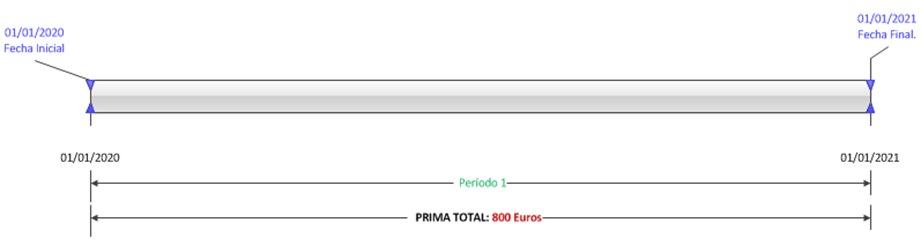
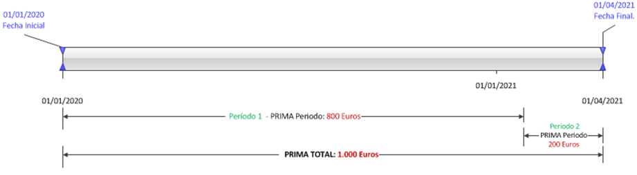
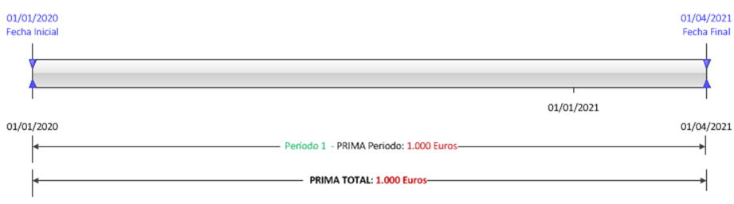
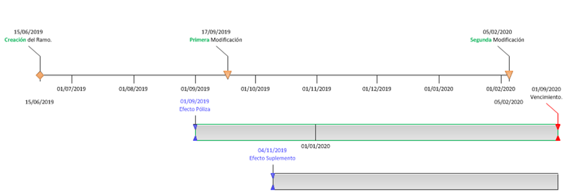
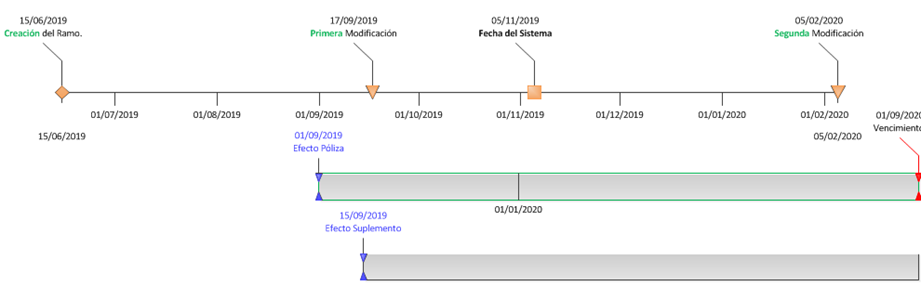
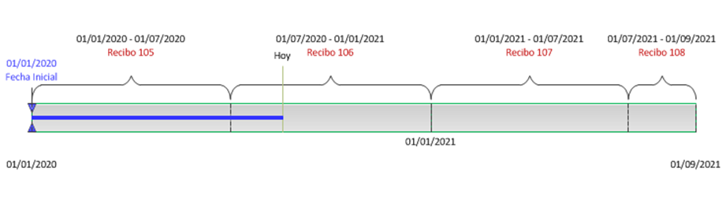
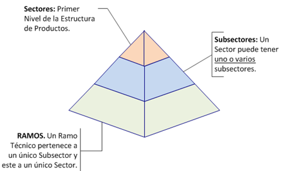

{ width="596" height="159" style="display: block; margin: 0 auto" }

==EN CONSTRUCCIÓN==

# DEFINICIÓN de Ramo Técnico {#titulo}

# Objetivo

Esta página pretende servir de guía para descubrir o recordar por parte
de todos los colaboradores de los grupos de interés de las entidades
MAPFRE encargados de la ejecución del Proceso de Desarrollo de Productos
y Servicios, de las funcionalidades existentes en TronWeb y NewTron
respecto a la definición y parametrización de los Ramos Técnicos de
acuerdo a las siguientes agrupaciones:     

-   Propiedades Generales
-   Propiedades Operativas Comunes
-   Propiedades Operativas Específicas por Tipo de Tratamiento
-   Propiedades relacionadas con el Coaseguro y Reaseguro
-   Propiedades relacionadas con Siniestros
-   Propiedades relacionadas con el Cálculo de las Primas
-   Propiedades relacionadas con la generación de los Recibos
-   Propiedades relacionadas con los Intermediarios y Comisiones
-   Propiedades relacionadas con PLATEA
-   Propiedades relacionadas con el Área Corporativa de Operaciones (**A.C.O.**)
-   Otras Propiedades de los Ramos Técnicos

# Definición y Parametrización

Desde un punto de vista transversal para los colaboradores de las
Direcciones y/o Departamentos a quienes va dirigido este documento, las
acciones y tareas que se tienen que contemplar localmente para definir
en TronWeb / NewTron un Ramo Técnico son conocer y comprender las
características generales de los mismos así como interpretar y
relacionar adecuadamente sus propiedades.

# Características Generales

El sistema permite definir y codificar por cada compañía hasta **999**
códigos de Ramos Técnicos diferentes pudiendo denominar e identificar
individualmente cada uno de ellos mediante una descripción y una
abreviatura, e.g:

-   Ramo 121 -- 'Automóviles' -- 'AUT'.

-   Ramo 317 -- 'Boiler & Machinery' -- 'B&M',

-   Ramo 416 - 'Vida Ahorro - Unit Linked' ...

... De acuerdo con la estructura de productos parametrizada en el
sistema, todos y cada uno de los Ramos Técnicos definidos han de estar
obligatoriamente asociados a uno de los posibles **sectores** definidos
y dentro del ellos a uno de sus posibles **subsectores**.

# Propiedades Operativas Comunes

Este grupo de propiedades son comunes y de aplicación para todos los
Ramos Técnicos definidos en el sistema independientemente de su
tratamiento de emisión.

### **Multirriesgo**

Esta propiedad le indica a TronWeb / NewTron que el Ramo Técnico permite
la contratación de más de un objeto asegurado / asegurado en la póliza.

### **Identificador del Objeto Asegurado**

Esta propiedad define la manera con la que se van a describir y nombrar
en TronWeb / NewTron los objetos asegurados dentro de las pólizas del
Ramo Técnico, facilitando de esta manera la identificación unívoca de
los riesgos en los diferentes módulos del sistema.

Para ello es necesario el desarrollo por parte de la Dirección de
Tecnología local de un *componente* *software* que permita obtener en
los procesos de emisión/suscripción y gestión de cartera el valor de
esta propiedad de acuerdo a los criterios que determinen y consideren
adecuado las Direcciones de Negocio de la entidad MAPFRE local.

Por ejemplo, la entidad podría identificar los riesgos de las pólizas de
los Ramos Técnicos de *Automóviles* conformando este identificador:

-   \[Marca\] -- \[Modelo\] -- \[Matrícula\] -- \[Bastidor\],

-   \[Marca\] -- \[Modelo\] -- \[Submodelo\] -- \[Año de Fabricación\],

Quedando por tanto la identificación de los objetos asegurados en el
sistema:

-   Toyota -- Corolla -- LFD 6357 -- WDDXXDPOI92322FUI.

-   Volkswagen -- Golf -- Gti 16v -- 2019.

En el caso de las pólizas de los Ramos Técnicos de *Vida,*
conformándolo:

-   \[Apellido1\] \[Apellido2\], \[Nombre del Asegurado\]

-   \[Certificado\] - \[Apellido1\] \[Apellido2\], \[Nombre del
    Asegurado\]

Quedando por tanto los identificadores de los Asegurados

-   Pérez Martínez, Juan Gabriel

-   234/2020 - Pérez Martínez, Juan Gabriel

### **Multiperiodos**

TronWeb / NewTron no restringe o limita en el proceso de emisión que se
puedan emitir pólizas de cualquier Ramo Técnico de a.) menos de un año,
b.) un año o c.) de más de un año de duración de acuerdo al período
comprendido entre sus fechas de efecto y vencimiento.

Específicamente para aquellas pólizas que tengan más de un año o periodo
de duración la activación de esta propiedad le indica a TronWeb /
NewTron que las pólizas tienen internamente que registrar la información
económica de manera diferenciada por cada uno de sus períodos, a
diferencia de su desactivación en la que el registro de la información
se realizará en un único periodo independientemente del número de
periodos que tenga la póliza.

Escenario I.- Con fecha de efecto del 01/01/2020 se emite en TronWeb una
póliza de duración anual de un ramo técnico que tiene activada la
propiedad Multiperiodos y cuya prima total asciende a 800 Euros.
Gráficamente el registro de las primas de esta póliza se efectúa sobre
un único \'periodo\' temporal,  ^(Fig.1)^

Escenario II.- Con fecha de efecto del 01/01/2020 se emite en TronWeb
una póliza de duración plurianual de un ramo técnico que tiene activada
la propiedad Multiperiodos con vencimiento el 01/04/2021 y cuya prima
total asciende a 1.000 Euros. Gráficamente el registro de las primas de
esta póliza se efectúa sobre dos \'periodos\',  ^(Fig.2)^

Escenario III.- Con fecha de efecto del 01/01/2020 se emite en TronWeb
una póliza de duración plurianual de un ramo técnico que tiene
desactivada la propiedad Multiperiodos con vencimiento el 01/04/2021 y
cuya prima total asciende a 1.000 Euros. Gráficamente el registro de las
primas de esta póliza se efectúa en un único \'periodo\' temporal, 
^(Fig.3)^

## **Registrar Hora/Minutos** 

La activación de esta propiedad indica que el
Ramo **obligatoriamente** exige la captura de la hora
y minutos en la fecha de efecto de la póliza /suplemento.

## **Respetar Día Vencimiento**

La activación de esta propiedad le indica a TronWeb / NewTron que el
Ramo Técnico [obligatoriamente]{.underline} ha de respetar el día de la
fecha de vencimiento.

### **Cláusulas**

La activación de esta propiedad en el Ramo Técnico le indica a TronWeb /
NewTron que las pólizas, sus objetos asegurados o las coberturas de los
mismos pueden tener asociadas cláusulas que modifican e individualizan
el contrato del seguro, limitando de esta manera el condicionado general
o particular de las pólizas del Ramo Técnico.

Esta asociación se puede producir automática o manualmente durante el
proceso de emisión de la póliza.

El detalle de su definición e impacto operativo en TronWeb / NewTron
reside en un documento funcional específico denominado Definición de
Cláusulas.

^NOTA:^ El proceso de impresión definido localmente deberá tener en
cuenta la impresión de los textos de estas cláusulas.

### **Anexos / Anexos por Objeto Asegurado**

La activación de estas propiedades determinan funcionalmente en el
proceso y programa de emisión de TronWeb / NewTron que se pueden
ingresar textos anexos sobre las pólizas y/o sobre los objetos
asegurados de las mismas.

La captura de dichos textos se puede realizar en el programa de emisión
directamente desde una página en blanco o mediante el uso de plantillas
que prefijen / estandaricen los textos de antemano en el sistema
facilitando de esta manera la labor de su escritura a los usuarios
Emisores.

^NOTA:^ El proceso de impresión definido localmente deberá tener en
cuenta la impresión de los textos capturados a nivel de póliza o por
objeto asegurado.

### **Arrastrar Anexos desde el Presupuesto**

La activación de esta propiedad en la definición del Ramo Técnico
implicará funcionalmente en TronWeb / NewTron que caso que se hayan
capturado anexos y/o anexos por objeto asegurado en la emisión de un
presupuesto, presupuesto a partir del cual se va realizar la emisión de
la póliza, estos anexos se arrastrarán y formarán parte de la
póliza.** **

### **Anexos en Varios Idiomas**

La activación de esta propiedad en la definición del Ramo Técnico
determina que se habilitará la captura de plantillas con textos
prefijados como anexos y/o anexos por objeto asegurado en cualquier
idioma, independientemente del idioma asignado en la parametrización del
Usuario Emisor.

### **Emisión de Presupuesto Obligatoria**

Este atributo le indica al sistema que las pólizas del Ramo Técnico han
de estar obligatoriamente fundamentadas en la información de una
cotización o presupuesto previamente emitido.

### **Reutilizar Presupuesto**

La activación de este atributo le indica a TronWeb / NewTron que
diferentes pólizas del Ramo Técnico pueden reutilizar el mismo código de
presupuesto o cotización.

### **Autorización de Presupuesto Obligatoria**

Este atributo determina funcionalmente en el proceso de emisión de
TronWeb / NewTron que un presupuesto podrá ser utilizado en la emisión
de una póliza del Ramo Técnico siempre y cuando esté completamente
autorizado y en el supuesto que sobre el mismo se haya ejecutado alguna
regla de negocio que implique y determine la existencia de controles
técnicos de auditoría.

^NOTA:^ La funcionalidad de esta propiedad en el sistema [no implica
tener a su vez activada]{.underline} la propiedad de emisión de
presupuesto obligatoria.

### **Disponibilizar la póliza para cualquier Usuario**

La activación de esta propiedad en la definición del Ramo Técnico
determinará funcionalmente en TronWeb / NewTron si [cualquier usuario
habilitado]{.underline} en el sistema puede o no recuperar la
información de la póliza y retomar el proceso de emisión de la misma,
a.) si la póliza está suspendida o b.) siempre y cuando se haya
ejecutado una regla de negocio cuyo resultado provoque la existencia de
un control técnico y que el usuario suscriptor responsable de autorizar
o rechazar haya decidido rechazar, permitiendo en cambio,
disponibilizarla en el sistema para su ulterior modificación.

En caso contrario solamente el usuario emisor original podrá retomar la
póliza y realizar los cambios que sean de consideración.

NOTA: La suspensión de un movimiento en el sistema permite a los
usuarios emisores grabar [temporalmente]{.underline} la información de
la póliza para poder retomarla posteriormente.

### **Ejecución Controles Técnicos en Anulación de Suplementos**

La activación de esta propiedad en la parametrización del Ramo Técnico
le indica a TronWeb / NewTron si se permite o no la ejecución de
controles técnicos en los suplementos cuya función sea la anulación de
suplementos previos.

^NOTA:^ Es responsabilidad del departamento de Tecnología y Procesos de
la Entidad MAPFRE local la activación o no de esta propiedad y su
asociación en el Ramo Técnico.

### **Numero máximo de riesgos para emisión on-line**

La funcionalidad de esta propiedad si bien no está descontinuada en el
núcleo del sistema no debiera usarse o reutilizarse para ningún
propósito de ámbito local por ser una propiedad obsoleta.

^NOTA:^ Originalmente la definición de esta propiedad en el Ramo Técnico
le indicaba al sistema el número máximo de riesgos individuales que
podría tener una póliza multirriesgo para poder ser grabada al finalizar
su emisión on-line y no tener que diferir su grabación.

### **Número máximo de riesgos para impresión on-line**

La funcionalidad de esta propiedad si bien no está descontinuada en el
núcleo del sistema no debiera usarse o reutilizarse para ningún
propósito de ámbito local.

^NOTA:^ Originalmente la definición de esta propiedad en el Ramo Técnico
le indicaba al sistema el número máximo de riesgos individuales que
podría tener una póliza multirriesgo para poder imprimir directamente
desde la emisión on-line sus condiciones particulares, pudiendo de esta
manera controlar y limitar el coste de la impresión directa.

### **Cambiar Numeración de la Póliza**

La activación de esta propiedad en el Ramo Técnico le indica a TronWeb /
NewTron que como parte del proceso de gestión de cartera y al emitir
on-line o de forma batch los suplementos de renovación de sus pólizas,
el sistema [tiene que cambiar]{.underline} la numeración de la póliza.

^NOTA:^ El cambio de la numeración se realizará automáticamente pudiendo
trazar y tener seguimiento de la numeración de la póliza desde el inicio
a su fin o hacia atrás en el tiempo.

### **Capturar 1 o n  Motivos por los que se emite un Suplemento**

Por defecto el programa y proceso de emisión de TronWeb / NewTron
[obliga a capturar]{.underline} el motivo o la causa por la que se
realiza cualquier suplemento en el sistema, pero se puede modificar este
comportamiento mediante la activación de esta propiedad en el Ramo
Técnico, propiedad que le indica a TronWeb / NewTron que se permite
capturar más de un motivo al finalizar la emisión del suplemento.

^NOTA:^ Las causas o motivos por los que se pueden realizar los
suplementos en el sistema [están codificadas]{.underline},
funcionalmente por cuestiones de estandarización.

### **Generar Registro del cambio del Plan de Pago**

La activación de este atributo en el Ramo Técnico permite a TronWeb /
NewTron registrar internamente en la base de datos del sistema el
suplemento del cambio del plan de pago realizado en la póliza como si
fuera un suplemento 'técnico' del proceso de gestión de cartera en vez
de modificar y registrar únicamente, en los recibos afectados por el
cambio del fraccionamiento de primas, el financiamiento realizado.

Por otra parte es factible que la Dirección de Tecnología local
implemente y desarrolle un *componente* *software* que permita evaluar y
cambiar, en tiempo real y de acuerdo a los criterios que determinen y
consideren adecuado las Direcciones de Negocio de la entidad MAPFRE
local,  el comportamiento de esta propiedad.

### **Formación de la Modalidad Comercial**

El valor de esta propiedad del Ramo Técnico le indica a TronWeb /
NewTron la manera con la que se va a obtener en el proceso de emisión la
modalidad comercial del objeto asegurado, entendiendo por modalidades
comerciales a cada una de las posibles modalidades de seguros que
comercializa la aseguradora, siendo sus posibles valores: a.) No existen
modalidades definidas en el Ramo Técnico, b.) El código de la modalidad
comercial se obtiene como resultado de las distintas combinaciones de
respuestas en datos variables del objeto asegurado o c.) El código de la
modalidad comercial se captura directamente en el sistema.

^NOTA:^ El valor de esta propiedad ha de estar en consonancia y ser
coherente con la definición realizada en los Datos Variables del Ramo
Técnico.

### **Formación imagen**

El valor de esta propiedad en la definición del Ramo Técnico permite que
TronWeb / NewTron pueda gestionar la emisión de suplementos sobre una
póliza de acuerdo a las posibles modificaciones realizadas en las
definiciones del ramo a lo largo del tiempo, siendo sus posibles
valores: 

1.  La Fecha del sistema

2.  La Fecha de efecto del suplemento

3.  La Fecha de efecto de la póliza

Escenario IV.- Con fecha de efecto del 01/09/2019 se emite una póliza de
duración anual en el sistema y con fecha de efecto del 04/11/2019 se
emite un suplemento sobre la misma en un ramo técnico cuya formación de
la imagen se ha considerado sea la **fecha del sistema**. El Ramo
Técnico originalmente se parametrizó en el sistema el 15/06/2019 y ha
sufrido dos cambios importantes afectando a su definición en 17/09/2019
y el 05/02/2020. Gráficamente ^(Fig.4)^

El efecto de seleccionar el valor de este atributo en la definición del
ramo implica en este ejemplo que la emisión de la póliza se basó en la
definición original que tenía el Ramo Técnico mientras que la emisión
del suplemento se realizó en base a la definición que tenía el Ramo una
vez sufrió la primera modificación en su definición, es decir, con la
información del ramo al 17/09/2019. En este escenario concreto, el
efecto hubiera sido el mismo si el valor del atributo hubiera sido la
**fecha de efecto del suplemento**

Escenario V.- Con fecha de efecto del 01/09/2019 se emite una póliza de
duración anual en el sistema. Estamos a primeros del mes de Noviembre y
con fecha de efecto del 15/09/2019 se emite un suplemento sobre la
póliza, en un ramo técnico cuya formación de la imagen se ha considerado
sea la **fecha de efecto del suplemento**. El Ramo Técnico originalmente
se parametrizó en el sistema el 15/06/2019 y ha sufrido dos cambios
importantes afectando a su definición en 17/09/2019 y el 05/02/2020.
Gráficamente ^(Fig.5)^

El efecto de seleccionar ese valor en el atributo implica que la emisión
de la póliza se basa en la definición original que tenía el Ramo
Técnico, además y aun existiendo una modificación en la definición del
ramo realizada el 17/09/2019, por ser la fecha del sistema posterior a
la fecha de efecto del suplemento, la emisión del suplemento también
tomará en consideración las definiciones que tenía el Ramo
originalmente. En este escenario, a diferencia del anterior, el efecto
no hubiera sido el mismo si el valor del atributo hubiera sido la
**fecha del sistema** puesto que de serlo la emisión del suplemento se
hubiera realizado tomando en cuenta las definiciones de la primera
Modificación del Ramo.

Por último, si el valor del atributo fuera **la fecha de efecto de la
póliza**, el sistema siempre realizará la emisión de los suplementos con
la definición con la que originalmente fuera emitida la póliza.

# Propiedades Operativas Específicas por Tipo de Tratamiento.

### **Tratamiento de Emisión** {#tratamiento-emision}

El valor de esta propiedad le indica a TronWeb / NewTron la tipología o
variante del proceso de gestión de pólizas y contratos que se ha de
ejecutar al suscribir/emitir una póliza del Ramo Técnico.

De esta manera el sistema permite especializar y validar la captura de
la información de los objetos asegurados en función de la tipología del
tratamiento de emisión, e.g: si el Ramo técnico tuviera asociado un
tratamiento de emisión de *Vida* estaríamos indicando al sistema que
cubre seguros de personas y por tanto en el proceso de emisión de sus
pólizas se podría capturar información específica (como un cuestionario
médico) o emitir suplementos específicos (como Aportaciones
Extraordinarias o Rescates) que no podrán ser utilizados en cambio si el
tratamiento de emisión correspondiera a un Ramo Técnico que cubriera
seguros de daños materiales. De igual manera un ramo técnico cuyo
tratamiento de emisión asociado se hubiera definido de *Automóviles*
permitirá captura*r* información de accesorios a diferencia de los otros
valores de esta propiedad. Sus posibles valores son:

-   *Automóviles.*

-   *Diversos.*

-   *Transportes, y*

-   *Vida.*

^NOTA:^ No es posible ampliar en el sistema la relación de posibles
valores de esta propiedad.

### **Tratamiento de Siniestros**

El valor de esta propiedad le indica a TronWeb / NewTron la tipología o
variante del proceso de gestión de siniestros y prestaciones que se ha
de ejecutar sobre las pólizas pertenecientes al Ramo Técnico, siendo sus
posibles valores los mismos que los indicados en la propiedad
tratamiento de emisión.

De esta manera el sistema permite especializar la tramitación y gestión
de los siniestros y sus expedientes en función de la tipología del
tratamiento de siniestros asociado en el ramo técnico.

### **Tratamiento Contable**

El valor de esta propiedad le indica a TronWeb / NewTron la tipología o
variante del proceso de gestión económica financiera que han de seguir
los elementos económicos de las pólizas emitidas, siendo sus posibles
valores los mismos que los de la propiedad tratamiento de emisión.

^NOTA:^ El sistema permite que un Ramo Técnico tenga diferentes
tipologías de tratamientos en los tres propiedades indicadas, e.g:
tratamiento de emisión de *Diversos,* tenga en cambio un tratamiento de
siniestros de *Automóviles* y un tratamiento contable de *Transportes*.

### **Fecha Contable Estándar**

La activación de esta propiedad en la parametrización del Ramo Técnico
le indica a TronWeb / NewTron que el sistema va a obtener la fecha para
contabilizar las primas de acuerdo al criterio expreso con que cuenta el
núcleo por defecto para ello.

En caso contrario es necesario el desarrollo por parte de la Dirección
de Tecnología local de un *componente* *software* que permita obtener en
los procesos de emisión/suscripción y gestión de cartera el valor de la
fecha contable de emisión, de acuerdo a los criterios que determinen y
consideren adecuado las Direcciones de Negocio de la entidad MAPFRE
local.

^NOTA:^ Por defecto el sistema obtiene la fecha contable de emisión a
partir de la información existente en una tabla del módulo de Tesorería
tanto para las pólizas cuyo efecto esté en el periodo contable vigente
como para las pólizas cuyas fechas de efecto sean retroactivas al mismo.

En el caso de las pólizas cuya emisión sea anticipada y a su vez excedan
el período contable vigente el criterio de TronWeb / NewTron es respetar
el mes de la fecha de efecto de las pólizas como fecha en la que serán
contabilizadas.

### **Caución**

La activación de esta propiedad en la definición del Ramo Técnico le
indica a TronWeb / NewTron que el Ramo soporta la operativa
especializada y específica del Seguro de Caución.

### **Proceso de Impresión**

El valor de este atributo en la definición del Ramo Técnico permite
tipificar en TronWeb / NewTron el subproceso de impresión por el que el
sistema va a realizar la impresión de las condiciones particulares de
sus pólizas, directamente desde la emisión on-line o de forma diferida
en modo batch, siendo responsabilidad del departamento de Tecnología y
Procesos de la Entidad MAPFRE local de su nomenclatura y de su
asociación en el Ramo Técnico.

^NOTA:^ El departamento de Tecnología y Procesos va a tener que
desarrollar localmente *componentes* *software* que contemplen todas
lógicas de negocio y sus posibles combinaciones, de acuerdo a los
criterios que determinen y consideren adecuado las Direcciones de
Negocio de la entidad MAPFRE local para realizar la impresión física de
la documentación contractual, e.g: pueden existir Ramos Técnicos en los
que a.) Por cuestiones de coste, la impresión masiva esté delegada en un
proveedor externo quien se haga cargo tan solo de imprimir o de imprimir
y enviar postalizando los documentos a los asegurados y mediadores, b.)
Por su complejidad técnica la impresión se realice de manera
centralizada con la supervisión de suscriptores expertos, c.) Se excluya
su impresión directa desde el proceso de emisión, d.) ...

### **Proceso de Impresión para Cotizaciones**

El valor de este atributo en la definición del Ramo Técnico permite
tipificar en TronWeb / NewTron el subproceso de impresión por el que el
sistema va a realizar la impresión de las cotizaciones o presupuestos
del Ramo Técnico, siendo responsabilidad del departamento de Tecnología
y Procesos de la Entidad MAPFRE local de su nomenclatura y asociación en
el Ramo Técnico.

### **Proceso de Impresión en caso de Control Técnico**

El valor de este atributo en la definición del Ramo Técnico permite
tipificar e identificar en TronWeb / NewTron el flujo del subproceso de
impresión que el sistema ha de seguir en caso que la póliza quede
finalmente retenida por control técnico.

### **Asociar Inspección en el proceso de emisión**

La activación de esta propiedad le indica inicialmente a TronWeb /
NewTron que el programa de emisión va a intentar asociar el código de la
inspección realizada sobre el objeto asegurado para poder contratar el
riesgo o dejar en cambio retenida la póliza a la espera de realizar la
inspección.

Para realizar la asociación es necesario el desarrollo por parte de la
Dirección de Tecnología local de un *componente* *software* que permita
buscar y asociar en los procesos de emisión/suscripción y gestión de
cartera de la póliza los códigos de las inspecciones realizadas sobre
los objetos asegurados de acuerdo a los criterios que determinen y
consideren adecuado las Direcciones de Negocio de la entidad MAPFRE
local.

^NOTA:^ En la parametrización de las garantías, el sistema cuenta con
una propiedad específica que le indica a TronWeb / NewTron que su
contratación implica la realización de una inspección visual sobre el
objeto asegurado, inspección que debe ser realizada [como por
ejemplo]{.underline} en a.) Un centro de Servicio de MAPFRE, b.) Un
centro de peritaje externo, c.) Enviando un inspector de ITSEMAP al
domicilio del asegurado o a la ubicación del riesgo ... y cuyo resultado
ha de ser favorable para poder contratar el riesgo.

### **Estructura de captura, datos de la Inspección**

Si en el programa de emisión de TronWeb / NewTron se detecta que al
menos una de las garantías contratadas del objeto asegurado que estemos
emitiendo pueda implicar la realización de una inspección, esta
propiedad le indica al programa de emisión que ha de realizarse una
llamada a un subprograma local que permitirá capturar toda aquella
información referente a la inspección del objeto asegurado.

^NOTA:^ Es responsabilidad del departamento de Tecnología y Procesos de
la Entidad MAPFRE local de su nomenclatura, implementación y asociación
en el Ramo Técnico.

### **Estructura de captura, datos de la póliza**

Por defecto el programa de emisión de TronWeb / NewTron realizará la
captura de los Datos Variables de la póliza que hayan podido ser
definidos en el Ramo Técnico en modo 'multiregistro' pero el sistema
permite cambiar ese comportamiento y realizar una llamada en tiempo real
a un subprograma que permita capturar los datos con los criterios que
determinen las Direcciones de Negocio implicadas.

^NOTA:^ Es responsabilidad del departamento de Tecnología y Procesos de
la Entidad MAPFRE local de la nomenclatura de esta propiedad, su
implementación y su asociación en el Ramo Técnico.

### **Estructura de captura, datos del Objeto Asegurado**

Por defecto el programa de emisión de TronWeb / NewTron realizará la
captura de los Datos Variables del objeto asegurado que hayan podido ser
definidos en el Ramo Técnico en modo 'multiregistro', si bien el sistema
permite cambiar ese comportamiento y realizar una llamada en tiempo real
a un subprograma que permita capturar los datos con los criterios que
determinen las Direcciones de Negocio implicadas.

^NOTA:^ Es responsabilidad del departamento de Tecnología y Procesos de
la Entidad MAPFRE local de la nomenclatura de esta propiedad, su
implementación y su asociación en el Ramo Técnico.

### **Estructura de captura, datos de la Modalidad Comercial**

Por defecto el programa de emisión de TronWeb / NewTron realizará la
captura de los Datos Variables de la modalidad de contratación o
producto comercial que hayan podido ser definidos en el Ramo Técnico en
forma 'multiregistro', si bien el sistema permite cambiar este
comportamiento y realizar una llamada en tiempo real a un subprograma
que permita capturar los datos con los criterios que determinen las
Direcciones de Negocio implicadas.

^NOTA:^ Al igual que para el resto de estructuras de captura, será
responsabilidad del departamento de Tecnología y Procesos de la Entidad
MAPFRE local de la nomenclatura de esta propiedad, su implementación y
su asociación en el Ramo Técnico.

### **Estructura de captura, accesorios**

Si en el programa de emisión de TronWeb / NewTron se detecta que al
menos una de las garantías contratadas del objeto asegurado que estemos
emitiendo va a contemplar en su tipo de capital los accesorios como
valor o parte del valor de su suma asegurada, esta propiedad del Ramo
Técnico le indica al programa de emisión que ha de realizarse una
llamada a un subprograma local en el que se efectuará la captura de los
accesorios del vehículo.

^NOTA:^ Esta propiedad por tanto solo podrá estar asignada en el Ramo
Técnico si la propiedad que indica su tratamiento de emisión sea de
*Automóviles*, siendo responsabilidad del departamento de Tecnología y
Procesos de la Entidad MAPFRE local de su nomenclatura, implementación y
asociación en el Ramo Técnico.

### **Estructura de captura o distribución, plan de pago. **

Por defecto el programa de emisión de TronWeb / NewTron realiza el
fraccionamiento de las primas del Seguro de acuerdo a la definición y
parametrización efectuada específicamente en el sistema para el código
del Plan de Pago capturado, ahora bien, el núcleo del sistema permite
cambiar este comportamiento y realizar una llamada en tiempo real a un
subprograma que permita distribuir las primas con los criterios que
determinen las Direcciones de Negocio implicadas.

La funcionalidad de esta propiedad, si bien no está descontinuada, no
debiera usarse o reutilizarse para ningún propósito de ámbito local por
ser una propiedad [extremadamente compleja]{.underline} de implementar.

^NOTA:^ Sería responsabilidad del departamento de Tecnología y Procesos
de la Entidad MAPFRE local de la nomenclatura de esta propiedad, su
implementación y su asociación en el Ramo Técnico.

### **Reutilizar Declaración previa**

Siempre y cuando el tratamiento de emisión asignado en el Ramo Técnico
sea de *Transportes* la  activación de esta propiedad le indica a
TronWeb / NewTron que se permite reutilizar una declaración previa  que
haya sido traspasada y convertida anteriormente en una aplicación.

### **Cambiar Numeración de la Póliza en Aplicaciones. **

Siempre y cuando el tratamiento de emisión asignado en el Ramo Técnico
sea de *Transportes* la activación de esta propiedad le indica a TronWeb
/ NewTron que como parte del proceso de gestión de cartera y al emitir
on-line o de forma batch aplicaciones sobre una póliza de *transportes*
previamente emitida, el sistema [obliga a cambiar]{.underline} la
numeración de la póliza.

^NOTA:^ Este cambio en la numeración se realizará automáticamente
pudiendo trazar y tener seguimiento de las numeraciones desde el inicio
a su fin o hacia atrás en el tiempo.

### **Uso de Certificados**

Normalmente cuando el tratamiento de emisión asignado en el Ramo Técnico
sea de *Vida* y la póliza de seguro sea **colectiva** (en la que el
tomador es una persona jurídica y los asegurados son un grupo de
personas a las que les une una relación común con dicho tomador: como
por ejemplo una empresa y sus trabajadores), la activación de esta
propiedad le indica a TronWeb / NewTron que como parte de los procesos
de emisión y gestión de cartera se va a identificar la adhesión de los
distintos asegurados a la póliza de seguro colectiva mediante un código
de documento que se entrega a cada uno de ellos y que señala la certeza
en la atención de las prestaciones en caso de siniestro, siendo los
certificados de seguro la identificación de dichos documentos.

^NOTA:^ Operativamente en TronWeb / NewTron y en el caso de seguros
colectivos en los que el tomador de la póliza de seguro colectiva cubra
no solamente a sus empleados sino así mismo a los miembros de sus
familias, los familiares deberían capturarse en el sistema como tipos de
terceros del objeto asegurado / asegurado principal.

### **Gestión de Fondos**

Cuando el tratamiento de emisión asignado en el Ramo Técnico sea de
*Vida* y la clasificación del Ramo Técnico atendiendo a su finalidad
corresponda con un seguro de ahorro o un seguro mixto, la activación de
esta propiedad le indica a TronWeb / NewTron que el Ramo Técnico puede
realizar operativas específicas con fondos de inversión.

### **Rechazar & Suspender Aplicaciones**

La activación de esta propiedad en la definición de un  Ramo Técnico
cuyo tratamiento de emisión asignado sea de *Transportes* determinará
funcionalmente en TronWeb / NewTron si se pueden a.) suspender las
aplicaciones de sus pólizas y b.) rechazar suspendiendo siempre y cuando
se haya ejecutado una regla de negocio cuyo resultado provoque la
existencia de un control técnico sobre la aplicación y que el usuario
suscriptor responsable de autorizar o rechazar haya decidido rechazar,
permitiendo, en cambio, disponibilizarla para su posterior modificación.

^NOTA:^ La suspensión de un movimiento en el sistema permite a los
usuarios emisores grabar [temporalmente]{.underline} la información de
la póliza para poder retomarla posteriormente.

# Propiedades relacionadas con el Coaseguro y Reaseguro.

### **Coaseguro**

Este atributo en la definición del Ramo Técnico le indica a TronWeb /
NewTron si el Ramo Técnico ampara y permite tener o no operaciones de
coaseguro, siendo sus posibles valores:

-   Coaseguro no permitido.

-   Se permiten únicamente operaciones de coaseguro **cedido**.

-   Se permiten únicamente operaciones de coaseguro **aceptado**.

-   Se permiten realizar tanto operaciones de coaseguro **cedido** como
    de coaseguro **aceptado**.

Dependiendo del valor de esta propiedad el proceso de Emisión del
sistema comprobará y en su caso habilitará la captura de la información
específica de la operación de coaseguro mediante la aparición de
ventanas emergentes en el programa de emisión.

### **Cuadro de Coaseguro obligatorio**

La activación de esta propiedad le indica a TronWeb / NewTron que la
captura de la información de coaseguro en el programa de emisión no se
realizará manualmente sino que únicamente se permitirá capturar un
código cuya definición previa prefija en el sistema las condiciones,
distribución y participación del coaseguro entre diferentes compañías
coaseguradoras formando un panel de coaseguro específico que facilita el
trabajo al usuario suscriptor / emisor amén de minimizar los posibles
errores en la captura de los datos.

### **Conceptos de Coaseguro Cedido sin porcentajes**

La activación de esta propiedad en la parametrización del Ramo Técnico
permite dejar sin valores los importes de las comisiones, Gastos,
Recargos,... al capturar la información de la operación de coaseguro
cedido realizada en el programa de emisión de TronWeb / NewTron.

### **Reaseguro**

Esta propiedad le indica a TronWeb / NewTron si el Ramo Técnico permite
tener o no operaciones de reaseguro, siendo sus posibles valores:

-   Solamente se permiten operaciones de Seguro Directo.

-   Se permiten operaciones de Reaseguro Aceptado (Contrato).

-   Se permiten operaciones de Reaseguro Aceptado (Facultativo).

-   Se permiten operaciones de Reaseguro Aceptado y Cedido.

Dependiendo del valor de esta propiedad el proceso de Emisión del
sistema validará y en su caso habilitará la captura de la información
específica de la operación de reaseguro en el programa de emisión.

### **Colocación de Reaseguro en Sistema Externo**

Dependiendo de la activación de esta propiedad en la parametrización del
Ramo Técnico, el programa de emisión de TronWeb / NewTron realizará una
llamada a la solución corporativa RE21 para resolver las cesiones de
reaseguro, partiendo de la información de las garantías contratadas en
la póliza o suplemento de TRON y de la parametrización de los contratos,
políticas, planes de colocación y reglas de negocio realizada en dicho
sistema externo, mientras que en caso contrario, las colocaciones y
cesiones de reaseguro seguirán siendo realizadas en el módulo de
Reaseguro de TronWeb.

### **Control Técnico de Emisión por colocación de Reaseguro en Sistema Externo**

Si el atributo que indica la colocación de reaseguro en sistema externo
está activada y el proceso de colocación de las cesiones de reaseguro en
RE21 no se pudiera ejecutar o terminara  anormalmente, la activación de
esta otra propiedad implicaría que se van a generar controles técnicos
en el proceso de emisión de TronWeb / NewTron,  controles que tendrán
que ser contemplados y gestionados desde los programas de autorizaciones
de los módulos de Reaseguro  y Emisión de TronWeb.

### **Control Técnico de Siniestros por colocación de Reaseguro en Sistema Externo**

Si el atributo que indica la colocación de reaseguro en sistema externo
está activada y las operaciones propias de siniestros en RE21 no se
pudieran ejecutar o estas finalizaran anormalmente, la activación de
esta otra propiedad implicaría que se van a generar controles técnicos
en el proceso de gestión de siniestros y prestaciones de TronWeb /
NewTron, controles que tendrán que ser contemplados y gestionados
posteriormente desde los programas de autorizaciones de los módulos de
Reaseguro y Siniestros de TronWeb.

### **Colocación de Reaseguro en el Proceso de Emisión ON-LINE o de manera diferida**

Dependiendo de la activación de esta propiedad en la parametrización del
Ramo Técnico, el programa de emisión de TronWeb / NewTron realizará una
llamada a la solución corporativa RE21 para resolver las cesiones de
reaseguro en el proceso ON-LINE o de manera diferida.

# Propiedades relacionadas con Siniestros.

### **Validar Siniestros Pendientes en Suplementos**

La activación de esta propiedad en un Ramo Técnico le indica a TronWeb /
NewTron que el Programa de emisión en el proceso de gestión de cartera
de la póliza tiene que validar la existencia de siniestros/expedientes
[pendientes]{.underline} a la fecha de efecto del suplemento.

En caso de existir alguno se puede parametrizar que el sistema tan solo
[emita un mensaje de aviso]{.underline} o se impida la emisión del
suplemento.

### **Validar Siniestros Terminados en Suplementos**

** **La activación de esta propiedad en un Ramo Técnico le indica a
TronWeb / NewTron que el Programa de emisión en la ejecución del proceso
de gestión de cartera de la póliza tiene que validar la existencia de
siniestros/expedientes [terminados]{.underline} a la fecha de efecto del
suplemento.

En caso de existir alguno se puede parametrizar que el sistema tan solo
[emita un mensaje de aviso]{.underline} o se impida la emisión del
suplemento.

# Propiedades relacionadas con el cálculo de las Primas.

### **Prorrata**

La activación de esta propiedad le indica a TronWeb / NewTron que el
cálculo económico de los conceptos de desglose de las garantías y para
las pólizas temporales va a realizarse **prorrata-temporis** de manera
proporcional a la duración de la póliza mientras que en caso contrario
el cálculo se realizará a **escala** en función del tramo de días de la
duración de la póliza y el  porcentaje de cálculo definido expresamente
para cada uno de los tramos del Ramo Técnico.

Si ambas alternativas no se adecuaran técnicamente a las necesidades de
la entidad MAPFRE local, existe una opción adicional mediante el
desarrollo por parte de la Dirección de Tecnología local de un
*componente* *software* que permita hallar en los procesos de
emisión/suscripción y gestión de cartera, en tiempo real y con las
combinaciones de criterios que determinaran las Direcciones de Negocio
el coeficiente que se hubiera de aplicar en los cálculos de los
conceptos de desglose.

### **Cambiar Prorrata**

La activación de esta propiedad en la definición del Ramo Técnico le
indica a TronWeb / NewTron que el cálculo prorrata-temporis o escala
definido en la propiedad prorrata, para los conceptos de desglose de las
coberturas y [para las pólizas temporales]{.underline} puede modificarse
durante el proceso de emisión por parte del Usuario emisor.

### **Calcular coeficiente en anulación de riesgos como en anulación de póliza** {#mca_aplica_at_en_riesgo}
Determina si la baja de un riesgo en una póliza donde hay varios, aplican las mismas reglas que en una anulación de póliza. Esto quiere decir que afectan parámetros del tipo:

- Uso de prorrata o Escala
- Uso del coeficiente de anulación
- Uso de la lógica de negocio que determina el coeficiente de anulación
- Uso del tipo de anulación en caso que sea a escala

En caso contrario se utilizará coeficiente de constitución tal y como se utiliza en el resto de suplementos

### **Considerar el 29 de Febrero en cálculos**

Si esta propiedad está activada en la definición del Ramo Técnico,
TronWeb / NewTron considerará el 29 de Febrero en la fórmula que se
encarga internamente de obtener el coeficiente para realizar el cálculo
de los conceptos de desglose, ...

### **Año de 360/365 días** {#mca_365_dias}
Determina el número de días que tiene un año. TRON permite a efectos de cálculo que un año tenga 360 o 365 días. Para el caso de 360 días, TRON asume que todos los meses son de 30 días (30 * 12 = 360). En ningún caso un año bisiesto altera estos valores. 

| AÑO BISIESTO | PARÁMETRO       | RESULTADO |
| :---:        | :---:           | :---:     |
| SI           | AÑO DE 360 DÍAS | 360       |
| SI           | AÑO DE 365 DÍAS | 365       |
| NO           | AÑO DE 360 DÍAS | 360       |
| NO           | AÑO DE 365 DÍAS | 365       |

######

| PARÁMETRO       | ENERO   | FEBRERO | MARZO   | ABRIL   | MAYO    | JUNIO   | JULIO   | AGOSTO  | SEPTIEMBRE | OCTUBRE | NOVIEMBRE | DICIEMBRE |
| :---:           | :---:   | :---:   | :---:   | :---:   | :---:   | :---:   | :---:   | :---:   | :---:      | :---:   | :---:     | :---:     |
| AÑO DE 360 DÍAS | 30 días | 30 días | 30 días | 30 días | 30 días | 30 días | 30 días | 30 días | 30 días    | 30 días | 30 días   | 30 días   |
| AÑO DE 365 DÍAS | 31 días | 28 días | 31 días | 30 días | 31 días | 30 días | 31 días | 31 días | 30 días    | 31 días | 30 días   | 31 días   |

### **Primas Manuales**

El valor de esta propiedad le indica a TronWeb / NewTron las opciones
que puede tener el Ramo Técnico para realizar el cálculo de las primas
de los Conceptos de Desglose correspondientes a la prima pura de las
Coberturas, siendo sus posibles valores:

-   Cálculo Manual
-   Cálculo Automático
-   Ambos cálculos están permitidos

### **Tasa Manual**

TronWeb / NewTron permite definir en el Ramo Técnico cómo se va a
realizar manualmente la captura de las primas de las coberturas en el
programa de emisión: a.) capturando la tasa  o b.) capturando la [prima
anualizada]{.underline} de la cobertura (siempre y cuando la propiedad
Primas Manuales esté activada).

Por tanto y dependiendo de la activación o desactivación de esta
propiedad el programa de emisión permitirá capturar la tasa o la prima
anualizada de la garantía respectivamente.

^NOTA:^ Independientemente de la activación o no de esta propiedad [si
el usuario emisor no captura]{.underline} en la pantalla de coberturas
del programa de emisión la tasa a aplicar o el importe anualizado de la
cobertura, el sistema intentará obtener el valor automáticamente de
acuerdo a la definición realizada para el concepto de desglose de la
prima pura de la garantía.

### **Modificar tipo de Cambio**

Si se indica en el proceso y programa de emisión que la póliza se va a
emitir en una moneda diferente a la de la moneda local del país en el
que está establecida la entidad MAPFRE, TronWeb / NewTron permite
**modificar y validar** el tipo de cambio contable de dicha moneda
siempre y cuando esta propiedad esté activada en el Ramo Técnico.

^NOTA:^ Es importante resaltar que la modificación del tipo de cambio
por sus implicaciones contables debería siempre de estar auditada,
amparada y aprobada expresamente por la Dirección de Administración y
Finanzas de la entidad y por tanto, por coherencia con las políticas y
controles definidos por esta Dirección, sería adecuado establecer un
control técnico en el proceso de emisión que se ejecutara
automáticamente siempre que el tipo de cambio variase respecto del tipo
de cambio oficial cargado en el sistema, siendo responsabilidad de
personal adscrito a la Dirección de Administración y Finanzas su
aprobación o rechazo.

### **Mostrar Importes Totales**

El efecto resultante de la activación de esta propiedad en la definición
del Ramo Técnico, consistirá en mostrar en el programa de emisión de
NewTron y en la pantalla y panel de contratación de las garantías del
objeto asegurado, la suma del total de los conceptos de desglose que
conforman la garantía y no únicamente la prima pura de la cobertura
siempre y cuando la póliza no sea una póliza multirriesgo con más de un
objeto asegurado.

### **Calcular Conceptos de Desglose en Ejecuciones Batch**

La activación de esta propiedad en la definición del Ramo Técnico tiene
tan solo un alcance e impacto tecnológico para indicar a TronWeb /
NewTron que la forma de realizar los cálculos de los conceptos de
desglose en los procesos batch de emisión es necesario que sea realizado
por objeto asegurado, mientras que en caso contrario se realizará una
vez se hayan tratado todos los posibles objetos asegurados de la póliza.

^NOTA:^ Es responsabilidad del departamento de Tecnología y Procesos de
la Entidad MAPFRE local la activación o no de esta propiedad y su
asociación en el Ramo Técnico.

### **Contempla Pricing Dinámico. **

La activación de esta propiedad en la definición del Ramo Técnico
permite que TronWeb / NewTron una vez ha finalizado en el proceso de
emisión el cálculo de las primas de las coberturas del riesgo llame a un
servicio que pueda ajustar las primas calculadas mediante la ejecución
de un componente software desarrollado por parte de la Dirección de
Tecnología local que obtenga en los procesos de emisión/suscripción y
gestión de cartera el importe a ajustar de acuerdo a los criterios que
determinen y consideren adecuado las Direcciones de Negocio de la
entidad MAPFRE local.

# Propiedades relacionadas con la generación de los Recibos.

### **Generación de Recibos por Periodo**

En el caso que la propiedad operativa Multiperiodos esté activada en un
Ramo Técnico y que la póliza emitida tenga una duración superior a un
año, TronWeb / NewTron permite definir si la generación de los recibos
de las pólizas se ha de realizar en cada uno de sus periodos o
considerar toda su duración como un único periodo, todo ello de acuerdo
a la definición realizada en el sistema para el código del Plan de pago
capturado en el proceso de emisión y a la activación de esta propiedad.

Escenario VI.- Con fecha de efecto del 01/01/2020 se emite en TronWeb
una póliza de duración plurianual de un ramo técnico que tiene
**activadas** tanto la propiedad Multiperiodos como la propiedad de
generación de recibos por periodo, con vencimiento el 01/09/2021 y con
un plan de pago semestral. Gráficamente el efecto de la generación de
los recibos sería ^(Fig.6)^

Escenario VII.- Con fecha de efecto del 01/01/2020 se emite en TronWeb
una póliza de duración plurianual de un ramo técnico que tiene
**activada** la propiedad Multiperiodos, pero desactivada la  propiedad
de generación de recibos por periodo, con vencimiento el 01/09/2021 y
con un plan de pago semestral. Gráficamente el efecto de la generación
de los recibos sería ^(Fig.7)^

^NOTA:^ Esta funcionalidad de la propiedad solo es de aplicación en los
[Planes de
Pago](https://mapfrecorp-my.sharepoint.com/wiki/spaces/CTRON/pages/8714739870912348263)
y no para las formas de pago.

### **Modificar Recibos manualmente**

La activación de esta propiedad en un Ramo Técnico le indica a TronWeb /
NewTron que se pueden modificar tanto las fechas de efecto como los
importes de los recibos generados en la póliza inicialmente calculados
de acuerdo a la definición y parametrización de los atributos del plan
de pago capturado en el proceso y programa de emisión, siempre y cuando
el rol del usuario suscriptor/emisor le confiera privilegios para
realizar esta operación.

^NOTA:^ El sistema valida automáticamente la coherencia de los cambios
efectuados sobre los recibos.

### **Remesa Recibos.                                                                                                             **
La activación de esta propiedad en un Ramo Técnico le indica a TronWeb /
NewTron que se tienen que remesar/poner al cobro [todos aquellos
recibos]{.underline} que se hayan generado en la póliza de acuerdo a la
definición del plan de pago capturado en el proceso y programa de
emisión y cuyas respectivas fechas de efecto sean menores o iguales a la
fecha del sistema. En caso contrario no se van a remesar ninguno de los
recibos generados directamente desde el proceso de emisión.

Si la activación o desactivación de esta propiedad no se adecúa técnica
y directamente a las necesidades operativas de la entidad MAPFRE local
existe una opción adicional, mediante el desarrollo por parte de la
Dirección de Tecnología local de un *componente* *software*, que permita
evaluar en los procesos de emisión/suscripción y gestión de cartera, en
tiempo real y con las combinaciones de criterios que determinen las
Direcciones de Negocio si se han o no de remesar los recibos.

NOTA: El valor y sentido de esta propiedad ha de estar contemplada y
ser coherente con las directrices marcadas por la Dirección de
Administración y Finanzas de la entidad MAPFRE Local respecto a la
extracción de vencimientos, la puesta al cobro y 'envío' de los recibos
a los Tomadores e intermediarios de las pólizas, ...

### **Emisión sin Recibos.                                                                                                                 **
La activación de esta propiedad en la definición de un Ramo Técnico le
indica a TronWeb / NewTron que se *permite* la emisión de una
póliza/suplemento [sin generar recibo alguno]{.underline}.

Para ello es **obligatoria** la ejecución de un *componente software*
desarrollado por parte de la Dirección de Tecnología local que permita
validar en los procesos de emisión/suscripción y gestión de cartera, en
tiempo real y con las combinaciones de criterios que determinen las
Direcciones de Negocio de la entidad MAPFRE Local la validación expresa
de esta situación.

### **Permitir el Cobro de Recibos**

El uso de esta propiedad en un Ramo Técnico permite habilitar en el
programa de emisión de TronWeb / NewTron la funcionalidad de cobranza
sobre los recibos generados en la póliza.

Para ello es [obligatoria]{.underline} la ejecución de un *componente
software* desarrollado por parte de la Dirección de Tecnología local,
que permita validar y controlar en los procesos de emisión/suscripción y
gestión de cartera, en tiempo real y con las combinaciones de criterios
que determine la Dirección de Administración y Finanzas de la entidad
MAPFRE Local, la habilitación de esta funcionalidad para el Usuario
Emisor.

NOTA: El sistema valida automáticamente que el Usuario Emisor /
Suscriptor tenga el rol de cajero para permitir realizar esta operación
propia de la Tesorería, directamente desde el proceso de emisión.

### **Calcular Fraccionamiento de Pago**

La funcionalidad de esta propiedad [está descontinuada]{.underline} y
obsoleta en el núcleo del sistema por lo que no se puede usar o
reutilizar para ningún propósito de ámbito local.

NOTA: Originalmente la definición de esta propiedad en el Ramo Técnico
le indicaba al sistema que el Ramo Técnico podía calcular como concepto
de desglose el recargo por fraccionamiento de las primas en las [formas
de pago]{.underline}, funcionalidad que ha sido sustituida en el núcleo
del sistema por el cálculo de los intereses en los recibos generados de
acuerdo a la definición de los Planes de Pago.

# Propiedades relacionadas con Intermediarios / Comisiones {#propiedades-relacionadas-intermediarios-comisiones}

### **Forma de acceder a los cuadros de comisiones**

Esta propiedad en la definición de un Ramo Técnico le indica a TronWeb /
NewTron la forma con la que se tiene que acceder y obtener la
información de los cuadros de comisiones habilitados para el Ramo,
siendo sus posibles valores.

-   Partiendo de la fecha de efecto del Suplemento
-   Partiendo de la fecha de efecto original de la Póliza
-   Partiendo de la fecha de emisión o fecha contable del Suplemento

^NOTA:^ El tipo de acceso definido en este propiedad del Ramo Técnico es
independiente de la forma de acceso en caso de existir excepciones de
comisiones que fueran de aplicación en la póliza, puesto que para
cualquier excepción **siempre se partirá** de la fecha de efecto del
Suplemento.

### **Número Máximo de Agentes**

El valor de esta propiedad le indica a TronWeb / NewTron el número
máximo de intermediarios, principal y secundarios, que se permiten
capturar en el programa de emisión.

^NOTA:^ Es mandatorio que toda póliza en TronWeb / NewTron tenga
asignada una clave de agente principal por lo cual el valor de esta
propiedad ha de estar comprendido entre \[1 .. 4\]

### **Modificar oficina de imputación.**

Puesto que toda póliza tiene asociada por defecto el código de la
oficina de la estructura comercial de la entidad a la que pertenece su
intermediario o agente principal siendo además posible y configurable en
el sistema que por motivos comerciales los agentes puedan realizar
producción en más de una oficina comercial, la activación de esta
propiedad en la definición del Ramo Técnico le indica a TronWeb /
NewTron que se puede modificar en el proceso y programa de Emisión la
oficina de imputación de las primas del agente principal (siempre y
cuando el sistema detecte que el agente principal esté asociado a más de
una oficina).

### **Modificar Organizador/Asesor**

La activación de esta propiedad en la definición del Ramo Técnico le
indica a TronWeb / NewTron que se pueden modificar en el Proceso y
programa de Emisión las claves del Organizador y/ó el Asesor que pudiera
tener asignados el intermediario principal de la póliza en la
parametrización de su información.

### **Modificar Comisiones manualmente**

La activación de esta propiedad en un Ramo Técnico le indica a TronWeb /
NewTron que es posible modificar los importes de las comisiones de los
recibos generados en la póliza, inicialmente calculados de acuerdo a la
definición de los porcentajes de comisiones por recibo del plan de pago
capturado en el proceso y programa de emisión, siempre y cuando el rol
del usuario suscriptor/emisor le confiera privilegios para realizar esta
operación.

^NOTA:^ El sistema valida automáticamente la coherencia de los cambios
efectuados sobre los recibos.

### **Distribuir Comisiones proporcionalmente**

La funcionalidad de esta propiedad está descontinuada en el núcleo del
sistema por la obsolescencia en el uso de las [formas de
pago]{.underline} y por tanto este atributo no debiera usarse o
reutilizarse para ningún propósito de ámbito local.

^NOTA:^ Originalmente la activación de esta propiedad en el Ramo Técnico
indicaba en el proceso y programa de emisión de TronWeb / NewTron la
forma con la que se tenían que distribuir los importes de las comisiones
entre los recibos generados por el movimiento: a.) Dividiendo
proporcionalmente los importes de las comisiones entre los recibos
generados, b.) Quedando únicamente en el primer recibo o c.) Si ambas
opciones no se adecuaran a las necesidades de la entidad MAPFRE local
existía una alternativa adicional mediante el desarrollo por parte de la
Dirección de Tecnología local de un *componente* *software* que
permitiera evaluar y hallar en los procesos de emisión/suscripción y
gestión de cartera, en tiempo real y con los criterios que determinaran
las Direcciones de Negocio la manera con la que se tenía que realizar la
distribución de las comisiones.

### **Modificar % de Comisiones**

Si en la parametrización del Ramo Técnico esta propiedad esta
desactivada, TronWeb / NewTron efectuará la distribución de las
comisiones de los intermediarios entre las cuotas generadas por el plan
de pago capturado en el proceso de emisión, de la misma manera que para
el agente principal de la póliza, mientras que en caso contrario, se
tendrán que definir en el sistema los porcentajes que le correspondan en
cada cuota a cada una de las intervenciones de la póliza: agentes
secundarios, asesor y/o organizador.

^NOTA:^ La activación de esta propiedad solamente puede realizarse para
los ramos técnicos cuya  propiedad Multiperiodos esté desactivada.

### **Respetar Comisiones de Nueva Producción**

La activación de esta propiedad en la parametrización del Ramo Técnico
determina en TronWeb / NewTron que las comisiones de las coberturas de
las pólizas se van siempre a calcular como Nueva Producción, mientras
que en caso contrario, los cálculos se efectuarán a.) como Nueva
Producción si la póliza no ha tenido renovación alguna o b.) de acuerdo
a las definiciones realizadas para los movimientos de Cartera si la
póliza ya ha tenido al menos un movimiento de renovación (además de
considerar la parametrización expresamente realizada a nivel de
Cobertura que indica si se ha de realizar o no el cálculo de las
comisiones en los movimientos de Cartera).

^NOTA:^ En el cálculo de las comisiones de la póliza (ya sea en
movimientos de nueva producción o de cartera) y por tanto de sus
garantías se debe considerar no solamente la definición realizada de los
conceptos económicos sino también otra serie de factores que pueden
influir y afectarlos como por ejemplo a.) la estructura de clientes
distribuidores, agrupaciones y fuentes de producción, b.) la estructura
comercial, c.) la estructura territorial, ...

El detalle del cálculo de las Comisiones reside en un documento
específico por lo extenso y complejo de su parametrización.

### **Permitir el recálculo de comisiones en Suplementos**

La activación de esta propiedad en la definición del Ramo Técnico
determina que el proceso de emisión de los suplementos cuya tipología en
TronWeb / NewTron corresponden a un 'Cambio de Agente' puede provocar,
en función de la información modificada en el suplemento, el recálculo
de las comisiones de los intermediarios de la póliza.

^NOTA:^ Para la Dirección de Tecnología de la entidad MAPFRE local es
importante conocer y contemplar en sus procesos y desarrollos el valor
de esta propiedad del Ramo Técnico puesto que la información de las
comisiones se almacenará físicamente de forma diferente en el modelo de
datos de TronWeb / NewTron.

# Propiedades relacionadas con PLATEA & A.C.O.

Este grupo de propiedades son específicas para la integración de TRON
con PLATEA permitiendo con su uso tanto la identificación temprana de
riesgos potencialmente fraudulentos como la prevención del fraude en el
momento de la Emisión.

### **Aplica control antifraude en el proceso de Gestión de Pólizas y Contratos**

Se aplicarán controles antifraude en el módulo de emisión de TRON.

### **Aplica control antifraude en el proceso de Gestión de Siniestros y Prestaciones**

Se aplicarán controles antifraude en el módulo de siniestros de TRON.

# Propiedades relacionadas con el A.C.O.

De acuerdo a la petición del Área Corporativa de Operaciones, este grupo
de propiedades específicas permiten controlar en los procesos de emisión
de las entidades los datos de las personas físicas y/o jurídicas
conjuntamente con los datos de los objetos asegurados que se pretenden
contratar.

### **Aplica Proceso Proactivo de Marcas**

Si aplica o no la ejecución de controles técnicos en las Operaciones
NewTron del módulo de emisión de acuerdo a la tipología de las *marcas*,
su severidad y a los hechos a controlar, entendiendo por *marcas* la
verificación de datos expresamente así definidos por la entidad MAPFRE
Local.

### **Número de años en los que aplica el Proceso Proactivo de Marcas**

Siempre y cuando el atributo de aplicación de marcas esté activado en el
Ramo Técnico este otro parámetro indicará el número de años que se han
de considerar en la búsqueda de los datos en los hechos a controlar.

# Otras Propiedades de los Ramos Técnicos.

### **Regenerar Suplementos Retroactivos**

La funcionalidad de esta propiedad [está descontinuada]{.underline} y
obsoleta en el núcleo del sistema por lo que no se debe usar o
reutilizar para ningún propósito de ámbito local.

^NOTA:^ Originalmente la activación de esta propiedad en la
parametrización del Ramo Técnico le indicaba a TronWeb / NewTron si se
permitía o no que la autorización de los controles técnicos continuara
con la regeneración de los suplementos anulados por un suplemento
retroactivo.

### **Real**

Esta propiedad le indica a TronWeb / NewTron que el Ramo Técnico es un
ramo real y por tanto se va a poder utilizar en el proceso de gestión de
pólizas y contratos por estar habilitado para emitir pólizas y [a
diferencia del ramo con código genérico 999]{.underline} que es un Ramo
Técnico ***ficticio*** pero necesario y de uso interno y exclusivo de la
aplicación.

### **Inhabilitación**

Esta propiedad le indica a TronWeb / NewTron que el Ramo Técnico está
inhabilitado para poder contratar pólizas de nueva producción estando en
cambio disponible para realizar suplementos sobre las pólizas
previamente contratadas a la fecha en la que se inhabilitó en el
sistema.

# Vínculos

Relación de Directrices y Documentos funcionales cuya lectura es
recomendada para evitar que la interpretación aislada del presente
documento pueda conducir a error.

-   [Definición de Cláusulas]
-   [Definición de Datos Variables]
-   [Definición de Coberturas]
-   [Definición Planes de Pago]
-   [Definición de cálculos a Prorrata/Escala]
-   [Definición Conceptos de desglose]
-   [Definición de Comisiones]
-   [Tarifa Multiplicativa -- Guía Actuarial]

# Preguntas frecuentes

**^(1)^** ¿A qué denominamos estructura de productos en TronWeb /
NewTron?

Es una estructura piramidal en la que en el vértice superior
encontraremos el primer nivel de la estructura y en la que definimos los
sectores de la entidad MAPFRE local, en un nivel intermedio definimos
los subsectores que componen a cada uno de los sectores definidos y en
el nivel inferior los Ramos Técnicos que están asociados a un único
subsector:

A [modo de ejemplo]{.underline} podríamos considerar la definición de un
Sector que contuviera todos los Ramos de *Vida* y otro para todos los
Productos *No* *Vida*. Dentro del Sector de *No Vida* podríamos
considerar la creación de los Subsectores de *Automóviles, Multirriesgo,
Salud, Resto No Vida*... y dentro del Subsector *Resto No Vida* los
productos de Riegos Industriales, Robo, Montaje, Pérdidas Pecuniarias...

** ^(2)^** ¿Qué es y qué implica exactamente la remesa de un recibo en
TronWeb / NewTron?

El término o concepto de remesa de un recibo es un concepto propio de
TronWeb / NewTron por el cual se modifica parte de la información del
recibo (específicamente se cambia el estado del recibo y se identifica
la fecha en la que se realiza el cambio de estado) e implica que el
recibo se pone a disposición del gestor de cobro que tenga asignado para
continuar manual o automáticamente con el flujo y subproceso de cobranza
que haya definido y establecido la entidad MAPFRE local.

**^ (3)^** ¿Cuál es la fórmula de cálculo de la tasa en TronWeb /
NewTron?

La Tasa siempre se obtiene con la relación: Capital / Prima Anualizada
de la Garantía.

** ^(4)\ ^**¿Es factible obviar la asociación de la inspección al objeto
asegurado?

Sí, es posible obviar la obligatoriedad de realizar esta asociación en
el proceso de emisión mediante el desarrollo por parte de la Dirección
de Tecnología local de un *componente* *software* que así lo confirme,
de acuerdo a los criterios que tengan a bien considerar las Direcciones
de Negocio de la entidad MAPFRE local.

Además, el sistema cuenta con la funcionalidad adicional, mediante el
desarrollo de otro *componente software,* para que en caso de que la
póliza quedara retenida por un control técnico y al no encontrar o
asociar la inspección al objeto asegurado, esta se pudiera igualmente
autorizar.

 ^**(5)**^ ¿Qué es conceptualmente para TronWeb / NewTron una
'declaración previa'?

 En las pólizas del tratamiento de emisión de *Transportes*
denominaremos 'aplicaciones' a cada una de las declaraciones de los
diferentes viajes que se realizan en el tiempo y cuyas características
individuales se enmarcan dentro del condicionado general definido en la
póliza marco y a la cual están asociadas.

Dependiendo del acuerdo comercial que la entidad MAPFRE establezca y
formalice con el asegurado, estas declaraciones se podrán emitir en el
sistema directamente o mediante la utilización de las 'declaraciones
previas' en las que el asegurado comunica a la entidad aseguradora parte
de la información antes de la realización del viaje para posteriormente
y una vez concluido este, facilitar el resto de información.

En este segundo caso las declaraciones previas se capturan en TronWeb /
NewTron como si fueran [presupuestos]{.underline}, presupuestos que
quedarán registrados inicialmente con su información parcial y que serán
posteriormente complementados con el resto de información para emitir la
declaración definitiva o aplicación partiendo de la información
contenida en el presupuesto.

[Tabla TRON: A1001800]:<>