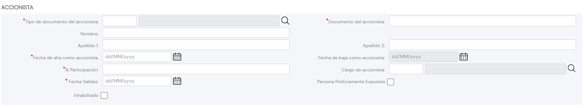

{ width="596" height="159" style="display: block; margin: 0 auto" }

# CREAR Accionistas del Tercero {#titulo}

## Objetivo

Una acción ​ en el mercado financiero es un título emitido por una Sociedad Anónima o Sociedad comanditaria por acciones que representa el valor de una de las fracciones iguales en que se divide su capital social.

El propósito en la acción de identificación de los Accionistas del Tercero, siempre y cuando la tipología del Tercero corresponda a una PERSONA JURÍDICA, es cumplir con la normativa de prevención de lavado de activos monetarios puesto que la identificación accionarial permitiría a la entidad aseguradora gestionar y controlar en sus procesos internos dicho supuesto.

## Accionistas

### **Tipo Documento Accionista**

Este Atributo del colapsador contiene el [tipo de documento] con el que se va a identificar a la persona física o jurídica accionista de acuerdo con los tipos de documentos que hayan sido configurados en el sistema previamente.

### **Clave del Documento Accionista**

Este Atributo del panel contiene la clave del documento del Accionista.

### **Nombre**

Este Atributo del colapsador contendrá el nombre del Accionista.

### **Apellidos**

Estos dos Atributos del colapsador permiten capturar los Apellidos o la Razón Social del accionista.

### **Fecha de Alta**

Este Campo identifica la fecha en la que el Accionista tiene los derechos accionariales del Tercero.

### **Fecha de Baja**

Este Campo identifica la fecha en la que el Accionista causa baja en relación con los derechos accionariales del Tercero al que está asociado.

### **Porcentaje Accionarial**

Este Campo identifica el Porcentaje accionarial del Accionista en relación al número de acciones emitidas por el Tercero.

### **Cargo**

Este Campo identifica el Cargo Accionarial que sustenta el Accionista de acuerdo con los posibles valores en los cargos definidos en el [catálogo maestro](../../../../../../01-TRON/01-Documentacion/01-Modulos/02-Terceros/01-Definicion/01-Comun/DEFINICION-de-Cargo-en-Personas-Juridicas.md#titulo) existente en el Sistema.

### **Fecha de Validez**

Esta propiedad le indica al sistema la fecha a partir de la cual el Accionista del Tercero estará plenamente operativo en el sistema por lo que su correcto uso permite tener un histórico de los cambios efectuados con su información.

### **Marca Persona Políticamente Expuesta**

Este Atributo permite identificar al Accionista como Persona Políticamente Expuesta, marca que permitiría a la entidad aseguradora gestionar y controlar en sus procesos internos este hecho.

### **Inhabilitación**

Esta propiedad establece que el Accionista está inhabilitado en el sistema.

[tipo de documento]: <../../../../../../01-TRON/01-Documentacion/01-Modulos/02-Terceros/01-Definicion/01-Comun/DEFINICION-de-Documento-Identificativo.md#titulo>