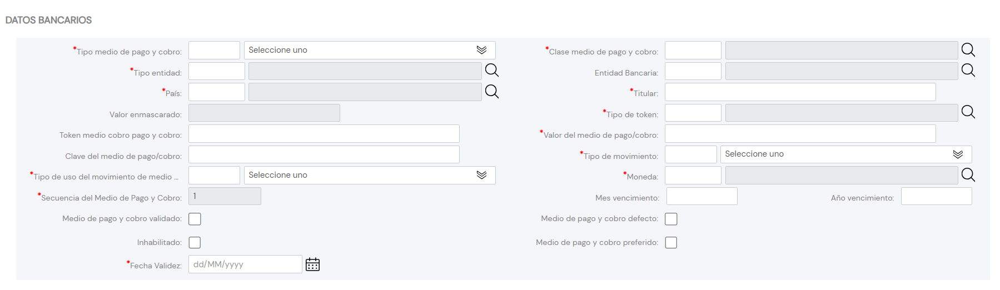

{ width="596" height="159" style="display: block; margin: 0 auto" }

# CREAR Datos Bancarios del Tercero {#titulo}

## Objetivo

El propósito de esta tarea es la identificación de los Datos Bancarios (Cuentas, Tarjetas, ...) asociadas al Tercero.

# Datos Bancarios

>De Izquierda a Derecha y de Arriba hacia Abajo, los siguientes atributos marcan la secuencia de captura de la Información en el sistema.

### **Tipo Medio Cobro/Pago**

De acuerdo con la Operativa de Tesorería de la Entidad, este dato contendrá el Tipo del Medio de Cobro/Pago del Tercero de acuerdo con la codificación efectuada localmente por parte de la entidad aseguradora para su posterior uso en los procesos internos de la entidad.

A modo de ejemplo sus valores podrían ser:

| Código TIPO MEDIO    |  Descripción       |
| -----------          | -----------        |
| 001                  | Cuenta Bancaria    |
| 002                  | Tarjeta Bancaria   |
| 003                  | Pago Móvil/Celular |
| 004                  | Monedero Virtual   |
| 005                  | Moneda Virtual     |
| 006                  | Pago On-Line       |

### **Clase Medio de Cobro/Pago**

Este Campo contiene el código de la Clase del Medio de Cobro/Pago asociado al Medio de Cobro/Pago del Tercero, de acuerdo con la relación de posibles valores existentes en el [catálogo maestro](../../../../../../01-TRON/01-Documentacion/01-Modulos/02-Terceros/01-Definicion/01-Comun/DEFINICION-de-Medio-de-Cobro-Pago.md#titulo) del Sistema.

### **Tipo de Entidad**

Este Campo contiene el código del Tipo de Entidad del Medio de Cobro/Pago asociado al Medio de Cobro/Pago del Tercero, de acuerdo con la relación de posibles valores existentes en el [catálogo maestro](../../../../../../01-TRON/01-Documentacion/01-Modulos/02-Terceros/01-Definicion/01-Comun/DEFINICION-de-Entidad-de-Cobro-Pago.md#titulo) del Sistema.

### **Entidad Bancaria**

Este Campo contiene el código de la Entidad Bancaria a la que pertenece el Medio de Cobro/Pago del Tercero, de acuerdo con la relación de posibles valores existentes en el [catálogo maestro](../../../../../../01-TRON/01-Documentacion/01-Modulos/02-Terceros/01-Definicion/12-Entidades-Bancarias/DEFINICION-de-Entidades-Bancarias.md#titulo) del Sistema.

### **Clave del País**

Este Campo contiene el código del primer nivel de la estructura Geográfica (países) en el que se estará identificando la ubicación del Medio de Cobro y Pago asociado al Tercero, de acuerdo con la relación de posibles valores existentes en el [catálogo maestro](../../../../../../01-TRON/01-Documentacion/01-Modulos/01-Comunes/01-Definicion/03-Estructura-geografica/DEFINICION-Nivel1-Estructura-Geografica.md#titulo) existente en el Sistema.

### **Titular**

Este Atributo identifica el Titular del Medio de Cobro/Pago.

### **Valor Enmascarado**

==Pendiente==

### **Tipo de Token**

Este Campo contiene el código del Tipo de Token del Medio de Cobro y Pago asociado al Tercero, de acuerdo con la relación de posibles valores existentes en el [catálogo maestro](../../../../../../01-TRON/01-Documentacion/01-Modulos/02-Terceros/01-Definicion/01-Comun/DEFINICION-de-Toquen-(Token).md#titulo) existente en el Sistema.

### **Token Medio Cobro Cobro/Pago**

==Pendiente==

### **Valor del Medio Cobro/Pago**

==Pendiente==

### **Clave del Medio Cobro/Pago**

==Pendiente==

### **Tipo de Movimiento**

Este Atributo identifica que el Medio de Cobro/Pago se puede utilizar para una realizar Cobros o Pagos.

### **Tipo Uso del Movimiento**

De acuerdo con la Operativa de Tesorería de la Entidad, este dato contendrá el Tipo del Medio de Cobro/Pago del Tercero de acuerdo con la codificación efectuada localmente por parte de la entidad aseguradora para su posterior uso en los procesos internos de la entidad.

A modo de ejemplo sus valores podrían ser:

| Código TIPO MEDIO    |  Descripción       |
| -----------          | -----------        |
| 001                  | Cuenta Bancaria    |
| 002                  | Tarjeta Bancaria   |
| 003                  | Pago Móvil/Celular |
| 004                  | Monedero Virtual   |
| 005                  | Moneda Virtual     |
| 006                  | Pago On-Line       |

### **Moneda**

Este Campo contendrá el código de la Moneda del Medio de Cobro/Pago de acuerdo con la relación de posibles valores existentes en el [catálogo maestro](../../../../../../01-TRON/01-Documentacion/01-Modulos/01-Comunes/01-Definicion/01-Moneda/DEFINICION-de-Moneda.md#código-de-la-divisa) de Monedas existente en el Sistema.

### **Secuencia/Orden**

Este dato contiene el Número de Secuencia del Medio de Cobro/Pago asociado al Tercero. Es un valor que se asigna automáticamente.

### **Mes Vencimiento**

Este Atributo contiene el Mes de Vencimiento del Medio de Cobro/Pago del Tercero.

### **Año Vencimiento**

Este Atributo contiene el Año de Vencimiento del Medio de Cobro/Pago del Tercero.

### **Medio Cobro/Pago Validado**

Este Dato indica si el Medio de Cobro/Pago ha sido o no validado, a efectos de calidad del dato, por la entidad aseguradora.

### **Medio Cobro/Pago por Defecto**

Este Campo, en aquellos Terceros que tienen más de un medio de Cobro/Pago asociado, indicará cual de ellos es el que aparecerá por defecto en los Procesos Operativos de la Entidad. Solamente puede haber uno identificado y marcado como tal.

### **Inhabilitación**

Esta propiedad establece si el Medio de Cobro/Pago asociado al Tercero ha dejado de estar en vigor por lo que no debería ser considerado en ninguno de los procesos de la entidad.

### **Medio Cobro/Pago Prioritario**

Este Campo, en aquellos Terceros que tienen más de un medio de Cobro/Pago asociado, indicará cual de ellos es el que se ha de considerar preferentemente en los Procesos Operativos de la Entidad. Solamente puede haber uno identificado y marcado como tal por cada **Tipo de Medio de Cobro/Pago**

### **Fecha de Validez**

Esta propiedad le indica al sistema la fecha a partir de la cual el Medio de Cobro/Pago estará plenamente operativo en el sistema por lo que su correcto uso permite tener un histórico de los cambios efectuados en su información.
