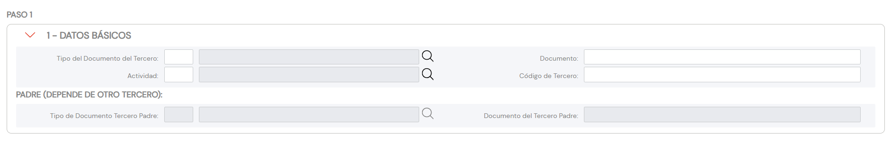

{ width="596" height="159" style="display: block; margin: 0 auto" }

# CREAR Datos Básicos del Tercero {#titulo}

## Objetivo

El propósito de la acción de creación de los Datos Básicos del Tercero es la **identificación** inequívoca e incontestable del Tercero Asegurado en el sistema.

## Datos Básicos

### **Tipo Documento Identificador**

Este Atributo del colapsador contiene el [tipo de documento] con el que se va a identificar a la persona física o jurídica de acuerdo con los tipos de documentos que hayan sido configurados en el sistema previamente.

### **Clave del Documento Identificador**

Este Atributo del catálogo contendrá la clave del Asegurado.

A modo de ejemplos:

- El Banco de Santander como persona jurídica se identifica en el Reino de España con el Tipo de Documento **NIF** con clave de documento **A-39000013**
- Juan Pérez Pérez como persona física se identificará en el sistema con el Tipo de Documento **DNI** cuya clave es **50818772**

### **Código de Actividad del Tercero**

Esta propiedad indicará el código de la [Actividad](../../../../../../01-TRON/01-Documentacion/01-Modulos/02-Terceros/01-Definicion/01-Comun/DEFINICION-de-Actividad.md#titulo) del Tercero.

### **Código del Tercero** {#codigo-del-tercero}

Este dato será el código interno del sistema que se asignará al Tercero **automáticamente** caso que se haya configurado que la actividad del tercero obligue a tener un código interno y este sea asignado por el Sistema, o **manualmente** caso que la actividad del Tercero obligue a tener un código de Tercero.

### **Tipo Documento Identificador Principal**

Operativamente y en caso de ser necesario, este Atributo del panel de datos básicos contiene [tipo de documento] *principal* con el que se va a relacionar el tipo y la clave del documento del Tercero pudiendo de esta manera relacionar diversos documentos con uno único.

### **Clave del Documento Identificador Principal**

Operativamente y en caso de ser necesario, este Atributo del panel de datos básicos contiene la clave del documento *principal* con el que se va a relacionar el tipo y la clave del documento del Tercero pudiendo de esta manera **conectar** diversos documentos con un documento principal.

A modo de ejemplo: Puesto que en España todas las personas físicas tienen asignada un Número de Identificación Fiscal cuyo tipo de documento es el **NIF**, es factible considerarlo como Tipo de Documento Principal y relacionar así tanto el código del pasaporte (**PAS**) como el Documento Nacional de Identidad (**DNI**) del Tercero con el **NIF**, evitando de esta manera considerar que el Sistema contiene tres Terceros distintos frente a tener uno único.

[tipo de documento]: <../../../../../../01-TRON/01-Documentacion/01-Modulos/02-Terceros/01-Definicion/01-Comun/DEFINICION-de-Documento-Identificativo.md#titulo>