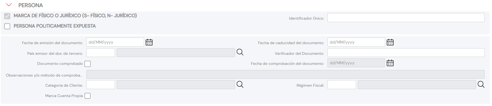

{ width="596" height="159" style="display: block; margin: 0 auto" }

# CREAR Datos Persona Física/Jurídica del Tercero {#titulo}

## Objetivo

La función de los datos que aparecen en este panel de información obedecen a los siguientes propósitos:

- **Identificar** al Tercero como Persona Física o Jurídica.
- **Identificar** o no al Tercero como **Persona Políticamente Expuesta**.
- **Complementar** la información específica del Documento identificador del Tercero.
- **Clasificar** al Tercero.

>De Izquierda a Derecha y de Arriba hacia Abajo, los siguientes atributos marcan la secuencia de captura en sus respectivos Bloques de Información en el sistema.

>Si no se especifica o indica expresamente, los Atributos se emplearán tanto en **Personas Físicas** como en **Personas Jurídicas**

# Datos Persona Persona Física/Jurídica

### **Persona Física o Persona Jurídica**

Esta marca de verificación, en aquellas actividades en las que se haya configurado la posibilidad de estar asociada tanto para personas físicas como para entidades jurídicas, indicará la tipología del Tercero.

### **ID único del Tercero**

Siempre y cuando se haya definido en la configuración de los parámetros de la [compañía](../../../../../../01-TRON/01-Documentacion/01-Modulos/01-Comunes/01-Definicion/DEFINICION-de-Compania.md#id-único-de-terceros) la necesidad de identificar unívocamente a los Terceros en todas las aplicaciones que gestionen su información, este atributo contendrá el código del Identificador único del Tercero que se asignará automáticamente al Tercero mediante la ejecución de una lógica de negocio local, permitiendo de esta manera la integración y cruce de datos entre los sistemas.

`NOTA`: Este atributo **NO SUSTITUYE** en ningún caso la funcionalidad soportada por el atributo del [Código del Tercero](./CREAR-Datos-Basicos-Terceros.md#codigo-del-tercero) que es de uso interno de TRON.

### **Persona Políticamente Expuesta**

La activación de esta marca de verificación modula el comportamiento del sistema permitiendo ingresar los datos específicos de la persona en el [panel de información](./CREAR-Personas-Politicamente-Expuestas.md) correspondiente.

### **Fecha de Emisión**

Esta propiedad indicará la Fecha de Emisión del Documento del Tercero.

### **Fecha de Caducidad**

Esta propiedad indicará la Fecha de Caducidad del Documento del Tercero.

### **País Emisor**

Este Campo contiene el código del país emisor del documento del Tercero de acuerdo con la relación de posibles valores existentes en el [catálogo maestro](../../../../../../01-TRON/01-Documentacion/01-Modulos/01-Comunes/01-Definicion/03-Estructura-geografica/DEFINICION-Nivel1-Estructura-Geografica.md#titulo) de Países existente en el Sistema.

### **Verificador del Documento Identificador**

==Pendiente==

### **Marca de Comprobación**

Esta propiedad permite considerar en los procesos de la entidad si el documento del Tercero ha sido o no revisado y verificado, todo ello en relación con la calidad de los datos en el sistema.

### **Fecha de Comprobación**

En el supuesto que el estado de la marca de comprobación implique que el documento del Tercero haya sido revisado y comprobado, este campo contemplará la fecha en la que esta acción se habrá realizado.

### **Observaciones**

Caso que el documento del Tercero haya sido revisado y validado, este Dato permite ingresar un texto aclaratorio u observaciones sobre el método realizado para su comprobación.

### **Categoría del Tercero**

Este Campo contiene el código de la Categoría asignada al Tercero de acuerdo con la relación de posibles valores existentes en el [catálogo maestro](../../../../../../01-TRON/01-Documentacion/01-Modulos/02-Terceros/01-Definicion/01-Comun/DEFINICION-de-Categoria.md#titulo) existente en el Sistema.

### **Régimen Fiscal**

Este Campo contiene el código del Régimen Fiscal del Tercero de acuerdo con la relación de posibles valores existentes en el [catálogo maestro](../../../../../../01-TRON/01-Documentacion/01-Modulos/02-Terceros/01-Definicion/01-Comun/DEFINICION-de-Regimen-Fiscal.md#itulo) existente en el Sistema.

### **Por Cuenta Propia**

Este dato permite identificar al Tercero como *Trabajador por cuenta propia* siempre y cuando el Tercero sea persona física y realice una actividad económica de forma independiente y directa, sin estar sujeto a un contrato de trabajo, aunque éste utilice el servicio remunerado de otras personas para llevar a cabo su actividad (empleador).

# Persona Legal

El propósito de los datos que aparecen en este panel de información no es otro que ingresar en el sistema ciertas características económicas del Tercero siempre y cuando este sea una **persona Jurídica**.

### **Alias del Tercero**

Este Campo permite capturar la Denominación del Tercero Jurídico.

### **Sociedad para Consolidación en Grupo MAPFRE - GL**

Este Dato permite capturar el Código Societario del Tercero Jurídico para su consolidación en los procesos del Grupo MAPFRE.

### **Actividad Económica**

Este atributo contiene una *clasificación* de las Actividades económicas en los Terceros Jurídicos que ha de ser realizada localmente por parte de la entidad aseguradora para su posterior uso en los procesos internos de la entidad.

A modo de ejemplo sus valores podrían ser:

| Código ACTIVIDAD.         |  Descripción            |
| -----------               | -----------             |
| 001                       | Actividad Comercial     |
| 002                       | Actividad AA.PP         |
| 003                       | Actividad Industrial    |
| ...                       | ...                     |

### **Tipo de Actividad Económica**

Este Campo contiene el código del Tipo de Actividad Económica del Tercero de acuerdo con la relación de posibles valores existentes en el [catálogo maestro](../../../../../../01-TRON/01-Documentacion/01-Modulos/02-Terceros/01-Definicion/01-Comun/DEFINICION-de-Actividad-Economica.md#titulo) de Actividades Económicas existente en el Sistema.

### **Folio Registral**

Cada Tercero como persona Jurídica debe tener un número que lo identifica y diferencia de los documentos similares (esta numeración individual recibe el nombre de folio).

### **Fecha de Constitución**

Puesto que las personas jurídicas nacen como consecuencia de un acto jurídico (acto de constitución), según un sistema de mera existencia, o bien por el reconocimiento que de ellas hace una autoridad u órgano administrativo o por concesión, este Atributo contemplará la fecha en la que el Tercero Jurídico se ha constituido como sociedad.

# Persona

El propósito de los datos que aparecen en este Bloque de información es **Identificar** los datos de filiación del Asegurado de acuerdo con la tipología del Tercero: Persona Física o bien Persona Jurídica.

### **Tratamiento**

Este Atributo contiene el Tratamiento de respeto que se antepone al nombre del Tercero y que por cortesía o por respeto está reservado a determinadas personas de elevado rango social.

A modo de ejemplo se podrían considerar:

| Código POSPUESTO.         |  Descripción  |
| -----------               | -----------   |
| 001                       | Don           |
| 002                       | Doña          |
| ...                       | ...           |

### **Pospuesto**

Este Dato contiene el código del pospuesto al Nombre Propio del Tercero para indicar alguna condición de este, como por ejemplo para indicar que se es más joven o mayor que otra Persona emparentada con ella, generalmente su padre, y del mismo nombre.

A modo de ejemplo se podrían codificar para las **Personas Físicas**:

| Código POSPUESTO.         |  Descripción  |
| -----------               | -----------   |
| 001                       | Junior        |
| 002                       | Senior        |
| ...                       | ...           |

Mientras que en el caso de **Personas Jurídicas**:

| Código POSPUESTO.         |  Descripción  |
| -----------               | -----------   |
| 003                       | U.T.E.        |
| 004                       | S.A.          |
| 005                       | Ltd.          |
| 006                       | G.M.B.H       |
| ...                       | ...           |

### **Nombre**

Este Atributo contiene el nombre del Tercero, en caso que el Tercero sea una Persona Física, o la Razón Social caso que sea una Persona Jurídica.

### **Segundo Nombre**

Siempre y cuando el Tercero sea una Persona Física, este dato contendrá el segundo nombre del Tercero.

### **Primer Apellido**

Siempre y cuando el Tercero sea una Persona Física, este dato contendrá el primer Apellido del Tercero.

### **Segundo Apellido**

Siempre y cuando el Tercero sea una Persona Física, este dato contendrá el segundo Apellido del Tercero.

### **Apellido de Casado/a**

Siempre y cuando el Tercero sea una Persona Física, este dato contendrá el Apellido de casado/a del Tercero (en aquellos países en los que esta costumbre relacionada con los nombres de soltero en el matrimonio sea de uso extendido).

### **Estado Civil**

Siempre y cuando el Tercero sea una Persona Física, este dato contendrá el código del Estado Civil del Tercero de acuerdo con la codificación efectuada localmente por parte de la entidad aseguradora para su posterior uso en los procesos internos de la entidad.

A modo de ejemplo sus valores podrían ser:

| Código ESTADO CIVIL       |  Descripción     |
| -----------               | -----------      |
| 001                       | Soltero/a        |
| 002                       | Casado/a         |
| 003                       | Viudo/a          |
| ...                       | ...              |

### **Fecha de Nacimiento**

Siempre y cuando el Tercero sea una Persona Física, este dato indicará la Fecha de nacimiento del Tercero.

### **Fecha de Fallecimiento**

Siempre y cuando el Tercero sea una Persona Física, este dato indicará la Fecha de fallecimiento del Tercero.

### **Fecha de Inicio de Residencia**

Siempre y cuando el Tercero sea una Persona Física, este dato indicará la Fecha de inicio de Residencia del Tercero.

### **Nacionalidad**

Siempre y cuando el Tercero sea una Persona Física, este dato indicará la nacionalidad del Tercero .

### **Tipo de Nacionalidad**

Siempre y cuando el Tercero sea una Persona Física, este dato contendrá el código de Tipo de Nacionalidad del Tercero de acuerdo con la codificación efectuada localmente por parte de la entidad aseguradora para su posterior uso en los procesos internos de la entidad.

A modo de ejemplo sus valores podrían ser:

| Tipo de NACIONALIDAD      |  Descripción     |
| -----------               | -----------      |
| 001                       | Nacional         |
| 002                       | Comunitario      |
| 003                       | No Comunitario   |
| ...                       | ...              |

### **País de Nacimiento/Constitución**

Este Campo contiene el código del primer nivel de la estructura Geográfica en el que haya nacido la Persona o se haya constituido el Tercero Jurídico, de acuerdo con la relación de posibles valores existentes en el [catálogo maestro](../../../../../../01-TRON/01-Documentacion/01-Modulos/01-Comunes/01-Definicion/03-Estructura-geografica/DEFINICION-Nivel1-Estructura-Geografica.md#titulo) existente en el Sistema.

### **Estado de Nacimiento/Constitución**

Este Campo contiene el código del segundo nivel de la estructura Geográfica en el que haya nacido la Persona o se haya constituido el Tercero Jurídico, de acuerdo con la relación de posibles valores existentes en el [catálogo maestro](../../../../../../01-TRON/01-Documentacion/01-Modulos/01-Comunes/01-Definicion/03-Estructura-geografica/DEFINICION-Nivel2-Estructura-Geografica.md#titulo) existente en el Sistema.

### **Provincia de Nacimiento/Constitución**

Este Campo contiene el código del tercer nivel de la estructura Geográfica en el que haya nacido la Persona o se haya constituido el Tercero Jurídico, de acuerdo con la relación de posibles valores existentes en el [catálogo maestro](../../../../../../01-TRON/01-Documentacion/01-Modulos/01-Comunes/01-Definicion/03-Estructura-geografica/DEFINICION-Nivel3-Estructura-Geografica.md#titulo) existente en el Sistema.

### **Localidad de Nacimiento/Constitución**

Este Campo contiene el código del cuarto nivel de la estructura Geográfica en el que haya nacido la Persona o se haya constituido el Tercero Jurídico, de acuerdo con la relación de posibles valores existentes en el [catálogo maestro](../../../../../../01-TRON/01-Documentacion/01-Modulos/01-Comunes/01-Definicion/03-Estructura-geografica/DEFINICION-Nivel4-Estructura-Geografica.md#titulo) existente en el Sistema.

### **Idioma**

Este Campo contiene el código del Idioma asociado al Tercero de acuerdo con la relación de posibles valores existentes en el [catálogo maestro](../../../01-Comunes/01-Definicion/DEFINICION-de-Idioma.md) de Idiomas existente en el Sistema.

### **Género**

Siempre y cuando el Tercero sea una Persona Física, este dato indicará el género del Tercero .

### **Porcentaje Discapacidad**

Siempre y cuando el Tercero sea una Persona Física, este dato indicaría el porcentaje de Discapacidad del Tercero de acuerdo con las tablas de baremos y grados de minusvalías del país.

### **Profesión**

Siempre y cuando el Tercero sea una Persona Física, este Campo contiene el código de la Profesión asociada al Tercero de acuerdo con la relación de posibles valores existentes en el [catálogo maestro](../../../../../../01-TRON/01-Documentacion/01-Modulos/02-Terceros/01-Definicion/01-Comun/DEFINICION-de-Profesion.md#titulo) de Profesiones existente en el Sistema.

### **Ocupación**

Siempre y cuando el Tercero sea una Persona Física, este Campo contiene el código de la Ocupación asociada al Tercero de acuerdo con la relación de posibles valores existentes en el [catálogo maestro](../../../../../../01-TRON/01-Documentacion/01-Modulos/02-Terceros/01-Definicion/01-Comun/DEFINICION-de-Profesion.md) de Ocupaciones existente en el Sistema.

### **Nombre de la Empresa**

Siempre y cuando el Tercero sea una Persona Física, este dato permite indicar el nombre de la Empresa en la que el Tercero está ocupado.

### **Ingresos Mensuales Estimados**

Siempre y cuando el Tercero sea una Persona Física, este Campo contendrá el importe de los Ingresos Mensuales del Tercero.

### **Moneda**

Siempre y cuando el Tercero sea una Persona Física, este Campo contendrá el código de la Moneda en la que se han expresado los Ingresos Mensuales Estimados del Tercero de acuerdo con la relación de posibles valores existentes en el [catálogo maestro](../../../01-Comunes/01-Definicion/01-Moneda/DEFINICION-de-Moneda.md#código-de-la-divisa) de Monedas existente en el Sistema.

### **Nivel de Estudios**

Siempre y cuando el Tercero sea una Persona Física, este Campo contendrá el código del Nivel de Estudios del Tercero de acuerdo con la relación de posibles valores existentes en el [catálogo maestro](../../../../../../01-TRON/01-Documentacion/01-Modulos/02-Terceros/01-Definicion/01-Comun/DEFINICION-Nivel-de-Estudios.md) existente en el Sistema.

### **Titulación**

Siempre y cuando el Tercero sea una Persona Física, este Campo contendrá el código del Nivel de Estudios del Tercero de acuerdo con la relación de posibles valores existentes en el [catálogo maestro](../../../../../../01-TRON/01-Documentacion/01-Modulos/02-Terceros/01-Definicion/01-Comun/DEFINICION-de-Titulacion.md) existente en el Sistema.

### **Perfil Financiero Act. Principal**

Siempre y cuando el Tercero sea una Persona Jurídica, este Campo contendrá el código del Perfil Financiero del Tercero de acuerdo con la relación de posibles valores existentes en el [catálogo maestro](../../../../../../01-TRON/01-Documentacion/01-Modulos/02-Terceros/01-Definicion/01-Comun/DEFINICION-de-Perfil-Financiero.md) existente en el Sistema.

### **Perfil Financiero Act. Secundarias**

Siempre y cuando el Tercero sea una Persona Jurídica, este Campo contendrá el código del Perfil Financiero del Tercero de acuerdo con la relación de posibles valores existentes en el [catálogo maestro](../../../../../../01-TRON/01-Documentacion/01-Modulos/02-Terceros/01-Definicion/01-Comun/DEFINICION-de-Perfil-Financiero.md) existente en el Sistema.

### **Código Tipo Sociedad**

Siempre y cuando el Tercero sea una Persona Jurídica, este Dato contendrá el código Societario del Tercero de acuerdo con la relación de posibles valores existentes en el [catálogo maestro](../../../../../../01-TRON/01-Documentacion/01-Modulos/02-Terceros/01-Definicion/01-Comun/DEFINICION-de-Catalogo-Multiproposito-de-Terceros.md) existente en el Sistema.

### **Obligaciones Fiscales**

La activación de esta marca de verificación modula el comportamiento del sistema permitiendo ingresar los datos de aquellos países en los que el Tercero tiene [Obligaciones Fiscales](./CREAR-Obligaciones-Fiscales.md) correspondiente.

### **Número de Hijos**

Siempre y cuando el Tercero sea una Persona Física, este Dato contendrá el número de vástagos del Tercero.

## Vínculos

## Preguntas frecuentes

## Audiencia
