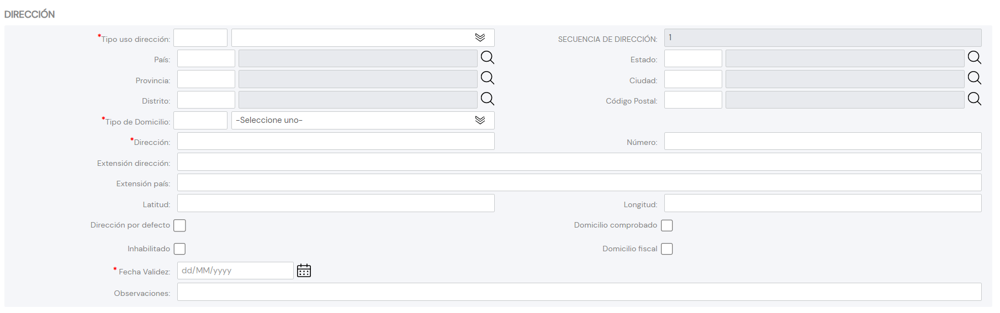
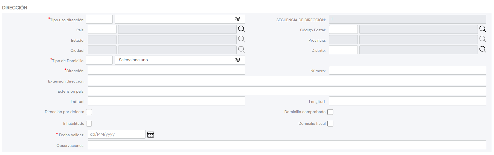

{ width="596" height="159" style="display: block; margin: 0 auto" }

# CREAR Direcciones del Tercero {#titulo}

## Objetivo

El propósito de esta acción no es otro que la captura de las Direcciones del Tercero.

>De Izquierda a Derecha y de Arriba hacia Abajo, los siguientes atributos marcan la secuencia de captura en el sistema.

# Direcciones

La secuencia de captura puede ser..

... De acuerdo con la configuración del [parámetro](../../../../../../01-TRON/01-Documentacion/01-Modulos/01-Comunes/01-Definicion/DEFINICION-de-Compania.md#captura-del-código-postal-o-de-la-dirección-postal) que le indica al Sistema el modo de visualización y captura de la información.

### **Uso de la Dirección**

Este dato contendrá el uso que se va a asociar a las Dirección del Tercero de acuerdo con la codificación efectuada localmente por parte de la entidad aseguradora para su posterior uso en los procesos internos de la entidad.

A modo de ejemplo sus valores podrían ser:

| Código USO DIRECCIÓN      |  Descripción     |
| -----------               | -----------      |
| 001                       | Residencial      |
| 002                       | Comercial        |
| 003                       | Correspondencia  |
| ...                       | ...              |

### **Secuencia/Orden**

Este dato contiene el Número de Secuencia en la Captura de las Direcciones del Tercero. Es un valor que se asigna automáticamente.

### **Pais**

Este Campo contiene el código del primer nivel de la estructura Geográfica en la que se encuentra ubicada la Dirección del Tercero de acuerdo con la relación de posibles valores existentes en el [catálogo maestro](../../../../../../01-TRON/01-Documentacion/01-Modulos/01-Comunes/01-Definicion/03-Estructura-geografica/DEFINICION-Nivel1-Estructura-Geografica.md#titulo) existente en el Sistema.

### **Estado**

Este Campo contiene el código del segundo nivel de la estructura Geográfica en la que se encuentra ubicada la Dirección del Tercero de acuerdo con la relación de posibles valores existentes en el [catálogo maestro](../../../../../../01-TRON/01-Documentacion/01-Modulos/01-Comunes/01-Definicion/03-Estructura-geografica/DEFINICION-Nivel2-Estructura-Geografica.md) existente en el Sistema.

### **Provincia**

Este Campo contiene el código del tercer nivel de la estructura Geográfica en la que se encuentra ubicada la Dirección del Tercero de acuerdo con la relación de posibles valores existentes en el [catálogo maestro](../../../../../../01-TRON/01-Documentacion/01-Modulos/01-Comunes/01-Definicion/03-Estructura-geografica/DEFINICION-Nivel3-Estructura-Geografica.md) existente en el Sistema.

### **Ciudad**

Este Campo contiene el código del cuarto nivel de la estructura Geográfica en la que se encuentra ubicada la Dirección del Tercero de acuerdo con la relación de posibles valores existentes en el [catálogo maestro](../../../../../../01-TRON/01-Documentacion/01-Modulos/01-Comunes/01-Definicion/03-Estructura-geografica/DEFINICION-Nivel4-Estructura-Geografica.md) existente en el Sistema.

### **Distrito**

Este Campo contiene el código del quinto nivel de la estructura Geográfica en la que se encuentra ubicada la Dirección del Tercero de acuerdo con la relación de posibles valores existentes en el [catálogo maestro](../../../../../../01-TRON/01-Documentacion/01-Modulos/01-Comunes/01-Definicion/03-Estructura-geografica/DEFINICION-Nivel5-Estructura-Geografica.md) existente en el Sistema.

### **Código Postal**

Esta Propiedad contiene la clave que identifica el Código Postal asociado a los cinco niveles de la estructura geográfica en la que está ubicada la Dirección del Tercero.

### **Tipo de Domicilio**

De acuerdo con el callejero local, este dato contendrá el Tipo de Vía que se va a asociar a las Dirección del Tercero de acuerdo con la codificación efectuada localmente por parte de la entidad aseguradora para su posterior uso en los procesos internos de la entidad.

A modo de ejemplo sus valores podrían ser:

| Código TIPO VIA      |  Descripción     |
| -----------          | -----------      |
| 001                  | Calle            |
| 002                  | Avenida          |
| 003                  | Plaza            |
| 004                  | Carretera        |
| 005                  | Eje Vial         |
| ...                  | ...              |

### **Dirección**

Este Campo contiene la Dirección detallada de acuerdo con el Callejero y los usos locales (Indicación o no de la Cerrada, Urbanización, Bloque, Escalera, Apartamento,...)

### **Número**

Este Atributo contiene el número de la Dirección del Tercero.

### **Complemento Dirección**

Este Campo permite capturar información complementaria de la Dirección del Tercero como por ejemplo:

1. Para indicar la Urbanización del Domicilio.
2. Para indicar algún punto kilométrico que facilite la ubicación del Domicilio.
3. Para indicar la Planta del Edificio en la que se encuentra la ubicación del Tercero en una Dirección tipificada como Dirección Comercial,

### **Complemento Pais**

Si la dirección que se está capturando en el sistema no es del país de la entidad aseguradora es posible que no se tenga en los catálogos de la estructura territorial la información correspondiente, por lo cual este campo permite capturar 'sin realizar validación alguna' los datos de la dirección.

NOTA: La captura de información en el Campo **Complemento Dirección** es excluyente de la captura de información del Campo **Complemento País**

### **Latitud**

CONTEXTO.

La latitud y la longitud son los dos tipos de coordenadas geográficas angulares que conforman el sistema de referencia planetario y que permiten ubicar un punto cualquiera en la superficie del planeta Tierra. 

El sistema de coordenadas que componen la latitud y longitud, conocido como Sistema de Coordenadas Geográficas, tiene como centro imaginario el centro de la Tierra y expresa sus valores en grados, minutos y segundos, acompañados de una letra que indica la orientación cardinal dentro del globo: Norte, Sur, Este u Oeste. Esta información suele anotarse entre paréntesis y se escriben **primero** los datos de la latitud y luego los de la longitud.

Por ejemplo: Coordenadas del punto X: (66° 33’ 9’’ N; 11° 04’ 13’’ E)

Es decir, el punto X está a 66 grados, 33 minutos, 9 segundos latitud norte, 11 grados, 4 minutos, 13 segundos longitud este. Es posible encontrar en algunos casos la letra W en vez de O para oeste, ya que se trata del término en inglés (West).

Latitud. Es el ángulo imaginario que determina la distancia entre un punto cualquiera y el ecuador (la línea imaginaria horizontal que divide al mundo en dos hemisferios: Norte y Sur). En otras palabras, se trata de qué tan lejos o tan cerca está un punto de la referencia del ecuador y de los trópicos que le son paralelos: el trópico de Cáncer y el de Capricornio. La latitud se simboliza con la letra griega phi, ϕ.

Longitud. Es el ángulo imaginario que determina la distancia entre un punto y el meridiano de Greenwich o meridiano 0, que atraviesa la localidad del mismo nombre en Inglaterra. Dicho meridiano es vertical y divide al mundo en dos regiones, la occidental (Oeste) y la oriental (Este), y sirve para trazar los demás meridianos que cruzan imaginariamente el globo de manera paralela al meridiano de Greenwich. La longitud se simboliza con la letra griega lambda, λ.

Este Atributo de la dirección del Tercero tiene que contener la información correspondiente a los grados, minutos y segundos que identifiquen su latitud, ... en nuestro ejemplo **66° 33’ 9’’ N**

### **Longitud**

Este Atributo de la Dirección del Tercero debe contener la información correspondiente a los grados, minutos y segundos que identifican su longitud, ... con los datos del ejemplo anterior **11° 04’ 13’’ E**

### **Dirección por Defecto**

Este Campo, en aquellos Terceros que tienen más de una dirección asociada, indicará cual de ellas es la Dirección por Defecto del Tercero. Solamente puede haber una marcada como tal.

### **Marca de Comprobación**

Esta propiedad permite considerar en los procesos de la entidad si la Dirección del Tercero ha sido o no revisada y verificada, todo ello en relación con la calidad de los datos en el sistema.

### **Inhabilitación**

Esta propiedad le indica al Sistema que la Dirección asociada al Tercero está inhabilitada, por lo que no debería ser empleada, contemplada o utilizada en los procesos operativos de la entidad.

### **Domicilio Fiscal**

Este Campo, en aquellos Terceros que tienen más de una dirección asociada, indicará cual de ellas es la Dirección Fiscal del Tercero. Solamente puede haber una marcada como tal.

### **Fecha de Validez**

Esta propiedad indicará la Fecha de Validez de la Dirección del Tercero.

### **Observaciones**

Este Campo permite capturar información complementaria sobre la Dirección del Tercero o sobre el Proceso de Captura de su información.