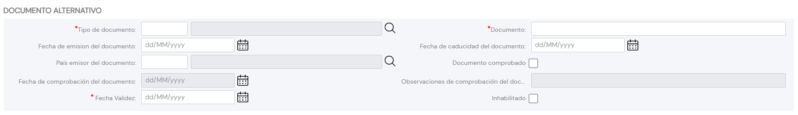

{ width="596" height="159" style="display: block; margin: 0 auto" }

# CREAR Documentos Alternativos del Tercero {#titulo}

## Objetivo

El propósito de la acción de captura de los Documentos Alternativos del Tercero es poder identificar al Tercero con documentos 'alternativos' al documento 'principal'.

## Documentos Alternativos

### **Tipo Documento Alternativo**

Este Atributo del colapsador contiene el [Documento Alternativo][Documento] con el que se va a identificar alternativamente al Tercero de acuerdo con los tipos de documentos existentes.

### **Clave del Documento Alternativo**

Este Atributo del panel contiene la clave del documento alternativo del Tercero.

### **Fecha de Emisión**

Esta propiedad indicará la Fecha de Emisión del Documento Alternativo del Tercero.

### **Fecha de Caducidad**

Esta propiedad indicará la Fecha de Caducidad del Documento Alternativo del Tercero.

### **País Emisor**

Este Campo contiene el código del país emisor del documento alternativo del Tercero de acuerdo con la relación de posibles valores existentes en el [catálogo maestro](../../../../../../01-TRON/01-Documentacion/01-Modulos/01-Comunes/01-Definicion/03-Estructura-geografica/DEFINICION-Nivel1-Estructura-Geografica.md#titulo) existente en el Sistema.

### **Marca de Comprobación**

Esta propiedad permite considerar en los procesos de la entidad si el documento alternativo ha sido o no revisado y verificado, todo ello en relación con la calidad de los datos en el sistema.

### **Fecha de Comprobación**

En el supuesto que el estado de la marca de comprobación implique que el documento alternativo ha sido revisado y comprobado, este campo contemplará la fecha en la que esta acción se habrá realizado.

### **Observaciones**

Caso que el documento alternativo haya sido revisado y validado, este Dato permite ingresar un texto aclaratorio u observaciones al hecho de la comprobación.

### **Fecha de Validez**

Esta propiedad le indica al sistema la fecha a partir de la cual el Documento Alternativo del Tercero estará plenamente operativo en el sistema por lo que su correcto uso permite tener un histórico de los cambios efectuados en su información.

[Documento]: <../../../../../../01-TRON/01-Documentacion/01-Modulos/02-Terceros/01-Definicion/01-Comun/DEFINICION-de-Documento-Identificativo.md#titulo>