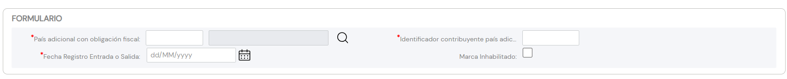

{ width="596" height="159" style="display: block; margin: 0 auto" }

# CREAR Obligaciones Fiscales del Tercero {#titulo}

## Objetivo

El propósito de la acción de identificación de aquellos **Países** en los que el Tercero tiene Obligaciones Fiscales o Tributarias permite contemplar o excluir al Tercero de aquellos procesos y procedimientos operativos de la entidad afectados por dicha situación.

## Obligaciones Fiscales.

### **Clave del País**

Este Campo contiene el código del primer nivel de la estructura Geográfica (países) en el que el Tercero está identificado como obligado tributario, de acuerdo con la relación de posibles valores existentes en el [catálogo maestro](../../../../../../01-TRON/01-Documentacion/01-Modulos/01-Comunes/01-Definicion/03-Estructura-geografica/DEFINICION-Nivel1-Estructura-Geografica.md#titulo) existente en el Sistema.

### **Clave/Código de Contribuyente**

Este Dato permite identificar la clave o el código del Tercero como Contribuyente local en el País en el que aparece como obligado tributario.

### **Fecha de Registro E/S**

Este Campo contiene la Fecha de Entrada o de Salida del Tercero con el status de Obligación Tributaria.

### **Inhabilitación**

Esta propiedad establece si el Tercero ha dejado de ser Obligado Tributario en el País en cuestión.