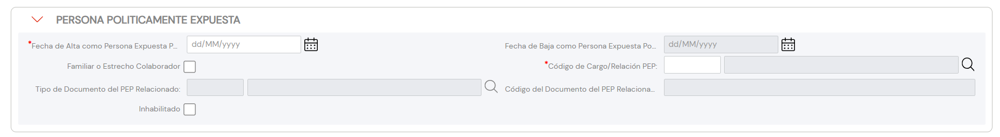

{ width="596" height="159" style="display: block; margin: 0 auto" }

# CREAR Personas Políticamente Expuestas del Tercero {#titulo}

## Objetivo

El propósito de la identificación de la relación de Personas Políticamente Expuestas relacionadas de una u otra manera con el Tercero previene y da cumplimiento.

## Datos Personas Políticamente Expuestas

Siempre y cuando se haya activado la [marca que identifica en el sistema](./CREAR-Datos-Persona-Fisica-Juridica.md#persona-políticamente-expuesta) que el Tercero tiene asociadas personas políticamente expuestas aparecerá el panel de información correspondiente de manera colapsada...

... o de manera extendida

### **Fecha de Alta como Persona Políticamente Expuesta**

Este Dato contendrá la fecha de Alta del Tercero como Persona Políticamente Expuesta o de la Persona Políticamente Expuesta relacionada con el Tercero.

### **Fecha de Baja como Persona Políticamente Expuesta**

Este Dato contendrá la fecha en la que el Tercero o la Persona Políticamente Expuesta relacionada causa baja en su relación con el Tercero.

### **Familiar / Colaborador**

Este Atributo permite identificar si la Persona Políticamente Expuesta relacionada es un Familiar o un Colaborador del Tercero.

### **Cargo o Relación con la Persona Políticamente Expuesta**

Este Campo identifica la relación o el Cargo del Tercero o de la Persona Políticamente Expuesta relacionada, de acuerdo con los posibles valores del [catálogo maestro](../../../../../../01-TRON/01-Documentacion/01-Modulos/02-Terceros/01-Definicion/01-Comun/DEFINICION-de-Persona-Politicamente-Expuesta.md#titulo) existente en el Sistema.

### **Tipo Documento Identificador de la Persona Políticamente Expuesta Relacionada**

Este Atributo del colapsador contiene el [tipo de documento][Documento] de la Persona Políticamente Expuesta relacionada con el Asegurado.

### **Clave del Documento Identificador de la Persona Políticamente Relacionada**

Este Atributo contiene la clave del documento Identificador de la Persona Políticamente Expuesta relacionada con el Asegurado.

### **Inhabilitación**

Esta propiedad le indica al Sistema que o bien el Tercero o la Asociación de la Persona Políticamente Expuesta con el Tercero está inhabilitada y por ende no debiera considerarse en los procesos de control internos existentes en la entidad.

[Documento]: <../../../../../../01-TRON/01-Documentacion/01-Modulos/02-Terceros/01-Definicion/01-Comun/DEFINICION-de-Documento-Identificativo.md#titulo>
