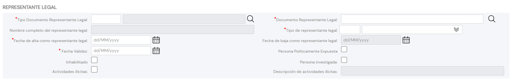

{ width="596" height="159" style="display: block; margin: 0 auto" }

# CREAR Representantes Legales del Tercero {#titulo}

## Objetivo

La representación legal es la facultad otorgada por la Ley a una persona para obrar en nombre de otra, recayendo en esta los efectos de tales actos. El ejercicio de esa representación puede ser obligatorio para el representante.

El propósito de esta acción es la Captura de la Información correspondiente a los Representantes Legales del Tercero.

>De Izquierda a Derecha y de Arriba hacia Abajo, los siguientes atributos marcan la secuencia de captura en el sistema.

# Representantes Legales

### **Tipo Documento Representante Legal**

Este Atributo del colapsador contiene el [Documento][Documento] con el que se va a identificar al Representante Legal de acuerdo con los tipos de documentos existentes en el sistema.

### **Clave del Documento**

Este Atributo contiene la clave del documento del Representante Legal del Tercero.

### **Nombre Completo**

Este Campo permite ingresar el nombre completo del Representante Legal del Tercero.

### **Tipo/Clase de Representación Legal**

Este dato contendrá la Clase o Tipología de Representación Legal que se va a asociar a la persona, de acuerdo con la codificación que se quiera efectuar localmente por parte de la entidad aseguradora (para el posterior uso y explotación de esta información en los procesos internos de la entidad).

A modo de ejemplo sus valores podrían ser:

| Tipo REPRESENTACIÓN LEGAL |  Descripción                |
| -----------               | -----------                 |
| 001                       | Directa                     |
| 002                       | Indirecta                   |
| 003                       | Activa                      |
| 004                       | Pasiva                      |
| 005                       | Legal                       |
| 006                       | Voluntaria                  |
| 007                       | en Interés Ajeno            |
| 008                       | en Interés del Representado |
| ...                       | ...                         |

### **Fecha Inicio**

Este Atributo indicará la Fecha de entrada en vigor de la persona como Representante Legal.

### **Fecha Fin**

Este Atributo indicará la Fecha en la que la persona deja de fungir como Representante Legal del Tercero.

### **Fecha de Validez**

Esta propiedad indicará la Fecha a partir de la cual entra en vigor como Representante Legal del Tercero.

### **Marca Persona Políticamente Expuesta**

Este Atributo permite identificar al Representante Legal como Persona Políticamente Expuesta, marca que permitiría a la entidad aseguradora gestionar y controlar en sus procesos internos esta circunstancia.

### **Inhabilitación**

Esta propiedad establece si el status del Representante Legal sigue en vigor o bien está inhabilitado para ejercer como tal.

### **Marca Persona Investigada**

Este Campo permite identificar al Representante Legal como Persona Investigada, marca que permitiría a la entidad aseguradora gestionar y controlar en sus procesos internos esta circunstancia.

### **Marca Realización Actividades Ilícitas**

Este Atributo permite identificar al Representante Legal como Persona que ha efectuado cualquier tipo de actividades ilícitas y por tanto la entidad Aseguradora estaría capacitada para gestionar y controlar en sus procesos internos esta circunstancia.

### **Descripción de Actividades**

En caso que la marca de realización de actividades ilícitas haya sido activada, este atributo permite ingresar la descripción de dichas actividades.

[Documento]: <../../../../../../01-TRON/01-Documentacion/01-Modulos/02-Terceros/01-Definicion/01-Comun/DEFINICION-de-Documento-Identificativo.md#titulo>