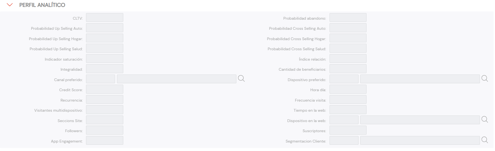

{ width="596" height="159" style="display: block; margin: 0 auto" }

# CONSULTAR Perfil Analítico {#titulo}

## Objetivo

El propósito de este Bloque de Información es poder visualizar los datos del Perfil Analítico del Tercero de acuerdo con el cálculo y carga de información efectuada   localmente por la Entidad aseguradora, responsable última de la calidad y coherencia de los Datos.

IMPORTANTE. Los valores de los Datos: *Canal y Dispositivo Preferido*, *Dispositivo en la Web* y *Segmentación Cliente* **deben contener** determinados códigos de acuerdo con la relación de los valores existentes en el [catálogo maestro](../../../../../../01-TRON/01-Documentacion/01-Modulos/02-Terceros/01-Definicion/01-Comun/DEFINICION-de-Catalogo-Multiproposito-de-Terceros.md#preguntas-frecuentes) existente en el Sistema.

# Perfil Analítico

### **C.L.T.V**

Contendrá el **El customer lifetime value** o valor del tiempo de vida del cliente que no es sino un pronóstico sobre la cantidad de dinero que espera recibir la empresa por parte de un usuario, durante todo el tiempo en que este siga siendo su cliente.

Si no se dispone de este dato deberá incluirse el margen de contribución y si tampoco se cuenta con él, el ratio combinado.

### **Probabilidad de Abandono**

La predicción de abandono es una técnica de marketing que busca identificar tempranamente a aquellos consumidores que tienen una alta probabilidad de dejar de ser clientes de la empresa.

Este Campo contiene el valor que la entidad, de acuerdo con sus modelos estadísticos, asigna al Asegurado.

### **Probabilidad Up Selling MOTOR**

En Marketing, se denomina 'Venta Adicional' a la técnica de ventas en la que un vendedor invita al cliente a comprar artículos más caros, actualizaciones u otros complementos para generar mayores ingresos para la Entidad Aseguradora ... En este caso la probabilidad estaría referenciada al Ramo Técnico de Automóviles.

### **Probabilidad Cross Selling MOTOR**

En marketing, se llama 'Venta Cruzada' a la táctica mediante la cual un vendedor intenta vender productos complementarios a los que consume o pretende consumir un cliente, en este caso la probabilidad está referenciada al Ramo Técnico de Automóviles.

### **Probabilidad Up Selling Hogar**

Similar a lo indicado previamente en el dato de *Probabilidad de Up Selling MOTOR* pero en esta ocasión para el Producto de Hogar.

### **Probabilidad Cross Selling Hogar**

Similar a lo indicado previamente en el Atributo de *Probabilidad de Cross Selling MOTOR* pero en esta ocasión para el Producto de Hogar.

### **Probabilidad Up Selling Salud**

Similar a lo indicado previamente en el dato de *Probabilidad de Up Selling MOTOR* pero en esta ocasión para el Producto de Salud.

### **Probabilidad Cross Selling Salud**

Similar a lo indicado previamente en el Atributo de *Probabilidad de Cross Selling MOTOR* pero en esta ocasión para el Producto de Salud.

### **Indicador Saturación**

Este Atributo indica el número de contactos totales recibidos por el Cliente por parte de MAPFRE para todos sus productos y servicios contratados.

### **Índice Relación**

Muestra el número de pólizas contratadas por el Cliente, independientemente del ramo en el que estén emitidas.

### **Integralidad**

Muestra el número de productos y pólizas de diferentes ramos contratadas por el Cliente.

### **Cantidad de Beneficiarios**

Este Dato muestra el número de beneficiarios del Cliente.

### **Canal Preferido**

Indica el canal preferido de contacto del Cliente para interaccionar con MAPFRE. Los valores posibles de este atributo se enumeran en su catálogo asociado.

### **Dispositivo Preferido**

Indica el dispositivo preferido utilizado por el Cliente para interaccionar con MAPFRE. Los valores posibles de este atributo se enumeran en su catálogo asociado

### **Credit Score**

Una puntuación de crédito es una expresión numérica basada en un análisis de nivel de los archivos de crédito de una persona, para representar la solvencia de un individuo, solvencia basada principalmente en un informe de crédito que generalmente se obtiene de las oficinas de crédito.

### **Hora Día**

Este Campo deber indicar el tramo horario del día en las cuáles el Asegurado navega por Internet.

### **Recurrencia**

Franja horaria de recurrencia más alta en la que el Cliente navega por Internet.

### **Frecuencia Visita**

Muestra el número de veces en las que el Cliente visita la página web de MAPFRE.

### **Visitantes Multi Dispositivo**

Indica si el Asegurado ha visitado la página web de MAPFRE desde más de un dispositivo diferente.

### **Tiempo en la Web**

Mide el tiempo en segundos que el Cliente está navegando por la web de MAPFRE.

### **Sections Site**

Muestra la sección de la página web en la que el Cliente contrató el producto o servicio de MAPFRE.

### **Dispositivo en la Web**

Recoge el dispositivo que utiliza el Cliente para acceder a los servicios o la página web de MAPFRE. Los valores posibles de este atributo se enumeran en su catálogo asociado.

### **Followers**

Sabiendo que un *Follower* es una Persona interesada en algo o alguien y que siguen su evolución, su trabajo o su trayectoria, especialmente en las redes sociales, este dato del Perfil Analítico de los Asegurados contendrá el número de Followers del mismo (de acuerdo con los procedimientos de cálculo de la entidad aseguradora)

### **Suscriptores**

Indica el número de subscriptores que tiene el Cliente a su canal de YouTube.

### **App Engagement**

Mide el número de aplicaciones diferentes de MAPFRE que utiliza el Cliente.

### **Segmentación Cliente**

Identifica la segmentación actual del Cliente. Los valores posibles de este atributo se enumeran en su catálogo asociado.

## Vínculos

## Preguntas frecuentes

## Audiencia

