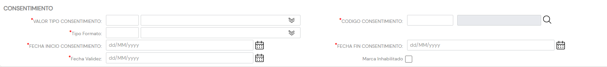

{ width="596" height="159" style="display: block; margin: 0 auto" }

# CREAR Consentimientos del Tercero {#titulo}

## Objetivo

Se entiende por consentimiento «toda manifestación de voluntad, libre, inequívoca, específica e informada, mediante la que el interesado acepta, ya sea mediante una declaración o una clara acción afirmativa, el tratamiento de datos personales que le conciernen.

El propósito en la identificación de los Consentimientos del Tercero, permite por tanto a la entidad Aseguradora el cumplimiento de la voluntad del Tercero.

>De Izquierda a Derecha y de Arriba hacia Abajo, los siguientes atributos marcan la secuencia de captura.

>Si no se especifica o indica expresamente, los Atributos se emplearán tanto en **Personas Físicas** como en **Personas Jurídicas**

# Consentimientos

### **Valor Tipo**

Esta propiedad indicará el **ámbito** del Consentimiento que se está asignando al Tercero.

Este atributo establece el ámbito de empleo del consentimiento del Tercero en la actividad de la Compañía Aseguradora, clasificación que ha de ser definida localmente por parte de la entidad aseguradora para su posterior uso en los procesos internos de la entidad.

A modo de ejemplo sus valores podrían ser:

| Código TIPO.         |  Descripción     |
| -----------          | -----------      |
| 001                  | Publicidad       |
| 002                  | Cesión de Datos  |
| 003                  | Perfilado        |
| ...                  | ...              |

### **Código Consentimiento**

Esta propiedad indicará la clave del Consentimiento que se está definiendo en el Sistema pudiendo agrupar bajo un mismo código distintos Tipos de Consentimiento.

Este Campo contiene el código del Tipo de Actividad Económica del Tercero de acuerdo con la relación de posibles valores existentes en el [catálogo maestro](../../../../../../01-TRON/01-Documentacion/01-Modulos/02-Terceros/01-Definicion/01-Comun/DEFINICION-de-Consentimiento.md#titulo) de Consentimientos existente en el Sistema.

### **Tipo Formato**

Este atributo contiene una *clasificación* de los Consentimientos del Tercero de acuerdo con la Normativa de Protección de Datos local, clasificación que ha de ser definida por parte de la entidad aseguradora para su posterior empleo en los procesos internos de la entidad.

A modo de ejemplo sus valores podrían ser:

| FORMATO.         |  Descripción    |
| -----------      | -----------     |
| 001              | No Otorgado     |
| 002              | Tácito          |
| 003              | Expreso         |
| 004              | Retirado        |
| ...              | ...             |

### **Fecha Inicio**

Este Atributo indicará la Fecha de entrada en vigor del Consentimiento del Tercero.

### **Fecha Fin**

Este Atributo indicará la Fecha en la que el Consentimiento del Tercero deja de estar activa.

### **Fecha Validez**

Esta propiedad le indica al sistema la fecha a partir de la cual el Consentimiento del Tercero estará plenamente operativo en el sistema por lo que su correcto uso permite tener un histórico de los cambios efectuados con su información.

### **Inhabilitación**

Esta propiedad le indica al Sistema que el Consentimiento asociado al Tercero está inhabilitado, por lo que no debería ser empleado, contemplado o utilizado en los procesos operativos de la entidad.
