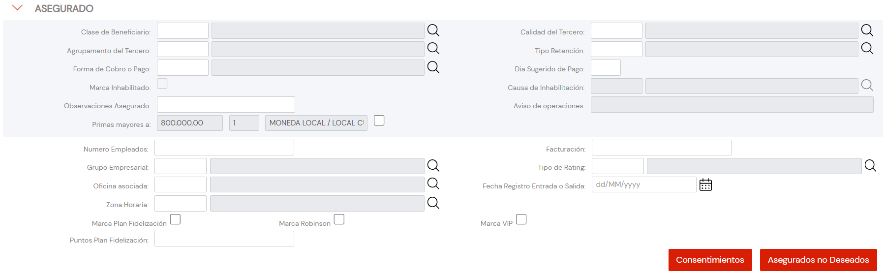

{ width="596" height="159" style="display: block; margin: 0 auto" }

# CREAR Información específica del Tercero Asegurado/Cliente {#titulo}

## Objetivo

La Tarea de capturar la información de este panel de información obedece a los siguientes propósitos:

- **Complementar** la información específica del Tercero como Asegurado.
- **Clasificar** al Asegurado para contemplarlo o no en determinados procesos de la entidad Aseguradora.

De Izquierda a Derecha y de Arriba hacia Abajo, los siguientes atributos marcan la secuencia de captura en este Bloque de Información.

Si no se especifica o indica expresamente, los Atributos se emplearán tanto en **Personas Físicas** como en **Personas Jurídicas**

# Datos Persona Persona Física/Jurídica

### **Clasificación**

Este Campo contendrá la Clasificación del Asegurado de acuerdo con la relación de valores existentes en el catálogo maestro de [Clasificaciones](../../../../../../01-TRON/01-Documentacion/01-Modulos/02-Terceros/01-Definicion/01-Comun/DEFINICION-de-Clasificacion.md#titulo) existente en el Sistema.

### **Calidad del Asegurado**

Este Campo contendrá la *calidad* del Asegurado de acuerdo con la relación de valores existentes en el catálogo maestro de [Códigos de Calidad](../../../../../../01-TRON/01-Documentacion/01-Modulos/02-Terceros/01-Definicion/01-Comun/DEFINICION-de-Codigo-de-Calidad.md#titulo) existente en el Sistema.

### **Agrupamiento Comercial del Asegurado**

Este Campo contendrá la Agrupación Comercial del Asegurado de acuerdo con la relación de valores definidos en el catálogo maestro de [Agrupaciones](../../../../../../01-TRON/01-Documentacion/01-Modulos/02-Terceros/01-Definicion/01-Comun/DEFINICION-de-Agrupacion.md#titulo) existente en el Sistema.

### **Tipo de Retención**

Este Dato contiene el código de uno de los Tipos de Retención configurados localmente por la Entidad Aseguradora.

### **Forma de Cobro/Pago**

Este Dato indicará el Código de la Forma de Cobro/Pago del Asegurado de acuerdo con las posibles Formas de Compensación definidas en el catálogo maestro de [Compensaciones](../../../../../../01-TRON/NOLINK.md)

### **Día Sugerido de Pago**

Este Campo en la Creación del Asegurado indica el día que este sugiere para que la entidad aseguradora realice los cargos correspondientes.

### **Inhabilitación**

Esta propiedad le indica al Sistema que el Asegurado está inhabilitado en el Sistema por lo que no debería ser empleado, contemplado o considerado en los procesos operativos de la entidad.

### **Causa de Inhabilitación**

En el supuesto que el Asegurado estuviera Inhabilitado, este Atributo contendrá el código de una [causa de Inhabilitación](../../../../../../01-TRON/01-Documentacion/01-Modulos/02-Terceros/01-Definicion/01-Comun/DEFINICION-de-Causa-de-Inhabilitacion-por-Actividad.md#titulo) definida en el catálogo maestro del Sistema.

### **Observaciones**

El propósito de este campo permite capturar información adicional del Asegurado de acuerdo con los Planteamientos o directrices que pudieran efectuar la Dirección de Clientes/Técnica,... de la entidad aseguradora.

### **Aviso de Operaciones**

En en el caso que el Tercero sea una Persona Jurídica y el [Control en la Prevención del Lavado de Dinero](../../../../../../01-TRON/01-Documentacion/01-Modulos/01-Comunes/01-Definicion/DEFINICION-de-Compania.md#limite-de-primas) esté activado, este campo indica si se va o no a tener que avisar a algún contacto del Tercero (identificado como Tercero de Referencia)

### **Primas Mayores a ...**

Esta Dato en la Creación del Asegurado está relacionado con el [Control en la Prevención del Lavado de Dinero](../../../../../../01-TRON/01-Documentacion/01-Modulos/01-Comunes/01-Definicion/DEFINICION-de-Compania.md#limite-de-primas) que la Entidad Aseguradora puede establecer en la configuración de las Compañías en el Sistema, para limitar los importes de las Primas de los Asegurados.

### **Moneda**

Este Campo contendrá el código de la Moneda en la que se ha expresado el valor de las **Primas Mayores a** del Asegurado de acuerdo con la relación de valores existentes en el [catálogo maestro](../../../../../../01-TRON/01-Documentacion/01-Modulos/01-Comunes/01-Definicion/01-Moneda/DEFINICION-de-Moneda.md#código-de-la-divisa) de Monedas existente en el Sistema.

### **Número de Empleados**

Este Atributo contendrá el número de empleados del Asegurado.

### **Facturación**

Este Atributo contendrá el importe de la Facturación Anual estimada del Asegurado.

### **Grupo Empresarial**

Este Campo contendrá el código del Grupo Empresarial al que pertenece el Asegurado de acuerdo a la posible relación de [Grupos Empresariales](../../../../../../01-TRON/01-Documentacion/01-Modulos/02-Terceros/01-Definicion/01-Comun/DEFINICION-de-Catalogo-Multiproposito-de-Terceros.md#titulo) identificados.

### **Tipo de Rating**

Este Campo contendrá la Calificación asignada al Asegurado de acuerdo con la relación de valores existentes en el catálogo maestro de [Calificaciones/Rating](../../../../../../01-TRON/01-Documentacion/01-Modulos/02-Terceros/01-Definicion/01-Comun/DEFINICION-de-Codigo-de-Calificacion-(Rating).md#titulo) existente en el Sistema.

### **Oficina Comercial**

Este atributo contiene el código del Tercer Nivel de la Estructura Comercial de acuerdo con la relación de valores existentes en el catálogo maestro de [Oficinas Comerciales](../../../../../../01-TRON/01-Documentacion/01-Modulos/01-Comunes/01-Definicion/02-Estructura-Comercial/DEFINICION-Nivel3-Estructura-Comercial.md#titulo) existente en el Sistema.

### **Fecha Registro**

Este Dato se utiliza para registrar la fecha real en la que el Asegurado entrega la documentación solicitada por la entidad aseguradora en aquellas entidades que tienen esta tarea como parte del Proceso de Identificación de sus Clientes (No confundir con la Fecha en la que se captura el Asegurado en el Sistema).

### **Zona Horaria**

Este Campo contendrá el código de la Zona Horaria asociada del Asegurado de acuerdo a la posible relación de [Zonas Horarias](../../../../../../01-TRON/01-Documentacion/01-Modulos/02-Terceros/01-Definicion/01-Comun/DEFINICION-de-Catalogo-Multiproposito-de-Terceros.md#titulo) habilitadas en el Sistema.

### **Fidelización**

Este Atributo permite contemplar o no en los procesos de la entidad si el Asegurado cuenta con un Plan de Fidelización.

### **Robinson**

Este Dato permite conocer si el Asegurado se debe incluir o no en los procesos de la entidad que impliquen cualquier tipo de contacto/comunicación con el Asegurado.

### **Asegurado V.I.P**

Esta marca permite identificar al Asegurado como un Cliente Importante.

### **Puntos Plan de Fidelización**

Caso de contar con un Plan de Fidelización, este campo contiene el número de *puntos acumulados* que tiene el Asegurado.

## Vínculos

## Preguntas frecuentes

## Audiencia
