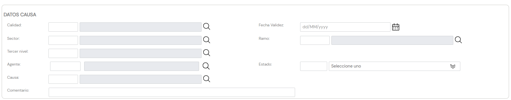

{ width="596" height="159" style="display: block; margin: 0 auto" }

# CREAR Terceros No Deseados {#titulo}

## Objetivo

El propósito de esta pantalla es proporcionar la funcionalidad para que el Sistema pueda registrar al Tercero como un **Tercero No Deseado**, de acuerdo con su código de [actividad](../../../../../../01-TRON/01-Documentacion/01-Modulos/02-Terceros/01-Definicion/01-Comun/DEFINICION-de-Actividad.md#titulo) y de los valores de los atributos que conforman su asignación.

# Datos Terceros No Deseados

De Izquierda a Derecha y de Arriba hacia Abajo, los siguientes atributos marcan la secuencia de captura de la Información en el sistema.

### **Calidad**

Este Campo va a permitir capturar el [código de calidad](../../../../../../01-TRON/01-Documentacion/01-Modulos/02-Terceros/01-Definicion/01-Comun/DEFINICION-de-Codigo-de-Calidad.md#titulo) que se va a asociar al Tercero de acuerdo a los valores codificados en el catálogo maestro existente en el Sistema, en el momento de registrarlo como Tercero No Deseado.

### **Fecha de Validez**

Esta propiedad le indica al sistema la fecha a partir de la cual el Tercero va a ser identificado como Tercero No Deseado por lo que su correcto uso permite tener un histórico de los cambios efectuados en la Información del Tercero.

### **Sector**

Este Campo contiene el código del [Sector](../../../../../../01-TRON/01-Documentacion/01-Modulos/01-Comunes/01-Definicion/04-Estructura-Producto/DEFINICION-de-Sector.md#titulo), de acuerdo a la estructura de productos definida en el catálogo maestro de Sectores existente en el Sistema.

De esta manera el sistema contempla la posibilidad de marcaje de un Tercero como Tercero No Deseado para un único Sector de los n existentes.

### **Ramo**

Este Campo deber contener el código del [Ramo Técnico](../../../../../../01-TRON/01-Documentacion/01-Modulos/01-Comunes/01-Definicion/04-Estructura-Producto/DEFINICION-Ramo-Tecnico.md#titulo), de acuerdo a la estructura de productos definida en el catálogo maestro de Productos existente en el Sistema.

De esta manera el sistema permite marcar al Tercero como No Deseado para un único Ramo Técnico de los n existentes.

### **Tercer Nivel**

Este Campo ha de contener el [código del Tercer Nivel](../../../../../../01-TRON/01-Documentacion/01-Modulos/01-Comunes/01-Definicion/02-Estructura-Comercial/DEFINICION-Nivel3-Estructura-Comercial.md#titulo) de la Estructura Comercial, de acuerdo con la relación de posibles valores existentes en el [catálogo maestro] del Sistema.

De esta manera el sistema permite marcar al Tercero como No Deseado para una única Oficina Comercial de las posibles.

### **Agente**

Este Campo tiene que registrar el [código del Agente](../../../../../../01-TRON/01-Documentacion/01-Modulos/02-Terceros/01-Definicion/03-Agentes/DEFINICION-Agente.md#titulo) de acuerdo con la relación de posibles valores existentes en el catálogo maestro de Intermediarios del Sistema.

De esta manera el sistema permite determinar al Tercero como No Deseado para un único Intermediario de los existentes en el Sistema.

### **Estado**

Este atributo contiene una *clasificación* de los Estados de Identificación del Tercero como Tercero No Deseado, clasificación que ha de ser definida por parte de la entidad aseguradora para su posterior consideración y empleo en los procesos internos de la entidad.

A modo de ejemplo sus valores podrían ser:

| FORMATO.         |  Descripción    |
| -----------      | -----------     |
| 001              | Temporal        |
| 002              | Permanente      |
| 003              | Parcial         |
| 004              | Total        |
| ...              | ...             |

### **Causa**

Este Campo contiene el código del motivo por el cual se está Inhabilitando al Tercero, de acuerdo a los valores codificados en el [catálogo maestro](../../../../../../01-TRON/01-Documentacion/01-Modulos/02-Terceros/01-Definicion/01-Comun/DEFINICION-de-Causa-de-Inhabilitacion-por-Actividad.md#titulo) de causas de inhabilitación por código de actividad existente en el Sistema.

### **Comentarios**

Este Atributo permite capturar texto plano para ampliar o detallar el motivo por el que se está considerando al Tercero como una Persona Física o Jurídica indeseable.

## Vínculos

## Preguntas frecuentes

## Audiencia
