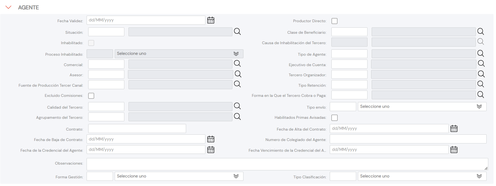

{ width="596" height="159" style="display: block; margin: 0 auto" }

# CREAR Información específica del Agente/Intermediario {#titulo}

## Objetivo

La Tarea de capturar la información de este panel de información obedece a los siguientes propósitos:

- **Capturar** la información de ámbito operativo del Agente dentro de la entidad Aseguradora.
- **Clasificar** al Agente para contemplarlo o no en determinados procesos de la entidad Aseguradora.

De Izquierda a Derecha y de Arriba hacia Abajo, los siguientes atributos marcan la secuencia de captura en este Bloque de Información.

Si no se especifica o indica expresamente, los Atributos se emplearán tanto en **Personas Físicas** como en **Personas Jurídicas**

# Datos Persona Persona Física/Jurídica

### **Fecha de Validez**

Esta propiedad le indica al Sistema la fecha a partir de la cual el Agente está plenamente operativo en el sistema por lo que su empleo y correcta utilización permite tener en la entidad Aseguradora un histórico de los cambios efectuados en la configuración de los Agentes.

### **Productor Directo?**

La activación de esta marca en la captura de la información del Asegurado califica al Agente como Productor Directo.

### **Situación**

El sentido de esta propiedad es permitir asignar un código de situación al Agente para que la entidad aseguradora, tras haber analizado la conveniencia de utilizarlo transversalmente en los procesos de la compañía, lo utilice adecuadamente.

A modo de *ejemplo* y si el Idioma utilizado en la definición es el español:

| Tipos de Situación | Descripción          |
| :-----------:      | -----------          |
| AAA                | Agente Inactivo      |
| BBB                | Agente Retirado      |
| ...                | ...                  |

### **Clasificación**

Este Campo contendrá la Clasificación del Agente de acuerdo con la relación de valores existentes en el catálogo maestro de [Clasificaciones](../../../../../../01-TRON/01-Documentacion/01-Modulos/02-Terceros/01-Definicion/01-Comun/DEFINICION-de-Clasificacion.md#titulo) existente en el Sistema.

### **Inhabilitación**

Esta propiedad le indica al Sistema que el Agente/Intermediario está inhabilitado en el Sistema por lo que no debería ser empleado, contemplado o considerado en los procesos operativos de la entidad.

### **Causa de Inhabilitación**

En el supuesto que el Agente estuviera Inhabilitado, este Atributo contendrá el código de una [causa de Inhabilitación](../../../../../../01-TRON/01-Documentacion/01-Modulos/02-Terceros/01-Definicion/01-Comun/DEFINICION-de-Causa-de-Inhabilitacion-por-Actividad.md#titulo) definida en el catálogo maestro del Sistema.

### **Proceso Inhabilitado**

Los 2 posibles valores de este campo implican que el Agente o bien está inhabilitado para comercializar pólizas de Nueva Producción o bien está inhabilitado para intermediar pólizas de Nueva Producción y realizar suplementos a su Cartera de pólizas, de acuerdo con la relación de valores existentes en el catálogo maestro del núcleo del Sistema.

### **Tipo de Agente**

Este Campo contendrá la Tipología del Agente de acuerdo con la relación de valores existentes en el catálogo maestro de [Tipos de Intermediarios](../../../../../../01-TRON/01-Documentacion/01-Modulos/02-Terceros/01-Definicion/03-Agentes/DEFINICION-Tipo-de-Agente.md#titulo) existente en el Sistema.

### **Oficina Comercial**

Este Campo contendrá Una de las Oficinas Comerciales que el Agente puede tener asociadas, de acuerdo con la relación de valores existentes en el catálogo maestro de [Oficinas Comerciales](../../../../../../01-TRON/01-Documentacion/01-Modulos/01-Comunes/01-Definicion/02-Estructura-Comercial/DEFINICION-Nivel3-Estructura-Comercial.md#titulo) existente en el Sistema.

### **Ejecutivo de Cuenta**

Este Campo contendrá el código del Ejecutivo de Cuenta al que estará asignado el Agente, de acuerdo con la relación existente en el catálogo maestro de [Agentes](../../../../../../01-TRON/01-Documentacion/01-Modulos/02-Terceros/01-Definicion/03-Agentes/DEFINICION-Tipo-de-Agente.md#titulo) existente en el Sistema.

NOTA: El Código del Ejecutivo de Cuenta, ha de ser un código de Tercero configurado en el Sistema con el [Código de Actividad](../../../../../../01-TRON/01-Documentacion/01-Modulos/02-Terceros/01-Definicion/01-Comun/DEFINICION-de-Actividad.md#titulo) **11**.

### **Asesor Comercial**

Este Campo contendrá el código del Asesor Comercial al que estará asignado el Agente, de acuerdo con la relación existente en el catálogo maestro de [Agentes](../../../../../../01-TRON/01-Documentacion/01-Modulos/02-Terceros/01-Definicion/03-Agentes/DEFINICION-Tipo-de-Agente.md#titulo) existente en el Sistema.

### **Organizador Comercial**

Este Campo contendrá el código del Organizador Comercial al que estará asignado el Agente, de acuerdo con la relación existente en el catálogo maestro de [Agentes](../../../../../../01-TRON/01-Documentacion/01-Modulos/02-Terceros/01-Definicion/03-Agentes/DEFINICION-Tipo-de-Agente.md#titulo) existente en el Sistema.

NOTA: Tanto el Código del Asesor Comercial como el Código del Organizador Comercial han de ser códigos de Terceros configurados en el Sistema con el [Código de Actividad](../../../../../../01-TRON/01-Documentacion/01-Modulos/02-Terceros/01-Definicion/01-Comun/DEFINICION-de-Actividad.md#titulo) **2**.

### **Fuente de Producción**

Este Campo contendrá Una de las Fuentes de Producción que el Agente tiene asociadas de acuerdo con la relación de valores existentes en el catálogo maestro de [Fuentes de Producción](../../../../../../01-TRON/01-Documentacion/01-Modulos/01-Comunes/01-Definicion/05-Estructura-Canal-de-Distribucion/DEFINICION-Relacion-Fuente-de-Produccion-Agente.md#titulo) existente en el Sistema.

### **Tipo de Retención**

Este Dato contiene el código de uno de los Tipos de Retención configurados localmente por la Entidad Aseguradora.

### **Exclusión de Comisiones**

Este atributo implica que la entidad Aseguradora excluye por cuestiones comerciales al Agente del Proceso de **Pago de la Liquidación de Comisiones** configurado en la Entidad.

### **Forma de Cobro/Pago**

Este Dato indicará el Código de la Forma de Cobro/Pago del Agente de acuerdo con las posibles Formas de Compensación definidas en el catálogo maestro de [Compensaciones](../../../../../../01-TRON/NOLINK.md)

### **Calidad del Agente**

Este Campo contendrá la *calidad* del Agente de acuerdo con la relación de valores existentes en el catálogo maestro de [Códigos de Calidad](../../../../../../01-TRON/01-Documentacion/01-Modulos/02-Terceros/01-Definicion/01-Comun/DEFINICION-de-Codigo-de-Calidad.md#titulo) existente en el Sistema.

### **Tipo de Envío**

Este Dato contiene el código que identificará el método de envío por el cual la entidad aseguradora va a avisar de la disponibilidad o de enviar determinada documentación al Agente, como por ejemplo de las copias de las CC.PP de las pólizas intermediadas por este, de acuerdo con el catálogo maestro de [Códigos de Envío](../../../../../../01-TRON/01-Documentacion/01-Modulos/02-Terceros/01-Definicion/01-Comun/DEFINICION-de-Codigo-de-Envio.md#titulo) existente en el núcleo del Sistema.

### **Agrupamiento Comercial del Agente**

Este Campo contendrá la Agrupación Comercial del Asegurado de acuerdo con la relación de valores definidos en el catálogo maestro de [Agrupaciones](../../../../../../01-TRON/01-Documentacion/01-Modulos/02-Terceros/01-Definicion/01-Comun/DEFINICION-de-Agrupacion.md#titulo) existente en el Sistema.

### **Primas Avisadas?**

Siempre y cuando la entidad Aseguradora tenga operativo el concepto de Primas Avisadas, este Atributo en la configuración del Agente le califica para estar o no en disposición de poder realizar su Operativa.

### **Contrato**

Código o Clave del Contrato Privado celebrado entre la Entidad Aseguradora y el Agente.

### **Fecha de Efecto del Contrato**

Fecha de Efecto del Contrato que habilita al Agente para poder ejercer comercialmente como tal.

### **Fecha de Baja del Contrato**

Fecha en la que causa baja el contrato celebrado previamente entre la entidad Aseguradora y el Agente.

### **Número de Colegiación**

Este Campo contiene la clave/código de la Cédula Profesional por la que un Agente, por pertenecer a un colegio profesional o asociación semejante de carácter oficial, está habilitado para ejercer como mediador de Seguros.

### **Fecha de Efecto de la Credencial**

Fecha de Efecto de la Colegiación del Agente.

### **Fecha de Baja de la Credencial**

Fecha en la que causa baja la Colegiación del Agente.

### **Observaciones**

El propósito de este campo es permitir la captura de información adicional del Agente de acuerdo con los Planteamientos o directrices que pudieran efectuar las Direcciones de Clientes, Comercial,... de la entidad aseguradora.

### **Forma de Gestión**

El propósito de este campo es identificar la Forma de Gestión que tendrá asignado al Agente de acuerdo con los Planteamientos o directrices que pudieran efectuar las Direcciones de Clientes, Comercial,... de la entidad aseguradora.

A modo de *ejemplo* y si el Idioma utilizado en la definición es el español:

| Formas de Gestión  | Descripción                 |
| :-----------:      | -----------                 |
| AA1                | No puede Cobrar Primas      |
| BB1                | Puede Cobrar Primas         |
| CC1                | Solo a Cuentas Corporativas |
| ...                | ...                  |

NOTA: Debe existir una total coherencia entre las forma de Gestión definidas y las operativas de la entidad Aseguradora.

### **Tipo de Clasificación**

Este atributo permite a la entidad Aseguradora asociar al Agente un **código de Agrupamiento local** para *uso y explotación* local, que complemente la información del Agente que está habilitada en el núcleo del Sistema.

## Vínculos

## Preguntas frecuentes

## Audiencia