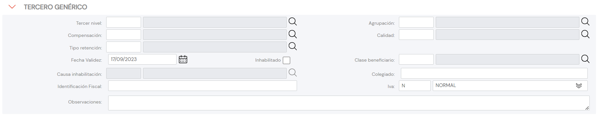

{ width="596" height="159" style="display: block; margin: 0 auto" }

# CREAR Información para los Terceros Genéricos {#titulo}

## Objetivo

La Tarea de capturar la información de este panel de información obedece a la necesidad de tener mínimamente identificado al Tercero y a los siguientes propósitos:

- **Conocer** la información de económica del Tercero Genérico para su correcto empleo en los procesos operativos de la entidad Aseguradora.
- **Clasificar** al Tercero Genérico.

De Izquierda a Derecha y de Arriba hacia Abajo, los siguientes atributos marcan la secuencia de captura en este Bloque de Información.

Si no se especifica o indica expresamente, los Atributos se emplearán tanto en **Personas Físicas** como en **Personas Jurídicas**

# Datos Tercero Genérico, Persona Física/Jurídica

### **Oficina Comercial Asociada**

Este atributo contiene el código del Tercer Nivel de la Estructura Comercial de acuerdo con la relación de valores existentes en el catálogo maestro de [Oficinas Comerciales](../../../../../../01-TRON/01-Documentacion/01-Modulos/01-Comunes/01-Definicion/02-Estructura-Comercial/DEFINICION-Nivel3-Estructura-Comercial.md#titulo) existente en el Sistema.

### **Agrupamiento Comercial del Asegurado**

Este Campo contendrá la Agrupación Comercial del Tercero Genérico  de acuerdo con la relación de valores definidos en el catálogo maestro de [Agrupaciones](../../../../../../01-TRON/01-Documentacion/01-Modulos/02-Terceros/01-Definicion/01-Comun/DEFINICION-de-Agrupacion.md#titulo) existente en el Sistema.

### **Forma de Cobro/Pago**

Este Dato indicará el Código de la Forma de Cobro/Pago del Asegurado de acuerdo con las posibles Formas de Compensación definidas en el catálogo maestro de [Compensaciones](../../../../../../01-TRON/NOLINK.md)

### **Calidad del Tercero Genérico**

Este Campo contendrá la *calidad* del Tercero Genérico de acuerdo con la relación de valores existentes en el catálogo maestro de [Códigos de Calidad](../../../../../../01-TRON/01-Documentacion/01-Modulos/02-Terceros/01-Definicion/01-Comun/DEFINICION-de-Codigo-de-Calidad.md#titulo) existente en el Sistema.

### **Tipo de Retención**

Este Dato contiene el código de uno de los Tipos de Retención configurados localmente por la Entidad Aseguradora.

### **Fecha de Validez**

Esta propiedad le indica al Sistema la fecha a partir de la cual el Tercero está plenamente operativo en el sistema por lo que su empleo y correcta utilización permite tener en la entidad Aseguradora un histórico de los cambios efectuados en la configuración de la persona Física o Jurídica.

### **Inhabilitación**

Esta propiedad le indica al Sistema que el Tercero Genérico  está inhabilitado en el Sistema por lo que no debería ser empleado, contemplado o considerado en los procesos operativos de la entidad.

### **Causa de Inhabilitación**

En el supuesto que el Tercero Genérico  estuviera Inhabilitado, este Atributo contendrá el código de una [causa de Inhabilitación](../../../../../../01-TRON/01-Documentacion/01-Modulos/02-Terceros/01-Definicion/01-Comun/DEFINICION-de-Causa-de-Inhabilitacion-por-Actividad.md#titulo) definida en el catálogo maestro del Sistema.

### **Clasificación**

Este Campo contendrá la Clasificación del Tercero Genérico de acuerdo con la relación de valores existentes en el catálogo maestro de [Clasificaciones](../../../../../../01-TRON/01-Documentacion/01-Modulos/02-Terceros/01-Definicion/01-Comun/DEFINICION-de-Clasificacion.md#titulo) existente en el Sistema.

### **Número de Colegiación**

Este Campo contiene la clave/código de la Cédula Profesional por la que el Tercero, por pertenecer a un colegio profesional o asociación semejante de carácter oficial, está habilitado para ejercer en el desempeño de su Profesión.

### **Identificación Fiscal**

Clave del Identificador fiscal del Tercero Genérico de acuerdo con la Legislación del País en el que se ubica la Entidad Aseguradora.

A modo de ejemplo y en España este Dato debería contener el número de Identificación Fiscal (NIF) que le corresponde tanto a las personas físicas (sean estas particulares o autónomos) como a las personas jurídicas (empresa).

### **IVA**

Este Dato contiene uno de los códigos de los Tipos de Impuesto de Valor Añadido (IVA) configurados localmente por la Entidad Aseguradora, código que identificará el gravamen por los servicios de los Terceros Genéricos recibidos por la Entidad Aseguradora.

### **Observaciones**

El propósito de este campo permite capturar información adicional del Tercero Genérico de acuerdo con los Planteamientos o directrices que pudieran efectuar la Dirección de Clientes/Técnica,... de la entidad aseguradora.

## Vínculos

## Preguntas frecuentes

## Audiencia