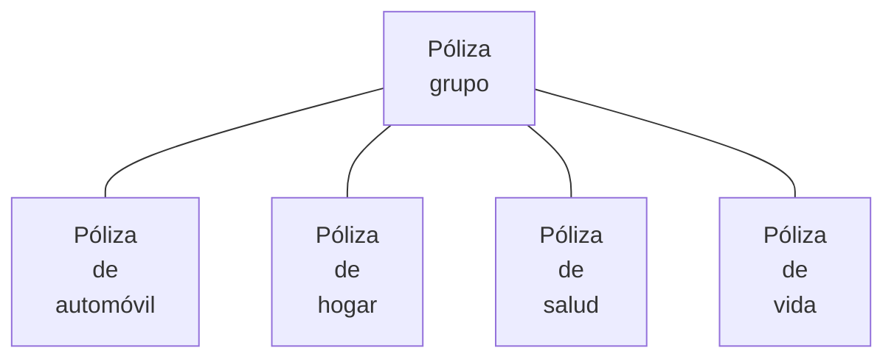
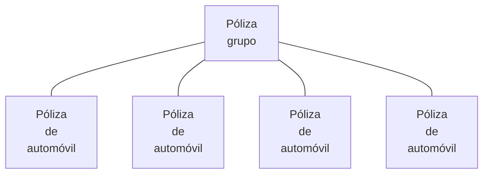

{ width="596" height="159" style="display: block; margin: 0 auto" }

[//]: # (---)
[//]: # (tags:)
[//]: # (  - negocio)
[//]: # (  - analista)
[//]: # (  - implementador)
[//]: # (  - desarrollador)
[//]: # (---)

# DEFINICIÓN de póliza grupo {#titulo}

## **Objetivo**
TRON permite agrupar varias pólizas (es decir, cualquier póliza de cualquier tipo de negocio o del mismo tipo de negocio) bajo una clave. A esta clave se la denomina póliza grupo. 

Un ejemplo de agrupación de pólizas de distintos tipos de negocio a una póliza grupo podría ser:

El gráfico anterior podría corresponder a un cliente que es una persona física con distintas pólizas en MAPFRE y todas ellas se encuentran bajo una póliza grupo.

Otro ejemplo podría ser el que se muestra a continuación:

Este ejemplo podría corresponder a un cliente que es una persona jurídica con una flota de automóviles (cada automóvil es una póliza) se encuentran bajo una póliza grupo.

## **Propiedades**
### **Nº de póliza grupo**
Identificador de la póliza grupo. Acepta cualquier valor.
### **Descripción**
Nombre que se va a asociar a la póliza grupo.
### **Descripción corta**
Nombre corto que se asociará a la póliza grupo.
### **Obliga a existencia de contrato**
Indica si el uso de esta póliza grupo obligará al uso de un [contrato][Nolink] cuando se emita una póliza.
### **Secuencia**
Toda póliza que es asociada a una póliza grupo dispone de un valor que indica el número de pólizas independientes que forman parte de una póliza grupo. El sentido es el mismo de un riesgo en una póliza. Cada riesgo tiene un identificador (nº de riesgo) y en este caso cada póliza que forma parte de una póliza grupo también tiene un identificador. Esta propiedad informa de cual es el último identificador asociado a una póliza grupo.

Como ejemplo, cuando una póliza tiene varios riesgos, cada riesgo tiene un identificador (nº de riesgo). Esto quiere decir que una póliza con varios riesgos atiende a:

|Nº de póliza|Ramo|Nº de riesgo|Riesgo|
|:---:|:---:|:---:|:---|
|1111111111111|Automóvil|1|Volkswagen Golf|
|1111111111111|Automóvil|2|Seat Toledo|
|1111111111111|Automóvil|3|Audi A4|
|2222222222222|Salud|1|María Martín Gómez|
|3333333333333|Hogar|1|Calle Oceanía, 24|

Si todas las pólizas anteriores se asocian a una misma póliza grupo con número 'AAAAAAAAAAAAA', quedaría de la forma que se muestra a continuación. Nótese que no se muestra la información desglosada por riesgo ya que carece de sentido para el ejemplo.

|Póliza grupo|Secuencia|Nº de póliza|Ramo|
|:---:|:---:|:---:|:---:|
|AAAAAAAAAAAAA|1|1111111111111|Automóvil|
|AAAAAAAAAAAAA|2|2222222222222|Salud|
|AAAAAAAAAAAAA|3|3333333333333|Hogar|

### **Inhabilitada**
Especifica si la póliza grupo se encuentra operativa o no en el sistema. Cuando se encuentra no operativa no podrá ser asignada a una nueva póliza.

[//]: # (## **Vínculos**)

## **Preguntas frecuentes**
- ¿Existe una estructura del número de póliza grupo como ocurren con el número de póliza y el número de siniestro?

No, la numeración de una póliza grupo no atiende a una estructura.

- ¿Se puede crear un número de póliza grupo de forma automática?

No, la creación de un número de póliza grupo en la actualidad se realiza de forma manual.

