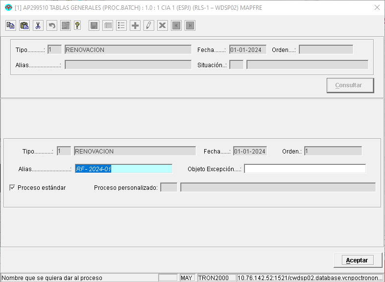
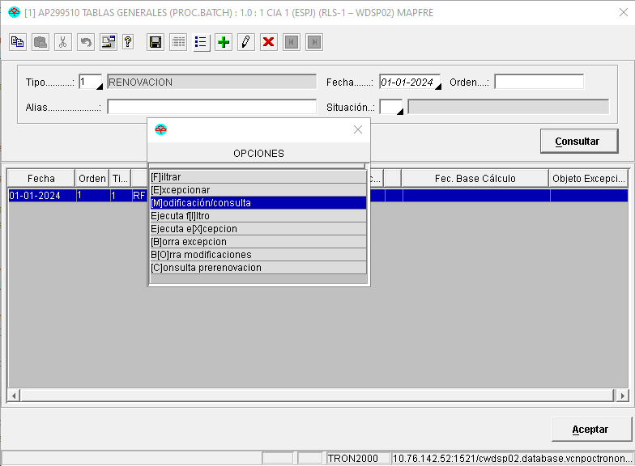
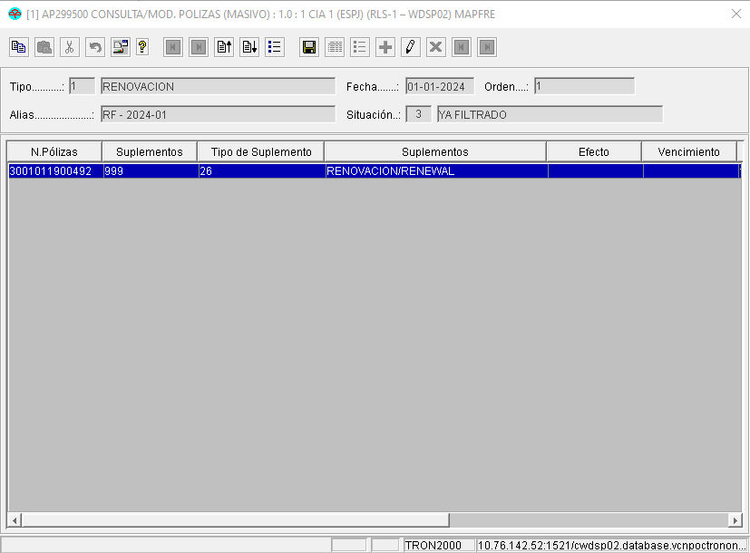
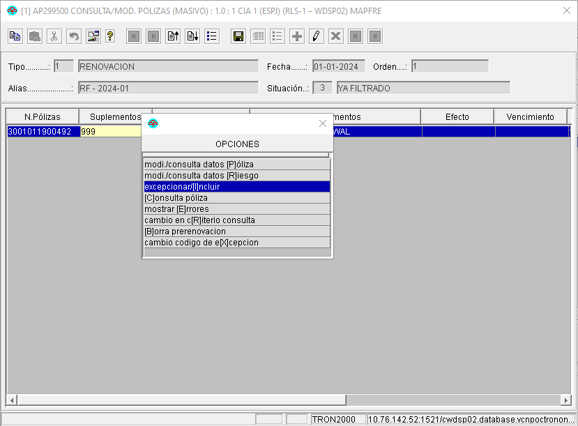
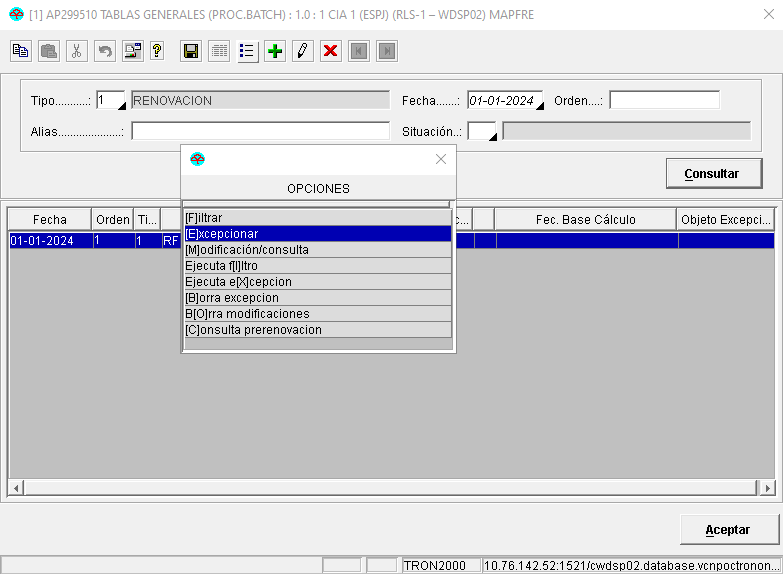

{ width="596" height="159" style="display: block; margin: 0 auto" }

# EXCEPCIONAR elementos candidatos en Emisión ([enlace con visión técnica][Tecnica])

## **¿En que consiste?**
Excluir temporal o definitivamente uno o varios [elementos][Elemento] del proceso masivo del que han sido seleccionados. Hay que indicar que cualquier [elemento][Elemento] que sea necesario excluir del proceso masivo, debe de contar con un motivo de excepción. Estos motivos deben ser previamente [definidos][definicion-excepcion].

## **Objetivo**
Conocer las formas en las que se puede excluir [elementos][Elemento] seleccionados previamente.

## **Proceso a seguir**
Existen tres formas en las que los [elementos][Elemento] puedan ser excepcionados de un proceso masivo:

1. [Manualmente](#manual)
1. [Herramienta de selección de pólizas a excepcionar](#herramienta)
1. [Proceso personalizado de la instalación](#personalizado)

#### Manualmente {#manual}
Es decir, seleccionando el [elemento][Elemento] e indicando el motivo de la excepción, según secuencia que se muestra a continuación:

#### Herramienta de selección de pólizas/riesgos {#herramienta}
Existe una utilizad en TRON que permite establecer las reglas que seleccionen las pólizas que serán excepcionadas del proceso masivo [FILTRAR póliza proceso masivo][filtrar-poliza]. Los pasos a seguir se muestran en la siguiente secuencia de pantallas:

#### Proceso personalizado de la instalación {#personalizado}
Como última opción, la instalación puede crear sus propias lógicas que seleccionen las pólizas y riesgos a procesar.

[//]: # (## **Vínculos**)
[//]: # (## **Preguntas frecuentes**)

[Elemento]: <../../../../../../99-Terminos/TRON-Terminos.md#elemento>
[definicion-excepcion]: <../../../../../../../01-TRON/01-Documentacion/01-Modulos/03-Emision/01-Definicion/01-Comun/07-Proceso-Masivo/DEFINIR-proceso-masivo-excepcion.md>
[filtrar-poliza]: <../../../../../../../01-TRON/01-Documentacion/01-Modulos/03-Emision/02-Operacion/01-Comun/07-Proceso-Masivo/SELECCIONAR/FILTRAR/FILTRAR-proceso-masivo-poliza-emision.md#filtrar-poliza-proceso-masivo-emision>
[Tecnica]: <./EXCEPCIONAR-proceso-masivo-elemento-candidato-emision-TECNICA.md#titulo>