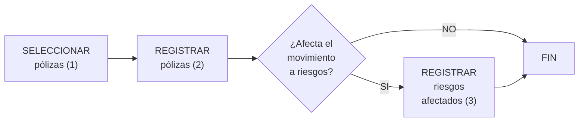

{ width="596" height="159" style="display: block; margin: 0 auto" }

[//]: # (---)
[//]: # (tags:)
[//]: # (  - negocio)
[//]: # (  - analista)
[//]: # (  - implementador)
[//]: # (  - desarrollador)
[//]: # (---)

# SELECCIONAR elementos candidatos en Emisión ([enlace con visión técnica][Tecnica])

## **¿En que consiste?**
Es la inclusión de aquellos [elementos][Elemento] que inicialmente se pretende afectar en el proceso masivo. Es decir, del universo de [elementos][Elemento] (como pueden ser las pólizas), se extraen aquellos que se quiere sean procesados.

## **Objetivo**
Conocer las formas en las que se puede incluir [elementos][Elemento] para que estos formen parte del movimiento en el proceso masivo.

## **Proceso a seguir**

1. [SELECCIONAR pólizas        ](../../../../../../../01-TRON/01-Documentacion/01-Modulos/03-Emision/02-Operacion/01-Comun/07-Proceso-Masivo/SELECCIONAR/SELECCIONAR-Proceso-masivo-poliza-emision.md)
1. [REGISTRAR pólizas          ](../../../../../../../01-TRON/01-Documentacion/01-Modulos/03-Emision/02-Operacion/01-Comun/07-Proceso-Masivo/SELECCIONAR/REGISTRAR-proceso-masivo-poliza-emision.md)
1. [REGISTRAR riesgos afectados](../../../../../../../01-TRON/01-Documentacion/01-Modulos/03-Emision/02-Operacion/01-Comun/07-Proceso-Masivo/SELECCIONAR/REGISTRAR-Proceso-masivo-riesgo-emision.md)

[//]: # (## **Vínculos**)
[//]: # (## **Preguntas frecuentes**)

[Elemento]: <../../../../../../99-Terminos/TRON-Terminos.md#elemento>
[Tecnica]:  <./SELECCIONAR-proceso-masivo-elemento-candidato-emision-TECNICA.md>