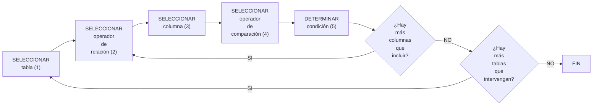

{ width="596" height="159" style="display: block; margin: 0 auto" }

[//]: # (---)
[//]: # (tags:)
[//]: # (  - negocio)
[//]: # (  - analista)
[//]: # (  - implementador)
[//]: # (  - desarrollador)
[//]: # (---)

# FILTRAR póliza en procesos masivos en emisión {#filtrar-poliza-proceso-masivo-emision}

## **¿En que consiste?**
Esta herramienta permite determinar las condiciones con las que se desea seleccionar pólizas (y sus riesgos) a las que posteriormente serán afectadas en un proceso masivo. Es imprescindible conocer que para utilizar esta herramienta es necesario disponer de conocimiento del modelo de datos del módulo de emisión.

## **Objetivo**
Extraer de la cartera solo aquellas pólizas con las que se pretende realizar la operación que se está definiendo.

## **Proceso a seguir**

1. [Tabla      ](#Tabla)
1. [Relación   ](#Relacion)
1. [Columna    ](#Columna)
1. [Comparación](#Comparacion)
1. [Condición  ](#Condicion)

### SELECCIONAR tabla {#Tabla}
Se especifica la tabla que se quiere utilizar con el fin de condicionar qué pólizas han de tomarse en el proceso masivo. Las tablas están fijadas previamente por lo que no se puede elegir libremente.
Es importante destacar que el orden en el que se eligen las tablas que participarán en la selección influye directamente en el rendimiento del sistema y por consiguiente en el tiempo que tarde el proceso en determinar qué pólizas se seleccionan.

### SELECCIONAR operador de relación {#Relacion}
Se determina el operador que es necesario utilizar con el fin de seleccionar las pólizas a tratar. Los operadores permitidos son:

|OPERADOR|
|:---:   |
|AND     |
|OR      |

### SELECCIONAR columna {#Columna}
Una vez elegida la tabla se debe seleccionar qué columna se utilizará para confeccionar la condición. Las columnas, al igual que las tablas están previamente fijadas y la elección no es libre.
Al igual que se comentó con la tabla, también es importante destacar que el orden en el que se eligen las columnas que participarán en la selección influye directamente en el rendimiento del sistema y por consiguiente en el tiempo que tarde el proceso en determinar qué pólizas se seleccionan.

### SELECCIONAR operador de comparación {#Comparacion}
Se especifica el operador que se utilizará para la columna seleccionada. Los operadores permitidos son:

|OPERADOR   |DESCRIPCIÓN  |
|:---:      |:---         |
|=          |IGUAL        |
|!=         |DISTINTO     |
|<          |MENOR        |
|<=         |MENOR O IGUAL|
|>          |MAYOR        |
|>=         |MAYOR O IGUAL|
|BETWEEN    |ENTRE        |
|NOT BETWEEN|NO ENTRE     |
|LIKE       |COMO         |
|NOT LIKE   |NO COMO      |
|EXISTS     |EXISTE       |
|NOT EXISTS |NO EXSITE    |

### DETERMINAR condición {#Condicion}
En este punto se determina el valor que correspondería con el operador de comparación elegido. 

### EJEMPLO
Por ejemplo, si se desea determinar que el ramo de las pólizas a seleccionar es el ramo de automóvil (suponiendo que el ramo en este ejemplo es el 400), los valores que se determinarían sería:

|TABLA   |RELACIÓN|COLUMNA |COMPARACIÓN|CONDICIÓN|
|:---    |:---:   |:---    |:---:      |:---:    |
|a2000030|AND     |cod_ramo|=          |400      |

[//]: # (## **Vínculos**)
[//]: # (## **Preguntas frecuentes**)
