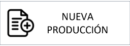

{ width="596" height="159" style="display: block; margin: 0 auto" }

# DOCUMENTACIÓN de OPERACIÓN de EMISIÓN (Automóvil) {#titulo}

 Formación orientada a la operación y tipo de negocio

## TIPOS DE OPERACIÓN

    