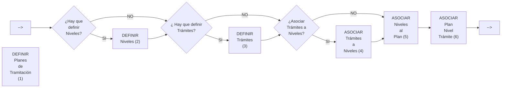

{ width="596" height="159" style="display: block; margin: 0 auto" }

==EN CONSTRUCCIÓN==
# DEFINICIÓN Plan Tramitación {#titulo}

## **¿En que consiste?**
TRON necesita para su funcionamiento una configuración previa del sistema. El Usuario será el que defina como quiere que se comporte. En este caso se va a documentar como configurar un plan de tramitación.   

El Plan de tramitación, puede considerarse como una guía para el manejo de los diferentes tipos de expedientes, así como una guía del supervisor para realizar un seguimiento del trabajo de cada uno de sus tramitadores.  
Con el Plan de tramitación, un tramitador tiene que poder gestionar un expediente desde su apertura hasta su cierre.  
Desde el  Plan de Tramitación ,se podrá:  

- __Acceder__ a todas las __funcionalidades de siniestros__. Esto le supone tramitador un ahorro de tiempo, ya que todas las operaciones que necesite realizar, las podrá hacer desde el Plan. También podrán acceder a __funcionalidades de otros módulos__.

-	__Generar Textos, documentos__ . Cuando se define un trámite se le puede asociar una o varias cartas. En el momento que el tramitador active el trámite el programa le mostrará las cartas,textos que puede generar y elegirá lo que más le convenga podrá enviarse por email, sms, correo ordinario...

- __Avisos de plazos__ Cuando se active un trámite que requiere ser resuelto en un plazo máximo de días, (ejemplo 10 días), si al trámite se le asocia un recordatorio a los 5 días (“Revisar si llegó el resultado de la peritación”), a los cinco días el sistema le avisará. Además de los avisos asociados al trámite, el tramitador podrá generar los que el crea conveniente.

-	__Anotaciones libres__ Son anotaciones que realiza el tramitador y que puede ser vistas por el supervisor. 
El plan de tramitación es de utilidad para el trabajo diario y realizar cualquier tipo de consultas. Todas las operaciones que realiza un tramitador para cada expediente, quedan registradas , programas a los que ha accedido, cartas que han sido lanzadas, tiempos ….

## **Objetivo**
Conocer cómo se define un Plan de Tramitación completo, para poder ser asignado a un Tipo de Expediente y poder tramitar un expediente desde la apertura hasta el cierre del mismo.

## **Proceso a seguir**

``` mermaid
graph LR
  A["DEFINIR 
     Planes
      de 
     Tramitación
      (1)"]
  B{"¿Hay que 
    definir 
    Niveles?"}
  C["DEFINIR
    Niveles (2)"]
  D{"¿ Hay que definir 
    Trámites?"}
  E["DEFINIR 
  Trámites 
   (3)"]
  F{"¿Asociar 
    Trámites a 
    Niveles?"}
  G["ASOCIAR
    Trámites 
    a 
    Niveles (4)"]
  H["ASOCIAR
    Niveles
    al 
    Plan (5)"]
  I["ASOCIAR
    Plan  
    Nivel   
    Trámite (6)"]
  J["-->"]
    A --> B;
  B -->|SI| C;
  B -->|NO| D;
  C --> D;
  D -->|SI| E;
  D -->|NO| F
  E --> F;
  F -->|SI| G;
  F -->|NO| H
  G --> H;
  H --> I;
  I --> J;
  click A "../../../../../../../../01-TRON/01-Documentacion/01-Modulos/04-Siniestros/01-Definicion/01-Comun/104-Plan-de-Tramitacion/DEFINIR-Plan-Tramitacion"
  click C "../../../../../../../../01-TRON/01-Documentacion/01-Modulos/04-Siniestros/01-Definicion/01-Comun/104-Plan-de-Tramitacion/DEFINIR-Niveles"
  click E "../../../../../../../../01-TRON/01-Documentacion/01-Modulos/04-Siniestros/01-Definicion/01-Comun/104-Plan-de-Tramitacion/DEFINICION-DEFINIR-Tramites"
  click G "../../../../../../../../01-TRON/01-Documentacion/01-Modulos/04-Siniestros/01-Definicion/01-Comun/104-Plan-de-Tramitacion/DEFINIR-Tramites"
```

   
