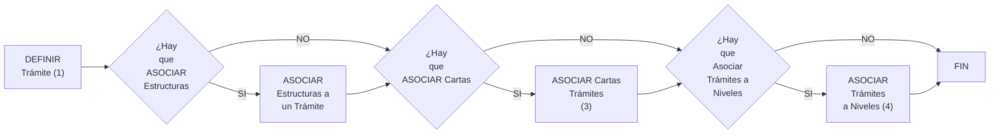

{ width="596" height="159" style="display: block; margin: 0 auto" }

==EN CONSTRUCCIÓN==
# DEFINICIóN Trámites {#titulo}

## **¿En que consiste?**
TRON necesita para su funcionamiento la configuración del sistema. El Usuario será el que defina como quiere que se comporte. En este caso se 

## **Objetivo**
Conocer que acciones se deben realizar para que posteriormente se pueda lanzar una [operación][Operacion] de forma diferida. Este documento no se centra en ninguna [operación][Operacion] en concreto.

## **Proceso a seguir**

   

1. [DEFININIR Planes de Tramitación](../../../../../../../01-TRON/01-Documentacion/01-Modulos/04-Siniestros/01-Definicion/01-Comun/104-Plan-de-Tramitacion/DEFINIR-Plan-Tramitacion.md#titulo)
1. [DEFINIR Niveles de Tramitación](../../../../../../../01-TRON/01-Documentacion/01-Modulos/04-Siniestros/01-Definicion/01-Comun/104-Plan-de-Tramitacion/DEFINIR-Niveles.md#titulo)
1. [DEFINIR Trámites](../../../../../../../01-TRON/01-Documentacion/01-Modulos/04-Siniestros/01-Definicion/01-Comun/104-Plan-de-Tramitacion/DEFINIR-Tramites.md#titulo)
1. [ASOCIAR Trámites a Niveles](../../../../../../../01-TRON/01-Documentacion/01-Modulos/04-Siniestros/01-Definicion/01-Comun/104-Plan-de-Tramitacion/DEFINIR-Tramites.md#titulo)
1. [ASOCIAR Trámites a Niveles](../../../../../../../01-TRON/01-Documentacion/01-Modulos/04-Siniestros/01-Definicion/01-Comun/104-Plan-de-Tramitacion/DEFINIR-Tramites.md#titulo)