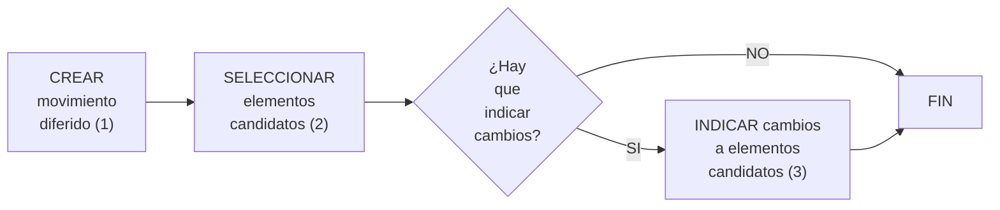

{ width="596" height="159" style="display: block; margin: 0 auto" }

==EN CONSTRUCCIÓN==
# CREAR proceso masivo en Siniestros {#titulo}

## **¿En que consiste?**
TRON está formado por una serie de [operaciones][Operacion]. Ciertas [operaciones][Operacion] se pueden realizar tanto en el momento (en línea), como diferidas en el tiempo. Cuando una [operación][Operacion] se puede diferir, además, se permite determinar a qué [elementos][Elemento] afectará la [operación][Operacion] (puede ser uno o varios [elementos][Elemento]). Por ejemplo, se puede seleccionar una serie de siniestros/expedientes a los que realizar un determinada operación por ejemplo cambiar valoración.

Al proceso que determina qué [operación][Operacion] diferida se va a realizar, a qué [elementos][Elemento] afectará esa [operación][Operacion] y qué modificaciones sufrirán los [elementos][Elemento], se le denomina proceso masivo.

## **Objetivo**
Conocer que acciones se deben realizar para que posteriormente se pueda lanzar una [operación][Operacion] de forma diferida. Este documento no se centra en ninguna [operación][Operacion] en concreto.

## **Proceso a seguir**

   

1. [CREAR movimiento diferido](../../../../../../../01-TRON/01-Documentacion/01-Modulos/04-Siniestros/02-Operacion/01-Comun/07-Proceso-Masivo/CREAR-Proceso-masivo-siniestros.md)
1. [SELECCIONAR elementos candidatos](../../../../../../../01-TRON/01-Documentacion/01-Modulos/04-Siniestros/02-Operacion/01-Comun/07-Proceso-Masivo/SELECCIONAR-Proceso-masivo-elemento-candidato-siniestros.md)
1. [INDICAR cambios a elementos candidatos](../../../../../../../01-TRON/01-Documentacion/01-Modulos/04-Siniestros/02-Operacion/01-Comun/07-Proceso-Masivo/INDICAR-CAMBIO-Proceso-masivo-elemento-candidato-siniestros.md)

[Elemento]:  <../../../../../../../99-Terminos/TRON-Terminos.md#elemento>
[Operacion]: <../../../../../../../99-Terminos/TRON-Terminos.md#operacion>
