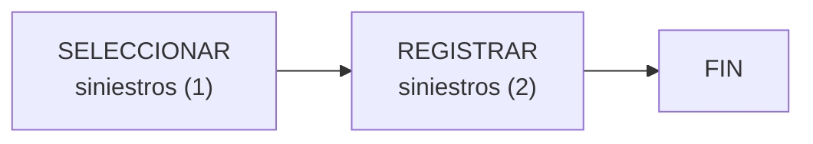

{ width="596" height="159" style="display: block; margin: 0 auto" }

==EN CONSTRUCCIÓN==

# SELECCIONAR elemento candidato en Siniestros ([enlace con visión técnica][Tecnica]) {#titulo}

## **¿En que consiste?**
Es la inclusión de aquellos [elementos][Elemento] que inicialmente se pretende afectar en el proceso masivo. Es decir, del universo de [elementos][Elemento] (como pueden ser siniestros,expedientes, liquidaciones..), se extraen aquellos que se quieren procesar.

## **Objetivo**
Conocer las formas en las que se puede incluir [elementos][Elemento] para que estos formen parte del movimiento en el proceso masivo.

## **Proceso a seguir**

1. [SELECCIONAR Siniestro       ](../../../../../../../01-TRON/01-Documentacion/01-Modulos/04-Siniestros/02-Operacion/01-Comun/07-Proceso-Masivo/SELECCIONAR/SELECCIONAR-Proceso-masivo-siniestro-siniestros.md#titulo)
1. [REGISTRAR Siniestro         ](../../../../../../../01-TRON/01-Documentacion/01-Modulos/04-Siniestros/02-Operacion/01-Comun/07-Proceso-Masivo/SELECCIONAR/REGISTRAR-Proceso-masivo-siniestro-siniestros.md#titulo)
                                           
[Tecnica]: <./SELECCIONAR-Proceso-masivo-elemento-candidato-siniestro-TECNICA.md>