{ width="596" height="159" style="display: block; margin: 0 auto" }

==EN CONSTRUCCIÓN==

[//]: # (## **FALTA: Completar documentos y links**)

# COBRAR recibo prima ([enlace con visión técnica][Tecnica]) {titulo}

## **¿En qué consiste?**
Se trata de registrar el dinero entregado, por parte del cliente, para saldar la prima adeudada en la póliza, para un determinado período de tiempo.  

En el proceso de cobro de recibo los agentes podrán descontarse las comisiones, recargos e impuestos, en cuyo caso habrá que registrar el importe descontado por cada concepto.

## **Objetivo**
Realizar los pasos necesarios para registrar la recepción del dinero correspondiente a un recibo en la contabilidad y actualizar la situación del recibo como cobrado, así como permitir descontar del importe cobrado las comisiones, recargos e impuestos. 

## **Proceso a seguir**
Una vez [identificado el recibo](Identificar-recibo) el proceso realiza los siguientes pasos:

``` mermaid
graph LR
  A["REGISTRAR
     recibo 
     cobrado (1)"]
  B{"¿Descuenta 
     comision?"}
  C["DESCONTAR
     comision
     recibo (2)"]
  D{"¿Descuenta
      impuesto?"}
  E["DESCONTAR
     impuesto
     recibo (3)"]
  F{"¿Descuenta
      recargo?"}
  G["DESCONTAR
     recargo
     recibo (4)"]
  H["EJECUTAR
     otras
     operaciones (5)"]
  I["FIN"]
  A --> B;
  B -->|SI| C;
  B -->|NO| D;
  C --> D;
  D -->|SI| E;
  D -->|NO| F;
  E --> F;
  F -->|SI| G;
  F -->|NO| H;
  G --> H;
  H --> I;
  click A "./REGISTRAR-Recibo-cobrado"
  click C "../../../../../../../01-TRON/01-Documentacion/01-Modulos/05-Tesoreria/02-Operacion/04-Comisiones/DESCONTAR-Comision-en-cobro-recibo"
  click E "../../../../../../../../01-TRON/01-Documentacion/01-Modulos/05-Tesoreria/02-Operacion/02-Recibos/01-Cobros/DESCONTAR-impuesto-recibo"
  click G "../../../../../../../../01-TRON/01-Documentacion/01-Modulos/05-Tesoreria/02-Operacion/02-Recibos/01-Cobros/DESCONTAR-Recargo-recibo"
  click H "../../../../../../../../01-TRON/01-Documentacion/01-Modulos/05-Tesoreria/02-Operacion/02-Recibos/01-Cobros/EJECUTAR-otras-operaciones"
```

1. [REGISTRAR recibo cobrado](./REGISTRAR-Recibo-cobrado.md#titulo)
2. [DESCONTAR comisión recibo](../../../../../../../01-TRON/01-Documentacion/01-Modulos/05-Tesoreria/02-Operacion/04-Comisiones/DESCONTAR-Comision-en-cobro-recibo.md#titulo)
3. [DESCONTAR impuestos recibo](../../../../../../../01-TRON/01-Documentacion/01-Modulos/05-Tesoreria/02-Operacion/02-Recibos/01-Cobros/DESCONTAR-impuesto-recibo.md)
4. [DESCONTAR recargo recibo](../../../../../../../01-TRON/01-Documentacion/01-Modulos/05-Tesoreria/02-Operacion/02-Recibos/01-Cobros/DESCONTAR-Recargo-recibo.md)
5. [EJECUTAR otras operaciones](../../../../../../../01-TRON/01-Documentacion/01-Modulos/05-Tesoreria/02-Operacion/02-Recibos/01-Cobros/EJECUTAR-Otras-operaciones.md)

[Identificar-recibo]: <../../../../../../01-TRON/01-Documentacion/02-Operaciones/01-Moduleos/05-Tesoreria/02-Recibos/01-Cobros/IDENTIFICAR-Recibo-cobro.md>
