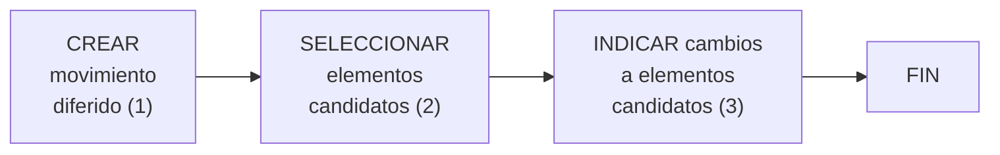

{ width="596" height="159" style="display: block; margin: 0 auto" }

# CREAR PROCESO MASIVO TERCEROS

## **¿En qué consiste?**

Temporalmente, la ejecución de ciertas operaciones se puede realizar en línea o de manera diferida.

Al proceso que determina qué operación diferida se va a realizar, cuales van a ser los Terceros afectados por dicha operación y qué modificaciones van a sufrir estos, se le denomina proceso masivo.

## **Objetivo**

Conocer qué acciones se deben realizar en el Sistema para estar en disposición de [ejecutar de manera diferida](./FORMACION-EJECUTAR-Proceso-Masivo-Terceros.md) una [operación][Operacion] de **Creación** o **Modificación** de un Tercero, independientemente del [Código ó Códigos de Actividad][Actividad] que este tenga asignados.

## **Proceso a seguir**

1. [CREAR movimiento diferido](../../../../../../../../01-TRON/01-Documentacion/01-Modulos/02-Terceros/02-Operacion/01-Comun/01-Procesos-Masivos/CREAR-Movimiento-Diferido.md#titulo)
2. [SELECCIONAR elementos candidatos](../../../../../../../../01-TRON/01-Documentacion/01-Modulos/02-Terceros/02-Operacion/01-Comun/01-Procesos-Masivos/SELECCIONAR-Elementos-Candidatos.md#titulo)
3. [INDICAR cambios a elementos candidatos](../../../../../../../../01-TRON/01-Documentacion/01-Modulos/02-Terceros/02-Operacion/01-Comun/01-Procesos-Masivos/INDICAR-Cambios-Elementos-Candidatos.md#titulo)

---
[Operacion]: <../../../../../../../99-Terminos/TRON-Terminos.md#operacion>
[Actividad]: <../../../../../../../../01-TRON/01-Documentacion/01-Modulos/02-Terceros/01-Definicion/01-Comun/DEFINICION-de-Actividad.md#titulo>