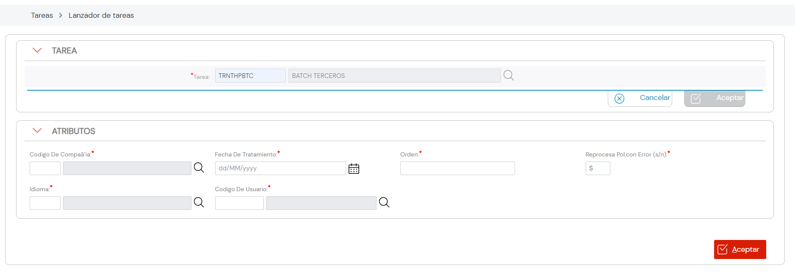

{ width="596" height="159" style="display: block; margin: 0 auto" }

# EJECUTAR Proceso Masivo TERCEROS

## **Objetivo**

Conocer el procedimiento que se ha de seguir para ejecutar un proceso diferido de Terceros en el Sistema.

## Ejecutar Proceso Diferido

Una vez se ha detallado la información de los Terceros afectados en las diferentes Tablas Buzón se tiene que ejecutar el proceso definido mediante el **Lanzador de Tareas** del Sistema:

Los Procesos Diferidos del módulo de Terceros se ejecutan con la [Tarea][Tarea] que tiene por clave: **TRNTHPBTC**, informando los siguientes Atributos o criterios de ejecución...

#### **Código de Compañía**

[Código de Compañía](../../../../../../01-TRON/01-Documentacion/01-Modulos/01-Comunes/01-Definicion/DEFINICION-de-Compania.md#titulo)

#### **Fecha de Tratamiento**

Fecha de Tratamiento.

 #### **Identificador del Proceso Diferido**

[Orden](#numero-de-orden-del-proceso)

#### **Volver a Procesar en caso de Error**

[Idioma](../../../../../../01-TRON/01-Documentacion/01-Modulos/01-Comunes/01-Definicion/DEFINICION-de-Idioma.md#titulo)

#### **Idioma**

[Idioma](../../../../../../01-TRON/01-Documentacion/01-Modulos/01-Comunes/01-Definicion/DEFINICION-de-Idioma.md#titulo)

#### **Usuario**

[Clave de Usuario](../../../../../../01-TRON/01-Documentacion/01-Modulos/01-Comunes/01-Definicion/07-Sistema-de-Seguridad/DEFINICION-Usuarios-Entidad.md#datos-identificativos)

... y por último, se pulsa el icono **ACEPTAR**.

[Tarea]: <../../../../../../../99-Terminos/TRON-Terminos.md#tarea>
[Tecn Elementos Candidatos]: <../02-Tecnica/CREAR-Proceso-Masivo-Terceros-Detallar-Informacion-TECNICA.md>

[Elemento]:  <../../../../../../99-Terminos/TRON-Terminos.md#elemento>
[Operacion]: <../../../../../../99-Terminos/TRON-Terminos.md#operacion>
[Actividad]: <../../../../../../01-TRON/01-Documentacion/01-Modulos/02-Terceros/01-Definicion/01-Comunes/DEFINICION-de-Actividad.md#titulo>

[TRNTHPBTC]: <sr_thp_thp_pss_btc.p_prc>