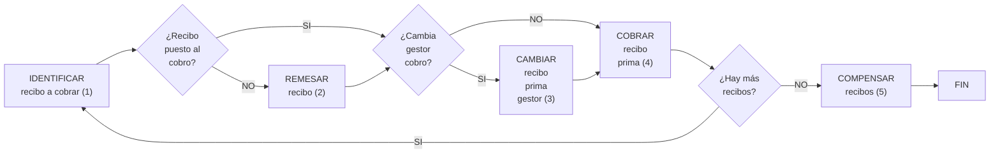

{ width="596" height="159" style="display: block; margin: 0 auto" }

==EN CONSTRUCCIÓN==

[//]: # (## **FALTA: Completar documentos de los distintos pasos y links**)

# COBRAR un recibo

## **¿En que consiste?**
En las [operaciones][Operacion] de emisión se determina la prima que debe pagar el asegurado, según el tipo de riesgo y las coberturas contratadas. Se generarán los [recibos][Recibo] correspondientes al [plan de pago][Plan-pago] elegido por el cliente. 

De esta forma, según el plan de pago que se haya acordado en la contratación, se podrá generar un único [recibo][Recibo] por el importe total de la prima para el período vigente, o fraccionar el pago en tantos [recibos][Recibo] como determine el [plan de pago][Plan-pago] elegido. El cálculo del importe de la prima correspondiente a cada [recibo][Recibo], en caso de pago fraccionado, lo determinará también el [plan de pago][Plan-pago].  

En el módulo de tesorería se registra y contabiliza el dinero correspondiente al cobro de la prima adeudada en la póliza, para un determinado período de tiempo, es decir, de un [recibo][Recibo]. 

## **Objetivo**
Realizar los pasos necesarios para registrar la recepción del dinero abonado por el cliente, en la contabilidad y dejar constancia de la nueva situación del [recibo][Recibo] como cobrado.

## **Proceso a seguir**

1. [IDENTIFICAR recibo a cobrar](../../../../../../../01-TRON/01-Documentacion/01-Modulos/05-Tesoreria/02-Operacion/02-Recibos/01-Cobros/IDENTIFICAR-Recibo-cobro.md)  
2. [REMESAR recibo](../../../../../../../01-TRON/01-Documentacion/01-Modulos/05-Tesoreria/02-Operacion/02-Recibos/01-Cobros/REMESAR-Recibo.md)
3. [CAMBIAR recibo prima gestor](../../../../../../../01-TRON/01-Documentacion/01-Modulos/05-Tesoreria/02-Operacion/02-Recibos/01-Cobros/CAMBIAR-Recibo-prima-gestor.md)
4. [COBRAR recibo prima](../../../../../../../../01-TRON/01-Documentacion/01-Modulos/05-Tesoreria/02-Operacion/02-Recibos/01-Cobros/COBRAR-recibo-prima.md)  
5. [COMPENSAR recibo](../../../../../../../01-TRON/01-Documentacion/01-Modulos/05-Tesoreria/02-Operacion/02-Recibos/01-Cobros/COMPENSAR-Recibo.md)

[Operacion]: <../../../../../../../99-Terminos/TRON-Terminos.md#operacion>
[Recibo]: <../../../../../../../99-Terminos/TRON-Terminos.md#recibo>
[Plan-pago]: <../../../../../../../01-TRON/01-Documentacion/01-Modulos/03-Emision/01-Definicion/01-Comun/100-Plan-Pago/DEFINIR-Plan-Pago.md>