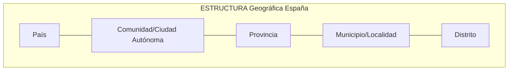
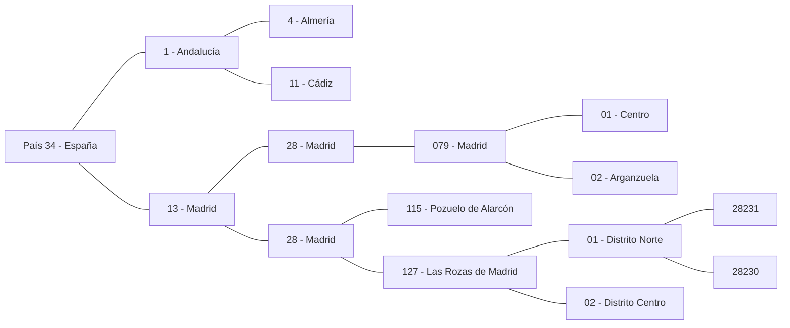
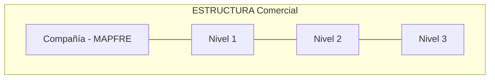
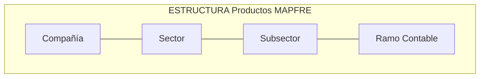
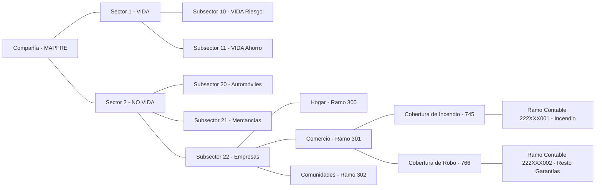
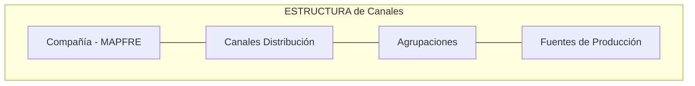
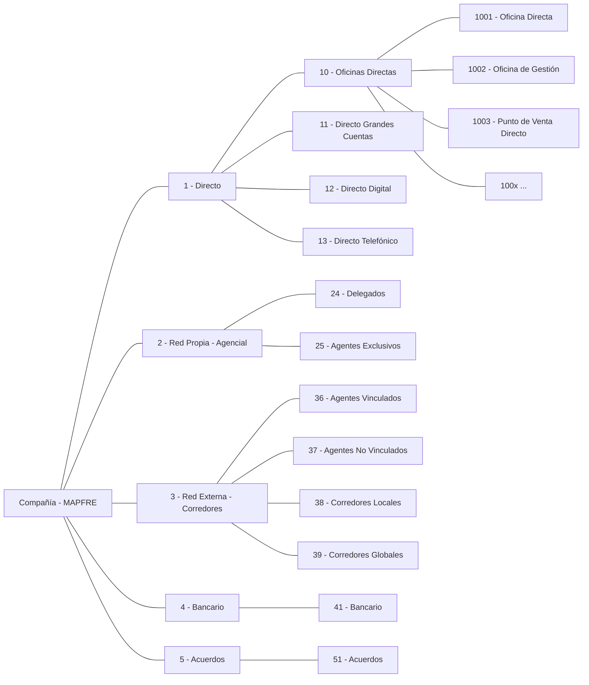

{ width="596" height="159" style="display: block; margin: 0 auto" }

# INTRODUCCIÓN - Módulo COMUNES {#titulo}

 

## **Objetivo**

La finalidad del módulo __"COMUNES"__ es configurar en la Solución y a nivel de compañía determinados conceptos que serán empleados transversalmente en los restantes módulos: Terceros, Emisión, Siniestros, Tesorería y Contabilidad.

- [Características                             ](#caracteristicas)
- [Principales Conceptos                       ](#principales-conceptos)
- [Integración y Dependencias con Otros Módulos](#integracion-y-dependencias-con-otros-modulos)

### **Características** {#caracteristicas}

#### Transversalidad

Todos los conceptos del módulo y la definición/configuración de los atributos que los componen se emplean e **interactúan total o parcialmente** en las funcionalidades del resto de módulos de la Solución.

#### Consistencia y coherencia lógica

Todos los conceptos del módulo y sus atributos afectan de **igual manera** a las funcionalidades de los módulos de la Solución que los emplean.

### **Principales Conceptos** {#principales-conceptos}

- [Idiomas                ](#idiomas)
- [Monedas                ](#monedas)
- [Usuarios/Roles         ](#usuarios-y-roles)
- [Estructuras            ](#estructuras)

#### **Idiomas**

Los Idiomas en los que se pueden visualizar los literales o textos de las pantallas de la aplicación.

#### **Monedas**

Las diferentes divisas y los tipos de cambio con las que puede operar el sistema para ejecutar determinadas operaciones como por ejemplo para calcular los importes de las primas del Seguro, para calcular los importes de las liquidaciones en los expedientes de los siniestros, para efectuar el cobro de los recibos, etcétera.

#### **Usuarios y Roles**

Las personas que utilizan la Solución han de estar declaradas como Usuarios en el Sistema además de tener asignadas las funciones que pueden desempeñar en la Solución mediante el concepto y uso de los roles.

#### **Estructuras**

Las diferentes organizaciones de información Geográfica, Comercial, Productos y de Canales que se emplean en el resto de módulos mediante su asociación a sus elementos principales: Terceros, Pólizas, Siniestros, Recibos, Comisiones, ...

Las principales estructuras de Información con las que cuenta el módulo son:

#### Estructura Geográfica

Esta Estructura permite establecer en el sistema las diferentes divisiones en las que se organizan geográficamente los países en una estructura piramidal de 5 niveles.

Por ejemplo en la estructura geográfica de España los niveles serían:

NOTA: Si bien los códigos postales no pertenecen a la estructura geográfica, se muestran en el gráfico por cuestiones de comprensión de la *estructura postal*.

#### **Estructura Territorial/Comercial**

Esta Estructura piramidal de tres niveles permite establecer en el sistema las diferentes divisiones en las que se organizan **comercialmente** las entidades aseguradoras (La Estructura Comercial no es más que una abstracción de la Estructura Geográfica).

#### Estructura de Productos

Esta Estructura de tres niveles permite configurar y **clasificar** los distintos Seguros que se comercializan en la entidad aseguradora.

En este Ejemplo se han considerado los Seguros de VIDA y NO VIDA como Sectores, Los Seguros de VIDA Riesgo y VIDA Ahorro como clasificaciones de los Subsectores del Sector VIDA y los Seguros de Automóviles, Mercancías y Empresas como los posibles Subsectores del Sector NO VIDA.

NOTA: Si bien los ramos técnicos (Hogar, Comercio, Comunidades) asignados al Subsector de Empresas y las Coberturas de Incendio y Robo configuradas en el ramo de Comercios no pertenecen a la Estructura de Productos, se muestran en el gráfico para facilitar la comprensión de la posible parametrización de los Ramos Contables.

Los Ramos Contables no son sino unos *códigos* utilizados en la contabilidad que relacionan la **estructura técnica** de los Ramos Técnicos con la **estructura contable** de las entidades (esta relación se efectúa en el Sistema a nivel de Cobertura/Garantía por lo que previamente a la definición de las Coberturas en el sistema se definirán a nivel de entidad la relación de posibles Ramos Contables que podrán ser utilizados posteriormente en la definición y configuración de las Coberturas)

#### Estructura de Canales

Esta Estructura de tres niveles posibilita configurar los distintos Canales de comercialización por los que los Clientes Distribuidores (tales como Agentes Exclusivos, Agentes Delegados y Corredores, ...) cierran la venta de un producto determinado.

Los dos primeros niveles, **Canales de Distribución y Agrupaciones**, son niveles cuya definición es Corporativa y por tanto de empleo obligatorio.

De esta manera, las agrupaciones del canal **directo** identifican y clasifican aquellos seguros que se han comercializado en las Oficinas de la Entidad Aseguradora (separando de estas, el subconjunto de oficinas destinadas a la comercialización de seguros para Grandes Cuentas), por medios telefónicos (vía call-center) o por vía Web (en la página web de la entidad aseguradora). 

NOTA: El cliente distribuidor directo esta compuesto por aquellas personas, normalmente empleados, o medios de distribución que realizan ventas para Mapfre sin percibir una Retribución Variable directa a cambio.

### **Integración y Dependencias con otros Módulos** {#integracion-y-dependencias-con-otros-modulos}

Como ejemplos de integración y dependencia con los otros Módulos de la Solución ...

#### **Con el Módulo de TERCEROS**

Determinados Parámetros de la Instalación modulan el comportamiento de la interfaz de la Solución para el Módulo de Terceros activando, desactivando o modificando los flujos de captura de su información (no es igual la captura de un Cliente si este es persona física que si es una compañía)

Además en el módulo de Terceros se utilizan los distintos niveles de las estructuras geográficas, comercial, canales y de productos para su asociación a elementos como:

- La identificación de las Localidades de nacimiento o constitución de las personas físicas o jurídicas.
- Los Datos Identificativos, de Contactos y de Obligaciones Fiscales en los Asegurados.
- Las identificación de las Direcciones postales, de Trabajo, de correspondencia, etc.
- Los datos identificativos del Asegurado, si la persona es un Agente, un Tramitador de Siniestros o un Supervisor de Siniestros (de acuerdo con la actividad del Tercero)

Por otra parte, en el módulo de Terceros se utilizan las Monedas para su asociación en la información de los Datos Bancarios de los Asegurados, Clientes, Proveedores,...

#### **Con el Módulo de EMISIÓN**

Determinados Parámetros de la Instalación modulan el comportamiento de la interfaz de la Solución para el Módulo de Emisión modificando el flujo de captura y validación de la información.

Determinadas reglas de negocio que las entidades MAPFRE pueden establecer y ejecutar de manera dinámica en el proceso de Emisión, conocidas como Controles Técnicos, se deben asociar a los Roles de los Usuarios para saber quién o quienes pueden autorizarlas.

Las Numeraciones de las Pólizas y Presupuestos pueden utilizar en su composición la estructura comercial definida para la entidad.

Además en el módulo de Emisión se asocian a la póliza:

- El tercer nivel de la estructura comercial del agente.
- La Fuente de Producción del Agente.
- El tercer nivel de la estructura comercial a la que pertenece el Usuario Emisor/Suscriptor.
- La Moneda en la que se emite la póliza y por tanto la moneda en la que se calculan las primas de la misma.

#### **Con el Módulo de SINIESTROS**

La solución permite configurar el que las Liquidaciones de los expedientes del módulo de Siniestros puedan emplear otras divisas diferentes a la moneda en la que se emitió la póliza.

#### **Con el Módulo de TESORERÍA**

Las Divisas y sus tipos de cambio se utilizan ampliamente en la mayoría de las funcionalidades del Módulo.

Con el tercer nivel de la estructura comercial (que se asocia a la póliza a partir de la clave del intermediario y por ende se hereda en sus recibos, siniestros, etcétera) se determinan y almacenan los movimientos realizados por los Cajeros en la Tesorería como por ejemplo:

Las numeraciones de las órdenes de pago y cheques utilizan en su formación el tercer nivel de la estructura comercial definida para la entidad.

#### **Con el Módulo de CONTABILIDAD**

De acuerdo con las fechas de procesos configuradas para la entidad, se iniciará el proceso de cierre contable mensual.

Las Monedas y sus tipos de cambio se utilizan en la generación de los Asientos Contables del Módulo.

Con el tercer nivel de la estructura comercial que se asocia a la póliza a partir de la clave del intermediario se determina la contabilización en los asientos.

Las Cuentas Contables que se emplean en los diferentes asientos pueden tener asociados los Ramos y los Ramos Contables definidos en la estructura de productos de la entidad.