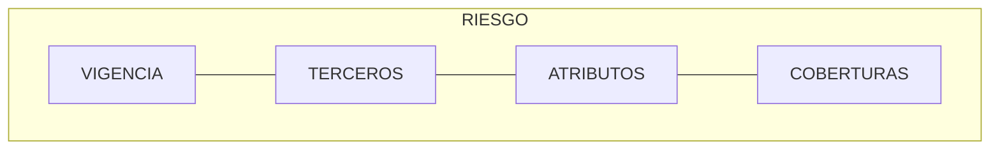
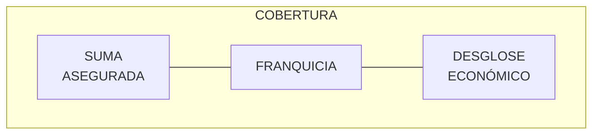
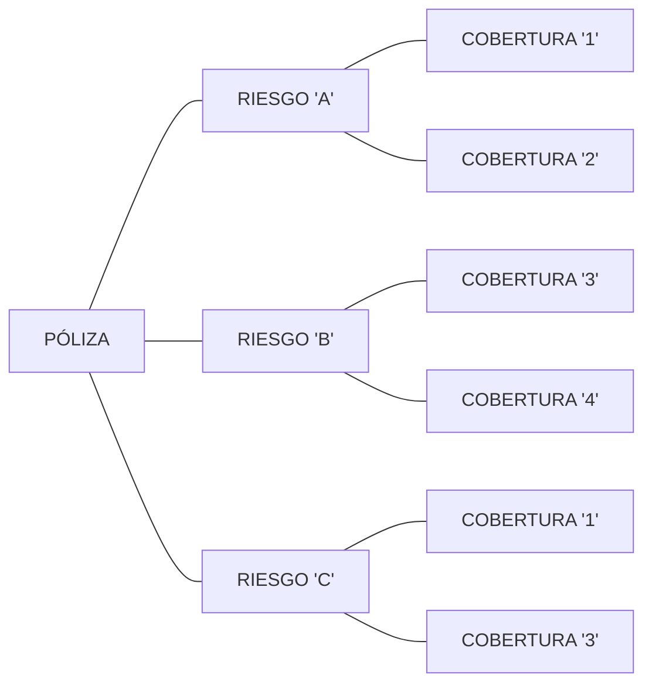
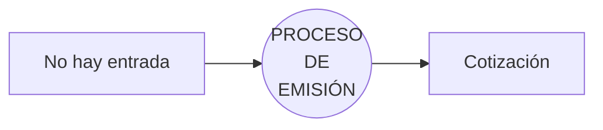
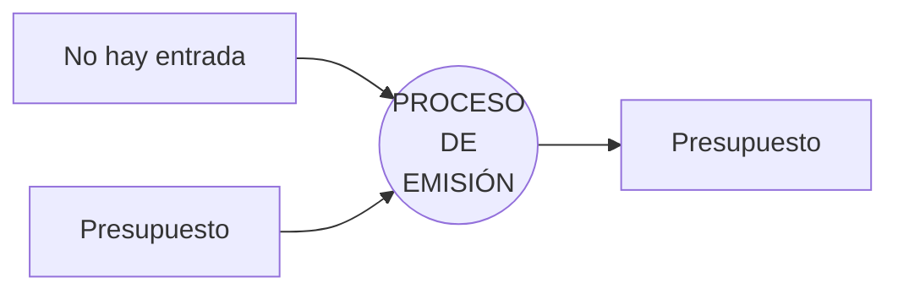
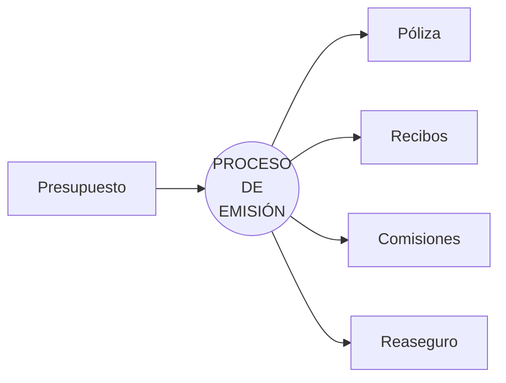
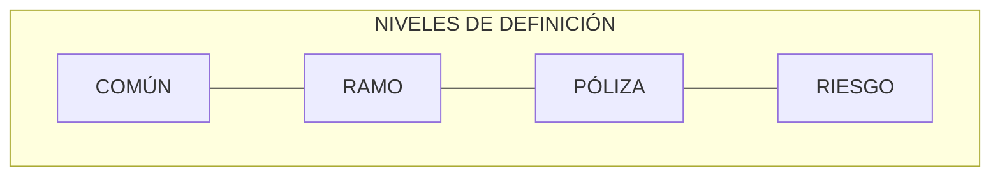

{ width="596" height="159" style="display: block; margin: 0 auto" }

# INTRODUCCIÓN - Módulo de emisión {#titulo}
## **Objetivo**
Básicamente la meta de este módulo es la de **crear** y **modificar** pólizas. Además de póliza, existen otros elementos a los que se les puede denominar como intermedios o de apoyo que facilitan alcanzar dicha meta. Estos elementos son las cotizaciones y presupuestos.

Para que el módulo sea operativo (al igual que el resto), es necesario realizar un proceso de definición previo que permitirá estructurar, determinar reglas y operaciones permitidas.

## **Principales conceptos**
A continuación se describen algunos conceptos considerados esenciales dentro del módulo

- [RIESGO     ](#riesgo)
- [COBERTURA  ](#cobertura)
- [PÓLIZA     ](#poliza)
- [SUPLEMENTO ](#suplemento)
- [COTIZACIÓN ](#cotizacion)
- [PRESUPUESTO](#presupuesto)
- [CUOTA      ](#cuota)
- [RECIBO     ](#recibo)

### **RIESGO** {#riesgo}
Es el qué o quien se asegura. Este puede ser una persona en un seguro de salud, un vehículo en un seguro de automóvil o una vivienda en un seguro de hogar. Los riesgos tienen una serie de características que lo identifican y, algunas de ellas influyen en el coste del seguro.

Ejemplos de atributos y cuales de ellos podrían afectar al coste (serían los marcados):

#### Persona:

- [ ] Documento de identidad (pasaporte, ...) 
- [x] Fecha de nacimiento
- [x] Sexo
- [ ] Domicilio de residencia
- [x] Fumador
- [x] Practica deportes de riesgo
- [ ] Etc.

#### Vehículo:

- [ ] Marca
- [ ] Modelo
- [x] Año de fabricación
- [x] Valor del vehículo
- [ ] Matrícula
- [x] Uso que se le da al vehículo
- [ ] Etc.

#### Vivienda:

- [ ] Estado donde está ubicada
- [ ] Provincia donde está ubicada
- [ ] Localidad donde está ubicada
- [x] Código postal
- [ ] Dirección
- [x] Tipo de construcción
- [ ] Etc.

Retomando el concepto de riesgo, en una póliza un riesgo está compuesto por varios elementos. Estos son:

#### Vigencia {#vigencia}
Especifica cual es el efecto y el vencimiento del riesgo. Es decir, el tiempo que el riesgo está cubierto.

#### Terceros {#tercero}
Se identifica que personas (físicas y/o jurídicas) cumplen con cierto rol en el riesgo. Esto es, existen figuras del tipo:

- Asegurado
- Conductor
- Entidad financiera
- Etc.

y en este apartado se identifican quienes son las personas que cumplen con el rol en el riesgo. Es decir:

- Asegurado: Quien es la persona o personas que estarán cubiertas en caso de siniestro.
- Conductor: Quien es la persona o personas que conducen el vehículo asegurado
- Entidad financiera: Si el riesgo está financiado, se especifica la entidad o entidades donde está financiado.

#### Atributos {#atributo}
Este elemento es el que contiene aquellas características que identifican al riesgo. Un ejemplo de estas características puede ser, y suponiendo que el riesgo es un automóvil:

- Marca
- Modelo
- Año de fabricación
- Valor del vehículo
- Matrícula
- Uso que se le da al vehículo
- Etc.

#### Coberturas {#cobertura}
Este elemento se comenta con más detalle en el siguiente apartado.

### **COBERTURA** {#cobertura}
Junto con el riesgo, este elemento identifica que está cubierto y determina en caso que este se vea afectado (como puede ser por un robo, una rotura, un daño, etc.), la prestación que MAPFRE realizará.

Una cobertura, al igual que el riesgo, está compuesta por una serie de elementos:

#### Suma asegurada {#suma-asegurada}
Determina el importe máximo que puede MAPFRE desembolsar en caso que la afectación se produzca en la cobertura contratada. Por ejemplo:

  - Daños al vehículo propio - Suma asegurada: 20.000,00. En caso que el riesgo sufra daños, MAPFRE responde por 20.000,00

#### Franquicia {#franquicia}
Tiene varios usos en TRON. Entre otros:

- Límite por el que el cliente responde en caso de siniestro:

  - Robo con franquicia del 10%. El cliente responde por el 10% del coste de la prestación y MAPFRE responde por el 90%. En términos prácticos, el cliente recibe el 90% del importe

- Puede actuar como límite:

  - Sustitución de vehículo con franquicia de 7 días. MAPFRE ofrece un vehículo de sustitución por un máximo de 7 días

#### Desglose económico
Corresponde al detalle de conceptos que han afectado económicamente y que sumados suponen costo de la cobertura. Ejemplos de detalles:

- Uso que se le da al vehículo
- Edad del conductor
- Zona de circulación
- Etc.

### **PÓLIZA** {#poliza}
Contrato en el que se registra el riesgo amparado, más las coberturas contratadas por las que MAPFRE responderá en caso que se vea afectado por alguna circunstancia. Con toda esta información se determina el coste al que se denomina prima.
Una póliza puede albergar más de un riesgo por lo que la información se divide en dos niveles:

- Póliza: Información que afecta a todos los posibles riesgos. Como ejemplo de información a este nivel sería:

  - Efecto/vencimiento (de la póliza) que es el periodo global de cobertura. Se denomina global ya que marca la cobertura de todos los posibles riesgos de la póliza
  - Plan de pago (como se fracciona la prima)
  - Tomador (cliente)
  - Etc.

- Riesgo: Información relativa al objeto o persona amparada que es por lo que se regirá el cálculo del coste y la tramitación en caso de siniestro. Ejemplo de información a este nivel:

  - Efecto/vencimiento (del riesgo) que corresponde al periodo en el que el riesgo está cubierto
  - Características del riesgo. Como puede ser la marca y modelo de un vehículo, dirección de una vivienda o datos relativos a una persona
  - Personas como puede ser un conductor en caso del seguro de un automóvil o una entidad financiera si el riesgo está financiado como pueda ser una vivienda
  - Coberturas
  - Etc.

### **SUPLEMENTO** {#suplemento}
Se denomina así a cada una de las modificaciones que se realizan en una póliza. Es decir, cualquier cambio en la información de una póliza y/o riesgo ha de registrarse. Dicha modificación puede afectar o no al coste del seguro (prima) y en caso que afecte al coste, el resultado puede ser a favor del cliente o a favor de MAPFRE.

Como ejemplo de una modificación, se va a suponer que el código postal influye en el coste y los costes son los siguientes:

| CÓDIGO POSTAL | COSTE  |
| :---:         | :---:  |
| 10            | 100,00 |
| 20            | 200,00 |
| 30            | 300,00 |
| 40            | 400,00 |
| 50            | 500,00 |

Para este ejemplo, en la póliza se registró el código postal treinta (30), lo que supone 300,00 de coste. Con esta información, si se realiza un suplemento donde se cambia al código postal:

- diez (10), el coste pasa de 300,00 a 100,00 por lo que corresponde una devolución al cliente
- cincuenta (50), el coste pasa de 300,00 a 500,00 por lo que corresponde un cargo al cliente

En cambio, si la modificación no afectó al código postal (siguió la póliza con el código postal original), el suplemento no generó un coste a favor del cliente o a favor de MAPFRE.

### **COTIZACIÓN** {#cotizacion}
Consiste en ofrecer el coste de la contratación de un riesgo junto a una serie de coberturas a partir de una simulación. Una simulación permite que la información necesaria para determinar el coste pueda ser parte aportada por el cliente y otra parte sea fijada previamente por MAPFRE. Todo ello con el fin de solicitar la menor información posible al cliente.

Existen dos escenarios por la que no se solicite cierta información para dar precio:

1. Hay información que el cliente desconoce. Por ejemplo, puede ser que el canal (internet, banca, presencial, etc.) por el que se solicita la cotización influya en el precio. Esta información el cliente la desconoce y no se va a solicitar, pero esta información se encuentra fijada previamente.
2. Hay información que el cliente conoce pero, con el fin que la solicitud de información sea baja, se fijan valores. Por ejemplo, es posible que la actividad deportiva que realice el cliente influya en el precio, ya que el cliente puede practicar atletismo o parapente. Por este motivo, se puede tomar la decisión de que el cliente no practica un deporte peligroso ya que es lo que hace la mayoría.

Es posible definir una o varias simulaciones con el fin de dar varios precios. Es común ofrecer paquetes con distintas coberturas junto con planes de pago. Como ejemplo, una compañía quiere ofrecer distintos precios de un seguro. Para ello, ofrece los siguientes paquetes de cobertura:

| PAQUETE |
| :---    |
| ORO     |
| PLATA   |
| BRONCE  |

con los siguientes planes de pago:

| PLAN DE PAGO |
| :---         |
| ANUAL        |
| SEMESTRAL    |
| TRIMESTRAL   |

Con esta información, cuando se solicite una cotización de este seguro, se ofrecerán nueve simulaciones, como se muestra a continuación

| SIMULACIÓN | PAQUETE | PLAN DE PAGO |
| :---:      | :---    | :---         |
| 1          | ORO     | ANUAL        |
| 2          | ORO     | SEMESTRAL    |
| 3          | ORO     | TRIMESTRAL   |
| 4          | PLATA   | ANUAL        |
| 5          | PLATA   | SEMESTRAL    |
| 6          | PLATA   | TRIMESTRAL   |
| 7          | BRONCE  | ANUAL        |
| 8          | BRONCE  | SEMESTRAL    |
| 9          | BRONCE  | TRIMESTRAL   |

En condiciones normales, una cotización no conlleva obligación por parte del cliente o parte de MAPFRE.

### **PRESUPUESTO** {#presupuesto}
El uso de este elemento, puede conllevar obligaciones durante un periodo de tiempo por parte de MAPFRE. Esto es, por ejemplo, la conservación del coste (prima) por si hubiera un cambio de tarifa antes de convertir el presupuesto en póliza. En todo caso, un presupuesto comparado con la cotización, correspondería a una simulación, donde la información que se utiliza para determinar el coste no está establecida previamente. Es decir, se proporciona el 100% de la información por parte del cliente y no se presupone nada como podía ocurrir en la cotización.
Si bien una cotización es la forma en la que se determina costes, un presupuesto, además, genera la misma información que si fuera una póliza. Es decir, genera comisiones e intenta realizar la distribución del reaseguro eso sí, de forma simulada.
Una comparación entre cotización y presupuesto sería

|                         | COTIZACIÓN   | PRESUPUESTO |
| :---                    | :---:        | :---:       |
| SIMULACIÓN              | UNA O VARIAS | UNA         |
| INFORMACIÓN ESTABLECIDA | SI           | NO          |
| HALLA COMISIONES        | NO           | SI          |
| SIMULA REASEGURO        | NO           | SI          |
| VARIOS RIESGOS          | NO           | SI          |

### **CUOTA** {#cuota}
Es el coste (prima) que resulta al crear (emitir) o modificar (hacer un suplemento) una póliza, distribuido según el plan de pago. Un plan de pago es la forma en la que el coste (prima) se distribuye en fracciones.

En TRON este concepto es distinto al de recibo.

Por ejemplo, se crea una póliza en el que el coste (prima) se fracciona en cuatro partes (4 cuotas):

| MOVIMIENTO   | TOTAL    | CUOTA 1 | CUOTA 2 | CUOTA 3 | CUOTA 4 |
| :---         | ---:     | ---:    | ---:    | ---:    | ---:    |
| Nueva póliza | 1.000,00 | 250,00  | 250,00  | 250,00  | 250,00  |

Acto seguido, se realiza un suplemento a la misma póliza en la que el coste (prima) cambia:

| MOVIMIENTO   | TOTAL    | CUOTA 1 | CUOTA 2 | CUOTA 3 | CUOTA 4 |
| :---         | ---:     | ---:    | ---:    | ---:    | ---:    |
| Suplemento   | -400,00  | -100,00 | -100,00 | -100,00 | -100,00 |

Una cuota, además dispone de un efecto y un vencimiento que es determinado también por el plan de pago. Es decir, el plan de pago determina cuantas fracciones y cuantos días tiene de vigencia cada fracción.

Siguiendo con el ejemplo anterior se añade información:

| MOVIMIENTO   | EFECTO        | VENCIMIENTO   | PRIMA    | PLAN DE PAGO | Nº DE FRACCIONES | DÍAS DE VIGENCIA (FRACCIÓN) |
| :---         | :---          | :---          | ---:     | :---         | :---:            | :---                        |
| Nueva póliza | 01 Enero 2023 | 01 Enero 2024 | 1.000,00 | TRIMESTRAL   | 4                | Un trimestre                |

Con esta información, el resultado de las cuotas generadas sería:

| CUOTA | EFECTO          | VENCIMIENTO     | IMPORTE |
| :---: | :---:           | :---:           | ---:    |
| 1     | 01 Enero   2023 | 01 Abril   2023 | 250,00  |
| 2     | 01 Abril   2023 | 01 Julio   2023 | 250,00  |
| 3     | 01 Julio   2023 | 01 Octubre 2023 | 250,00  |
| 4     | 01 Octubre 2023 | 01 Enero   2024 | 250,00  |

El siguiente movimiento (suplemento) que se realiza a la póliza tiene la información:

| MOVIMIENTO | EFECTO        | VENCIMIENTO   | PRIMA   | PLAN DE PAGO | Nº DE FRACCIONES | DÍAS DE VIGENCIA (FRACCIÓN) |
| :---       | :---          | :---          | ---:    | :---         | :---:            | :---                        |
| Suplemento | 01 Enero 2023 | 01 Enero 2024 | -400,00 | TRIMESTRAL   | 4                | Un trimestre                |

Con esta información, el resultado de las cuotas generadas sería:

| CUOTA | EFECTO          | VENCIMIENTO     | IMPORTE |
| :---: | :---:           | :---:           | ---:    |
| 1     | 01 Enero   2023 | 01 Abril   2023 | -100,00 |
| 2     | 01 Abril   2023 | 01 Julio   2023 | -100,00 |
| 3     | 01 Julio   2023 | 01 Octubre 2023 | -100,00 |
| 4     | 01 Octubre 2023 | 01 Enero   2024 | -100,00 |

### **RECIBO** {#recibo}
Un recibo es el resultado de asociar una o varias cuotas de una póliza. Para que una cuota se pueda asociar a un recibo debe cumplir una serie de requisitos, que entre otros afecta a:

- Efecto y vencimiento de la cuota debe coincidir con el efecto y vencimiento del recibo.

  Al igual que la cuota, el recibo dispone de un efecto y un vencimiento. Para que una cuota se pueda integrar en un recibo, el efecto/vencimiento de la cuota debe ser el mismo que el efecto/vencimiento del recibo.

- La situación del recibo debe indicar que no ha sido enviado al cliente ni ha sido cobrado.

  Un recibo tiene una situación. La situación indica en qué lugar se encuentra (se encuentra en MAPFRE o fuera de MAPFRE) y si ha sido cobrado o no. Un recibo tiene las siguientes situaciones:

  | SITUACIÓN | DESCRIPCIÓN | ¿ES EXIGIBLE EL COBRO? | ¿SE ENCUENTRA EN MAPFRE? | ¿HA SIDO COBRADO? |
  | :---:     | :---        | :---:                  | :---:                    | :---:             |
  | EP        | El efecto del recibo no ha llegado aún          |  NO | SI | NO|
  | RE        | El efecto del recibo ya ha llegado              |  SI | NO | NO|
  | CT        | El recibo ya ha sido cobrado                    |  SI | SI | SI|

  Bajo el cuadro anterior, para que una cuota pueda integrarse en un recibo, el recibo debe estar con situación EP

Sobre el ejemplo anterior de las cuotas, se va a añadir información con el fin de ilustrar el concepto de recibo:

| MOVIMIENTO   | EFECTO        | VENCIMIENTO   | PRIMA    | PLAN DE PAGO | Nº DE FRACCIONES | DÍAS DE VIGENCIA (FRACCIÓN) |
| :---         | :---          | :---          | ---:     | :---         | :---:            | :---                        |
| Nueva póliza | 01 Enero 2023 | 01 Enero 2024 | 1.000,00 | TRIMESTRAL   | 4                | Un trimestre                |

El resultado con la información anterior sería:

| CUOTA | EFECTO          | VENCIMIENTO     | IMPORTE | Nº RECIBO |
| :---: | :---:           | :---:           | ---:    | :---      |
| 1     | 01 Enero   2023 | 01 Abril   2023 | 250,00  | R-101     |
| 2     | 01 Abril   2023 | 01 Julio   2023 | 250,00  | R-102     |
| 3     | 01 Julio   2023 | 01 Octubre 2023 | 250,00  | R-103     |
| 4     | 01 Octubre 2023 | 01 Enero   2024 | 250,00  | R-104     |

En este caso cada una de las cuotas se han convertido en un nuevo recibo ya que para cada una de ellas no existía un recibo para la póliza al ser una nueva emisión.

Ahora se realiza una modificación (suplemento) con la misma información dada en el concepto cuota:

| MOVIMIENTO | EFECTO        | VENCIMIENTO   | PRIMA   | PLAN DE PAGO | Nº DE FRACCIONES | DÍAS DE VIGENCIA (FRACCIÓN) |
| :---       | :---          | :---          | ---:    | :---         | :---:            | :---                        |
| Suplemento | 01 Enero 2023 | 01 Enero 2024 | -400,00 | TRIMESTRAL   | 4                | Un trimestre                |

Antes de dar el resultado, se muestran los recibos generados en la emisión de la póliza con su situación:

| CUOTA | EFECTO          | VENCIMIENTO     | IMPORTE | Nº RECIBO | SITUACIÓN |
| :---: | :---:           | :---:           | ---:    | :---      | :---:     |
| 1     | 01 Enero   2023 | 01 Abril   2023 | 250,00  | R-101     | CT        |
| 2     | 01 Abril   2023 | 01 Julio   2023 | 250,00  | R-102     | RE        |
| 3     | 01 Julio   2023 | 01 Octubre 2023 | 250,00  | R-103     | EP        |
| 4     | 01 Octubre 2023 | 01 Enero   2024 | 250,00  | R-104     | EP        |

Es decir, de los cuatro recibos que se generaron en la emisión de póliza, hay uno cobrado (el primer recibo), uno enviado al cobro (el segundo) y dos que  no ha llegado su efecto (el tercero y cuarto).

El resultado del suplemento con la información anterior sería:

| CUOTA | EFECTO          | VENCIMIENTO     | IMPORTE  | Nº RECIBO |
| :---: | :---:           | :---:           | ---:     | :---      |
| 5     | 01 Enero   2023 | 01 Abril   2023 | -100,00  | R-105     |
| 6     | 01 Abril   2023 | 01 Julio   2023 | -100,00  | R-106     |
| 3     | 01 Julio   2023 | 01 Octubre 2023 | -100,00  | R-103     |
| 4     | 01 Octubre 2023 | 01 Enero   2024 | -100,00  | R-104     |

Hay que observar que:

- A la cuota con efecto 01 Enero 2023 se ha asignado un nuevo número de recibo (R-105) porque aunque existe un recibo con el mismo efecto/vencimiento (R-101), este está cobrado
- A la cuota con efecto 01 Abril 2023 se ha asignado un nuevo recibo de recibo (R-106) porque aunque existe un recibo con el mismo efecto/vencimiento (R-102), este no se encuentra en MAPFRE
- A la cuota con efecto 01 Julio 2023 se le asignó el recibo R-103 porque este recibo tiene el mismo efecto/vencimiento, se encuentra en MAPFRE y no ha sido cobrado
- A la cuota con efecto 01 Octubre 2023 se le asignó el recibo R-104 porque este recibo tiene el mismo efecto/vencimiento, se encuentra en MAPFRE y no ha sido cobrado

Si se cambia la vista a una en la que la información está agrupada por efecto/vencimiento:

| MOVIMIENTO | CUOTA | EFECTO          | VENCIMIENTO     | SITUACIÓN | R-101  | R-102  | R-103   | R-104   | R-105   | R-106   |
| :---       | :---: | :---:           | :---:           | :---      | ---:   | ---:   | ---:    | ---:    | ---:    | ---:    |
| Emisión    | 1     | 01 Enero   2023 | 01 Abril   2023 | CT        | 250,00 |        |         |         |         |         |
| Suplemento | 5     | 01 Enero   2023 | 01 Abril   2023 | EP        |        |        |         |         | -100,00 |         |

| MOVIMIENTO | CUOTA | EFECTO          | VENCIMIENTO     | SITUACIÓN | R-101  | R-102  | R-103   | R-104   | R-105   | R-106   |
| :---       | :---: | :---:           | :---:           | :---      | ---:   | ---:   | ---:    | ---:    | ---:    | ---:    |
| Emisión    | 2     | 01 Abril   2023 | 01 Julio   2023 | RE        |        | 250,00 |         |         |         |         |
| Suplemento | 6     | 01 Abril   2023 | 01 Julio   2023 | EP        |        |        |         |         |         | -100,00 |

| MOVIMIENTO | CUOTA | EFECTO          | VENCIMIENTO     | SITUACIÓN | R-101  | R-102  | R-103   | R-104   | R-105   | R-106   |
| :---       | :---: | :---:           | :---:           | :---      | ---:   | ---:   | ---:    | ---:    | ---:    | ---:    |
| Emisión    | 3     | 01 Julio   2023 | 01 Octubre 2023 | EP        |        |        |  250,00 |         |         |         |
| Suplemento | 3     | 01 Julio   2023 | 01 Octubre 2023 | EP        |        |        | -100,00 |         |         |         |

| MOVIMIENTO | CUOTA | EFECTO          | VENCIMIENTO     | SITUACIÓN | R-101  | R-102  | R-103   | R-104   | R-105   | R-106   |
| :---       | :---: | :---:           | :---:           | :---      | ---:   | ---:   | ---:    | ---:    | ---:    | ---:    |
| Emisión    | 4     | 01 Octubre 2023 | 01 Enero   2024 | EP        |        |        |         |  250,00 |         |         |
| Suplemento | 4     | 01 Octubre 2023 | 01 Enero   2024 | EP        |        |        |         | -100,00 |         |         |

## **Entradas/Salidas** {#entrada-salida}
### Generación de cotizaciones

### Generación de presupuestos

### Generación de pólizas

## **Características principales**
- **Múltiples tipos de negocio**

  El carácter abierto del módulo facilita la posibilidad de contratar seguros del tipo:

  - Automóvil
  - Salud
  - Vida
  - Transporte
  - Diversos
  - Etc.

- **Varias vigencias de póliza**

  Las pólizas pueden tener una duración de:

  - Un año
  - Inferior a un año
  - Superior a un año

 - **Diferentes tipos de duración de póliza**

  - Temporales
  - Renovables
  - Renovables por su temporalidad
  - Renovables por su periodo

- **Uno o varios riesgos**
  
  Es factible que una póliza disponga de más de un elemento asegurado.

- **Varios agentes**

  Las pólizas pueden disponer desde uno a seis agentes.

- **Varias figuras que intervienen en la póliza**

  Una póliza puede albergar varias figuras como pueden ser la de:

  - Tomador
  - Asegurado
  - Etc.

- **Múltiples planes de pago**

  Las formas en las que se dividen los pagos son totalmente abiertas.

- **Libre definición del detalle del riesgo**

  La definición de aquello o a quien se asegura es totalmente abierta.

- **Libre definición del detalle de cobertura**

  Al igual que el riesgo, las coberturas son de definición libre.

- **Libre definición del detalle económico**

  La información económica es totalmente libre de definición.

- **Varias formas de cálculo**

  Se pueden aplicar cálculos automáticos, manuales o mixtos (parte automática, parte manual)

- **Posibilidad de retener la póliza para posterior autorización o rechazo**

  La póliza puede quedar en un estado llamado retenido a la espera a que alguien (una o varias personas) determinen si el riesgo es aceptado o no.

- **Posibilidad de particularizar el comportamiento a nivel de cliente**

  Es posible aplicar condiciones especiales de los que se puede beneficiar uno o varios clientes. Estas condiciones afectan a todos los niveles. Es decir, pueden afectar a:

  - Estructura
  - Comportamiento
  - Cálculo
  - Etc.

- **Independencia del frontal**

  El módulo se puede operar a través de las pantallas que se proporcionan o con cualquier otro tipo de pantallas.

## **Definición de ramo** {#definicion-ramo}
Para conseguir lo visto anteriormente es necesario que previamente se realice la definición de distintos elementos. A estas acciones se las denomina "definir el ramo". Esta definición determinará:

- Los elementos necesarios para, posteriormente conseguir el objetivo del módulo, tales como definir personas que intervienen
- La estructura de los elementos. Como puede ser los atributos que componen un riesgo o las coberturas que participarán en la contratación de un seguro
- El comportamiento de los elementos definidos, como la información del riesgo que es obligatoria y/o dependiente de otros
- El tipo de modificaciones que será posible realizar

Por otro lado, los elementos de definición atienden a distintos niveles:

#### COMÚN {#comun-nivel}
En este nivel se encuentran definiciones que no son exclusivas del módulo de emisión, pero son necesarias para poder realizar la definición. Entre otras definiciones se encuentra:

- Estructura geográfica
- Estructura comercial
- Estructura de canal
- Etc.

#### RAMO {#ramo-nivel}
Son definiciones que siendo del módulo de emisión, no son exclusivas del ramo que se está definiendo. Por ejemplo:

- Numeración de póliza
- Contratos
- Subcontratos
- Etc.

#### PÓLIZA {#poliza-nivel}
En este nivel se encuentran definiciones que afectarán a todos los posibles riesgos de la póliza. Entre otros se define:

- Monedas
- Planes de pago
- Etc.

#### RIESGO {#riesgo-nivel}
Definiciones que afectan a cada uno de los posibles riesgos de la póliza. Por ejemplo:

- Atributos que definen el riesgo
- Coberturas
- Desglose económico
- Etc.
