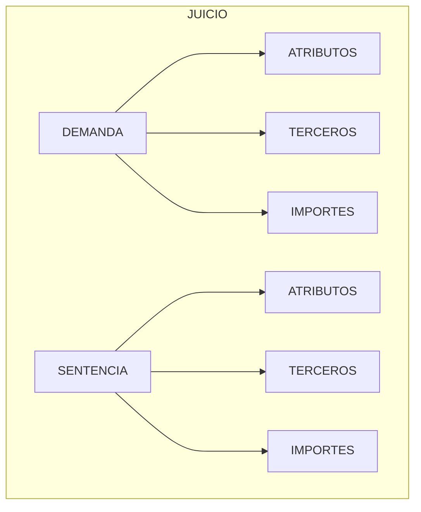

{ width="596" height="159" style="display: block; margin: 0 auto" }

# INTRODUCIR - Juicios {#titulo}

 
## **OBJETIVO**
La finalizad de este módulo es poder registrar todos los datos de un juicio, tanto si la compañía ha demandado a un tercero (físico o jurídico), como si un tercero ha demandado a la compañía.      

## **Características**

- **Múltiples tipos de negocio**  
  El carácter abierto del módulo facilita la posibilidad de trabajar seguros del tipo:  
  - Automóvil
  - Salud
  - Vida
  - Transporte
  - Diversos
  - Etc.

- **Configurable**    
    Mediante catálogos vamos a poder definir el comportamiento y las características que le vamos a dar al modulo de Juicios. 

- **Cubre todas las funcionalidades de los juicios**  
  Este módulo, contiene todas las funcionalidades necesarias para registrar y realizar un seguimiento de los __juicios__  .

- **Histórico de abogados**  
 

## **Elementos de un Juicio** {elementos}

Un juicio está compuesto de varios elementos  

### **Demanda** {#demanda}  

En este elemento del juicio se tiene que identificar:  

- Siniestro/expediente pendiente, al que va afectar el juicio.
- Estado del Juicio  
- Fecha estimada del Juicio
- Abogado
- Etc.  

### **Atributos** {#atributo}  

Este elemento contiene información adicional de los juicios, es opcional, tanto para la demanda como para la sentencia.

### **Terceros** {#beneficiario}  
En este elemento se puede identificar las personas (físicas y/o jurídicas),  que tiene relación con el juicio, tanto en la demanda como en la sentencia, testigos..

### **Importes** {#importes}  
Cuando el juicio esté en la primera fase de la demanda los importes podrían ser: 

- Consignaciones    
- Adelanto de Honorarios Abogado  
- Etc

Cuando se haya celebrado el juicio y se haya dictado una sentencia el detalle de los importes podrían ser:

- Honorarios del Abogado
- Importe de la sentencia
- Etc

### **Sentencia** {#sentencia}  
En este elemento del juicio se tiene que identificar:  

- Fecha del Juicio
- Tipo de sentencia
- Fecha pago o de cobro
- Etc.  

