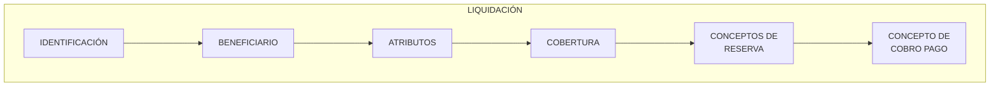

{ width="596" height="159" style="display: block; margin: 0 auto" }

# INTRODUCCIÓN - Módulo Liquidaciones {#titulo}

 

## **OBJETIVO**
La finalizad de este módulo es poder __ordenar el pago/cobro de expedientes__ a personas físicas o jurídicas que hayan intervenido en el expediente, tanto proveedores, como perjudicados ...llamadas liquidaciones.     

- Concepto
  - [Concepto de Cobro-Pago](#conceptocpv)
- [Características](#caracteristicas)
- [Elementos de una liquidación](#elementos)

## **Conceptos**

### **Conceptos de Cobro Pago Vario de Siniestros** {#conceptocpv}

La liquidación de un expediente (cobro o pago a un beneficiario), se realiza a través de unos __conceptos económicos__ que se denominan conceptos de cobro y pago vario. Estos conceptos posibilitan detallar el pago. Por ejemplo si se va a pagar a un taller:

- Mano de Obra
- Piezas
- Pintura
- Etc.  
 

## **Características** {#caracteristicas}

- **Cubre todas las funcionalidades de las liquidaciones**  

  Este módulo, contiene todas las funcionalidades necesarias para ordenar el pago o el cobro a una persona física o jurídica

- **Parametrizable**  

  El  módulo es parametrizable y el comportamiento de la aplicación depende de las definiciones previas (Taller de Productos).  

- **Importes económicos**   

  Cada liquidación contiene los importes económicos almacenados a nivel de cobertura. El detalle del pago se realiza a través de los conceptos de cobro pago vario

- **Múltiples monedas**  

  Los pagos pueden realizarse en monedas distintas a la de la póliza o a la de los expedientes

- **Registro de Beneficiario**    

  Para realizar una liquidación el beneficiario tiene que estar **registrado** en el sistema (Terceros), con sus medios de contacto, sus medios de cobro / pago, para poder realizar pagos y para poder contactar con ellos.

- **Una o varias liquidaciones por expediente**   

  Existirán tantas liquidaciones como beneficiarios haya que pagar o cobrar.

## **Elementos de un Liquidación** {#elementos}

Un liquidación está compuesta de varios elementos  

### **Datos Identificación** {#identificacion}  

Se tiene que identificar:  

- Siniestro/expediente  al que va afectar la liquidación  
- Fechas estimada de pago  
- Moneda de pago  
- Datos de la factura (si es que el pago se realiza por una factura) 
- Etc.  

### **Beneficiario** {#beneficiario}  

Se debe identificar la persona (físicas y/o jurídicas) a la cual le vamos a pagar o cobrar.

El modo en el que le vamos a pagar o cobrar:  

- Efectivo
- Transferencia Bancaria
- Etc.

### **Atributos** {#atributo}  

Este elemento contiene información adicional de la liquidación, es opcional.

### **Cobertura** {#cobertura}  

 La cobertura del expediente a la que está afectando la liquidación.

### **Concepto de Reserva** {#ctoreseva}  

Detalle de si se va a pagar por indemnización, honorarios o gastos.

### **Concepto de Cobro Pago Vario** {#ctopago}  
Detalle del pago.