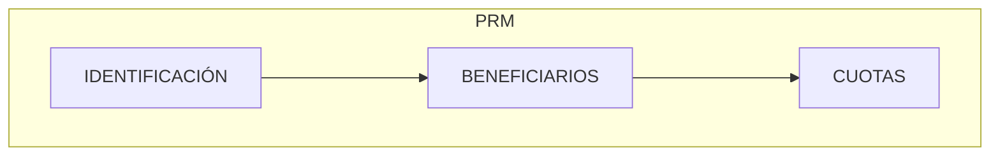

{ width="596" height="159" style="display: block; margin: 0 auto" }

# INTRODUCCIÓN - Plan de Renta {#titulo}

 

## **OBJETIVO**
La finalizad de este módulo es cubrir las necesidades de pagar un importe periódicamente a un asegurado, por una invalidez permanente o temporal.

- Concepto
  - [Cuota](#cuota)
- [Características](#caracteristicas)
- [Elementos del Plan de Renta](#elementos)

## **Conceptos**

### **Cuota** {#cuota}
Es el importe que hay que pagar al asegurado hasta su recuperación o muerte.

 
## **Características** {#caracteristicas}

- **Cubre todas las funcionalidades del Plan de Renta**  
Este módulo, contiene todas las funcionalidades necesarias para ordenar el pago a una persona física o jurídica automáticamente, cuando una persona tiene contratada una cobertura de invalidez, accidente laboral, etc.

- **Parametrizable**  

  El  módulo es parametrizable y el comportamiento de la aplicación depende de las definiciones previas (Taller de Productos)

- **Múltiples monedas**   

  Los pagos pueden realizarse en monedas distintas a la de la póliza o a la de los expedientes

- **Registro de Beneficiario**  
  Para realizar las liquidaciones del Plan, el beneficiario tiene que estar **registrado** en el sistema (Terceros), con sus medios de contacto, sus medios de cobro / pago, para poder realizar pagos y para poder contactar con ellos.  

- **Una o varias liquidaciones por Plan de Renta**   

  Existirán tantas liquidaciones como beneficiarios y cuotas haya que pagar.  

## **Elementos del Plan de Renta** {#elementos}  

El Plan de Renta está compuesto de varios elementos:

### **Datos Identificación del Plan de Renta** {#identificacion}  

Se tiene que identificar:  

- Siniestro/expediente  al que va afectar el plan de Renta  
- Fechas estimada de pago  
- Moneda de pago  
- Importe Total del Plan  
- Número de cuotas  
- Etc.  

### **Beneficiarios** {#beneficiario}  

Se debe identificar la/s persona/s (físicas y/o jurídicas) a la cual le vamos a pagar.  

El modo en el que le vamos a pagar:

- Efectivo
- Transferencia Bancaria
- Etc.

### **Cuotas** {#cuotas}
Es el importe que hay que pagar periódicamente a una asegurado o a sus beneficiarios hasta su recuperación (en caso de invalidez temporal) o muerte.

