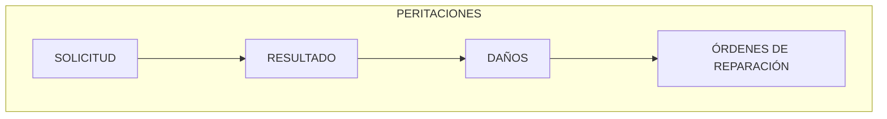

{ width="596" height="159" style="display: block; margin: 0 auto" }

# INTRODUCCIÓN - Peritaciones {#titulo}

 

## **Objetivo**
La finalidad de este módulo, es poder registrar todas las peritaciones, desde que se encarga a un profesional, hasta que se finaliza y recibimos el resultado.
La Peritación es el estudio realizado por un Perito con experiencia y conocimientos técnicos, científicos. Este estudio y análisis se pone por escrito a través del llamado "Informe Pericial".

## **Características** {#caracteristicas}

- **Cubre todas las funcionalidades de las peritaciones**  
  Contiene todas las funcionalidades necesarias de las peritaciones, desde el encargo o solicitud de las peritaciones a un profesional (perito), hasta la finalización de la misma, con el envío de la factura por parte del taller. 

- **Parametrizable**  

  El  módulo es parametrizable y el comportamiento de la aplicación depende de las definiciones previas (Taller de Productos).

- **Registro de Beneficiario/ Proveedor**  

  Para realizar una peritación, el profesional (perito) y el proveedor (proveedor de piezas, taller, etc) tiene que estar **registrado** en el sistema (Terceros), con sus medios de contacto, sus medios de cobro / pago, para poder realizar pagos y para poder contactar con ellos.  

## **Elementos de las Peritaciones** {#elementos}  

Las peritaciones están compuestas de varios elementos:

### **Solicitud de la peritación** {#solicitud}   
Se recogerán los datos mínimos de la peritación:  

 - Lugar de peritación  
 - Profesional asignado (perito, inspector)  
 - Fecha estimada de peritación  
 - Etc  

### **Resultado de la peritación** {#peritacion}  

Este elemento contendrá el resultado de la peritación:   
- Fecha de la peritación  
- Se indicará si es pérdida total o no  
- Si se adjunta fotos  
- Si es una peritación definitiva   
- Etc.

### **Daños** {#danos} (opcional)   
Este elemento es opcional. Si se utiliza, se detallará:   
- Daños producidos  
- Tipo de  reparación 
- Importe  
- Número de horas que se tarda en reparar   
- Etc.

### **Órdenes de reparación** (opcional)  
Este elemento de las peritaciones es opcional. 

Se generarán tantas órdenes como beneficiarios hayan surgido en la peritación.
  - Si es de autos: el taller, proveedor de repuestos, perito externo..
  - Si es de generales: el albañil, el perito externo...   

Si el expediente está definido como que se puede peritar y además es obligatoria la peritación, no se podrá liquidar el expediente si no han registrado las órdenes de reparación.  

