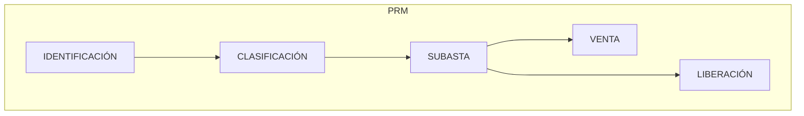

{ width="596" height="159" style="display: block; margin: 0 auto" }

# INTRODUCCIÓN - Salvamentos {#titulo}

 n 

## **OBJETIVO**
La finalidad de este  módulo es controlar los automóviles o cualquier otro bien recuperado de un robo o de una pérdida parcial o total, desde su recuperación, hasta su venta.

- Concepto
  - [Cuota](#cuota)
- [Características](#caracteristicas)
- [Elementos del Plan de Renta](#elementos)

## **Conceptos**
Que exista un expediente pendiente, cuyo tipo de expediente se le haya definido como recuperación material (Tipo Salvamento).
### **Cuota** {#cuota}

 
## **Características** {#caracteristicas}

- **Cubre todas las funcionalidades para el control de Salvados**  

Este módulo, contiene todas las funcionalidades necesarias para el control, la clasificación y la venta de los bienes recuperados (salvados).

- **Parametrizable**  

  El  módulo es parametrizable y el comportamiento de la aplicación depende de las definiciones previas (Taller de Productos)

- **Múltiples monedas**   

  Los pagos pueden realizarse en monedas distintas a la de la póliza o a la de los expedientes

- **Registro de Beneficiario**  
  Para realizar los cobros a las personas que compran los salvamentos, el pagador tiene que estar **registrado** en el sistema (Terceros), con sus medios de contacto, sus medios de cobro / pago, para poder realizar pagos y para poder contactar con ellos.  

- **Una o varias liquidaciones para Salvamentos**   

  Existirán tantas liquidaciones como compradores existan.  

## **Elementos de Salvamentos** {#elementos}  

Los salvamentos está compuesto de varios elementos:

### **Datos Identificación de Salvamentos** {#identificacion}  

Se tiene que identificar:  

- Siniestro/expediente  al que va afectar el Salvamento
- Fechas estimada de pago  
- Moneda de pago  
- Importe Total del Plan  
- Etc.  

### **Beneficiarios** {#beneficiario}  

Se debe identificar la/s persona/s (físicas y/o jurídicas) a la cual le vamos a pagar.  

El modo en el que le vamos a pagar:

- Efectivo
- Transferencia Bancaria
- Etc.

