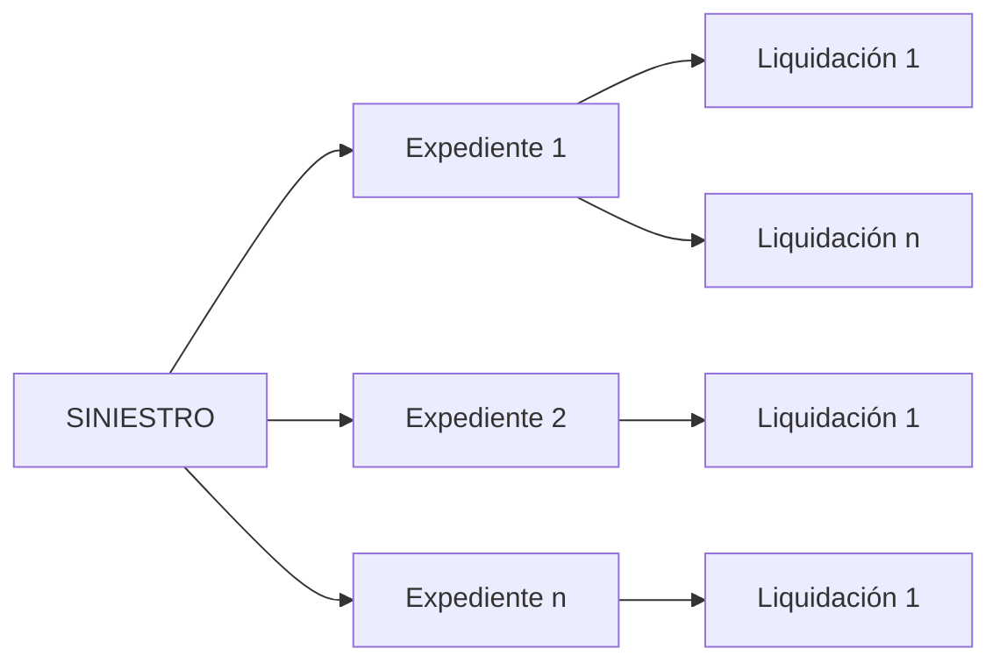
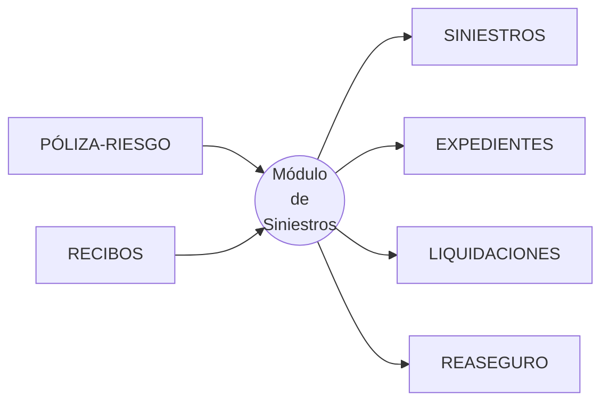
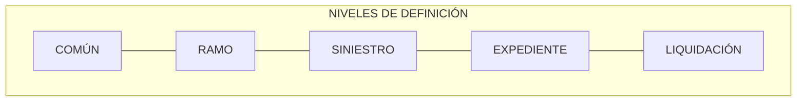

{ width="596" height="159" style="display: block; margin: 0 auto" }

# INTRODUCCIÓN - Módulo Siniestros {#titulo}

 

## **OBJETIVO**
La finalidad de este módulo es realizar todas las gestiones cuando un riesgo contratado por la compañía es afectado y supone el abono de una indemnización. Se realizan dichas gestiones desde que tenemos constancia de que el riesgo es afectado, hasta su cierre.

- [Conceptos            ](#conceptos)  
  - [Siniestro            ](#siniestro)  
  - [Expediente           ](#expediente)  
  - [Liquidación          ](#liquidacion)  
- [Entradas/Salidas     ](#entrada-salida) 
- [Características      ](#caracteristicas)   
- [Módulos Gestionados por el Plan de Tramitación](#modulos)  
- [Herramientas Basadas en el Plan de Tramitación](#herramientas-plan)
- [Otras Herramientas](#herramientas)  
- [Definiciones del Ramo](#definicion-ramo)  

## **Conceptos** {#conceptos}

### **Siniestro** {#siniestro}  
 Es el hecho que ocurre cuando un riesgo contratado por la compañía es afectado. En el __siniestro__ se almacena, toda la información que la persona que se ha puesto en contacto con la compañía, ha facilitado. Como por ejemplo: 

- Póliza y riesgo afectado por el siniestro  
- Fechas    
- Relato del siniestro  
- Lugar del siniestro  
- Etc.  

### **Expediente** {#expediente}
Es cada uno de los daños ocasionado como consecuencia de ese hecho, evento. Cada __expediente__ almacena la información específica de cada daño, como por ejemplo:  

- Daños de lesiones  
- Daños materiales  
- Datos de invalidez  
- Etc.  

Cada expediente contiene su propia información económica. Esta información se almacena por cobertura.

__Ejemplo:__    

Un asegurado, se pone en contacto con la compañía para indicar que ha tenido un accidente y ha chocado con otro coche y él está herido.
Según el relato, la culpa es suya debido a un despiste. A este hecho, se le denomina __siniestro__.  

Por cada daño que se ha ocasionado se va a abrir un __expediente__.  
En este caso se abrirán tres expedientes:   

- Un expediente del tipo Daños Materiales al vehículo Asegurado   
- Un expediente del tipo Daños Materiales al vehículo Contrario  
- Un expediente del tipo Lesiones ocupante Vehículo Asegurado  

Cada expediente va a tener su propia información tanto de datos, como económica.   

### **Liquidación** {#liquidacion}
Es el medio mediante el cual se va poder pagar a los afectados y a los proveedores que han participado en un expediente.  Habrá que generar tantas __liquidaciones__ como __beneficiarios__ haya involucrados en el expediente. 
######

## **Características** {#caracteristicas}

- **Múltiples tipos de negocio**  
  El carácter abierto del módulo facilita la posibilidad de trabajar seguros del tipo:
  - Automóvil
  - Salud
  - Vida
  - Transporte
  - Diversos
  - Etc.

- **Configurable**  
Mediante catálogos vamos a poder definir el comportamiento y las características que le vamos a dar a toda aplicación de siniestros para cada producto. 

- **Orientado a perfiles**
Este módulo necesita definir los perfiles que pueden trabajar con el mismo y su especialización.
  - Tramitador   (responsable de que se realicen todas las gestiones necesarias a un expediente)      
  - Supervisor (Responsable de los tramitadores)     

- **Herramientas de gestión**  
En este módulo existe una herramienta de gestión de expedientes para, tramitadores, para supervisores, para jefe de supervisores y para algún colaborador de la empresa. 

## **Entradas/Salidas** {#entrada-salida}

### __Póliza-Riesgo__  
Para poder generar un siniestro, tiene que existir una póliza riesgo contratada por la empresa y vigente a la fecha de ocurrencia del siniestro.

### __Recibos__
Desde siniestros se comprueba el estado del recibo a la fecha del siniestro y según el ramo el módulo se puede comportar de distinta manera.  

######
## __Módulos Gestionados por el Plan de Tramitación__ {#modulos} 
Los principales __sub-módulos__ con los que cuenta el módulo de Siniestros y que son gestionados por el __Plan de tramitación__  son:  

######  
| | | ||       |  
|---|---|---|---|:---:| 
| __MÓDULOS__| | ||      __GESTIONADOS__ |  
|__SINIESTROS__        |  || __EXPEDIENTES__|  |
|__LIQUIDACIONES__|  || __PERITACIONES__|  |
__SALVAMENTOS__|  || __JUICIOS__|  __PLAN TRAMITACIÓN__
 __P.R.M.__|  || __FRAUDE__|
| __I.Q.R.F.__|  || __FACTURACIÓN__|  

######

## __Herramientas Basadas en el Plan de Tramitación__ {#herramientas-plan} 

El módulo de siniestros tiene  varias __herramientas__ para la gestión diaria del tramitador y del supervisor, así como auditoría para supervisores y responsables de Supervisores, que están __basadas en el Plan de Tramitación__

### __Gestión del Tramitador__  
 Herramienta para organizar el trabajo de los tramitadores, basado en 
 el “Plan de Tramitación”.

### __Auditoría del Supervisor__
Herramienta para organizar el trabajo de gestión y auditoria de los supervisores, basado en el "Plan de Tramitación", cuyo principal objetivo es el __Control__ de la gestión de sus __tramitadores__:  

## __Otras Herramientas__  {#otras-herramientas}

### **Gestión del Supervisor**
 Herramienta para organizar el trabajo de gestión de los supervisores. No está basado en el Plan de Tramitación.  
Las operaciones más importantes son el mantenimiento de tramitadores y especialización de los mismos.
  
## **Definición de ramo** {#definicion-ramo}
Para conseguir lo visto anteriormente es necesario que previamente se realice la definición de distintos elementos. A estas acciones se las denomina "definir el ramo". Esta definición determinará:

- Los elementos necesarios para, posteriormente conseguir el objetivo del módulo, tales como definir personas que intervienen
- La estructura de los elementos. Como puede ser los atributos que componen un siniestro o las coberturas que afectarán a un tipo de expediente (tipo de daño)

- El tipo de modificaciones que será posible realizar

Por otro lado, los elementos de definición atienden a distintos niveles:

#### COMÚN {#comun-nivel}
En este nivel se encuentran definiciones que no son exclusivas del módulo de siniestros, pero son necesarias para poder realizar la definición. Entre otras definiciones se encuentra:

- Estructura geográfica
- Estructura comercial
- Estructura de canal
- Monedas
- Etc.

#### RAMO {#ramo-nivel}  
Son definiciones que siendo del módulo de siniestros, no son exclusivas del ramo que se está definiendo. Por ejemplo:

- Numeración de siniestros
- Eventos
- Causas de procesos (apertura, modificación, terminación)
- Etc.

#### SINIESTROS {#siniestro-nivel}  

En este nivel se encuentran definiciones que afectarán a todos los posibles expedientes de un siniestro. Entre otros se define:

- Estructura de tramitación
- Causa del Siniestro
- Consecuencias del Siniestro
- Atributos adicionales del Siniestro
- Etc.

#### EXPEDIENTES {#expediente-nivel}  

Definiciones que afectan a cada uno de los posibles expedientes del siniestro. Por ejemplo:

- Tipología de expedientes
- Atributos que definen al expediente
- Coberturas del expediente
- Desglose económico del expediente
- Importe Inicial
- Importe máximo
- Etc.

#### LIQUIDACIÓN {#liquidacion-nivel}  

Definiciones que afectan a cada uno de las posibles liquidaciones de un expediente. Por ejemplo:

- Atributos que definen a la liquidación
- Posibles Beneficiario
- Desglose económico de la liquidación
- Importe Inicial
- Importe máximo
- Etc.
