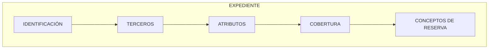

{ width="596" height="159" style="display: block; margin: 0 auto" }

# INTRODUCCIÓN - Módulo Tramitación de Expedientes {#titulo}

## **Objetivo**
La finalidad de este módulo es poder realizar cualquier operación con un Expediente.   

- Concepto
  - [Concepto de Reserva](#conceptoreserva)
- [Características](#caracteristicas)
- [Elementos de un expediente](#elementos)

## **Conceptos** 

### **Concepto de Reserva** {#conceptoreserva}  
La valoración económica de un expediente, se realiza a través de unos __conceptos económicos__ que denominaremos __conceptos de reserva__. Estos permiten detallar para cada cobertura, el importe que se está reservando a qué está afectando. 
Hay tres tipos de Conceptos:    

- **Indemnización**  
- **Honorarios**   
- **Gastos**     

Ejemplo:

 | Conceptos de Reserva  
 |---|  
 |**1** Indemnización           |
 |**2** Honorarios Profesionales|
 |**3** Gastos Profesionales    |

## **Características** {#caracteristicas}

- **Cubre todas las funcionalidades de expedientes**  

  Este módulo, contiene todas las funcionalidades necesarias para tramitar  __expedientes__.

- **Parametrizable**  

  El  módulo es parametrizable y el comportamiento de la aplicación depende de las definiciones previas (Taller de Productos)

- **Importes económicos**  

  Cada expediente tiene importes económicos almacenados a nivel de cobertura.

- **Múltiples monedas**  

  Los expedientes pueden valorarse en una moneda diferente a la del siniestro (póliza) y pagarse en otra moneda diferente a la de la valoración.  

- **Múltiples expediente**  
  Un siniestro podrá tener de uno a n expedientes, tantos expedientes como daños se hayan ocasionado.  
  
  
## **Elementos de un expediente** {#elementos}
Un expediente está compuesto de varios elementos:  

### **Datos Identificación del expediente** {#identificacion}

Se identifica:   

- El siniestro al que va afectar el expediente  
- Las fechas de notificación  
- Moneda del expediente  
- Etc.  

### **Terceros** {#tercero}  

Se identifica a las personas (físicas y/o jurídicas) que intervienen en el Expediente. Son necesarias para realizar distintas gestiones, como comunicaciones, generar liquidaciones, etc.  

- Asegurado  
- Perjudicado  
- Propietario  
- Taller  
- Abogado  
- Etc.  

### **Atributos** {#atributo}  
Este elemento contiene todos los datos relacionados con el  expediente, es opcional. La información variará dependiendo del tipo de expediente.  

Ejemplo de estas características:  

- Si el tipo de expediente es __Daños al vehículo contrario__:    

  - Propietario vehículo contrario
  - Conductor vehículo contrario
  - Aseguradora del contrario
  - Matrícula
  - Marca
  - Modelo
  - Etc.
      
- Si el tipo de expediente es __Daños Personales__:    

  - Lesionado  
  - Lesiones  
  - Información de contacto  
  - Hospital  
  - Etc.

### **Cobertura** {#cobertura}

Este elemento identifica de lo que está cubierto el riesgo a qué se va a afectar en caso de siniestro, la prestación que MAPFRE realizará.

### **Concepto de Reserva** {#ctoreserva}

Detalle de la cobertura, en el que se determina si se va a reservar un importe para pagar Indemnización, Honorarios o Gastos

 |Cobertura    | Concepto Reserva   
 |---|---|  
 |**2001** Daños Propios Vehículo |**1** Indemnización Asegurado| 
 |                                |**2** Honorarios Profesionales|
 |                                 |**3** Gastos Profesionales    |
  