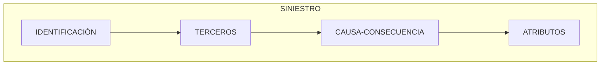

{ width="596" height="159" style="display: block; margin: 0 auto" }

# INTRODUCCIÓN - Tramitación Siniestros {#titulo}

 
## **Objetivo**
La finalizad de este módulo es poder  realizar cualquier operación con un Siniestro.  

- [Conceptos      ](#conceptos)
  - [Causa          ](#causa)
  - [Consecuencias  ](#consecuencias)
  - [Causas-Consecuencias     ](#causa-consecuencia)
- [Caracteristicas](#caracteristicas)
- [Elementos de un siniestro](#elementos)

## **Conceptos** {#conceptos}

### **Causa** {#causa}
Es el motivo que origina el siniestro. La causa es única por siniestro. 

Ejemplos:  

- Si un vehículo es robado y luego se incendia, la **causa del siniestro**,el origen es "Robo".     

- Si una casa se incendia y luego entran a robar, la **causa del siniestro** será "Incendio".

### **Consecuencias** {#consecuencia}

Es el o los daños que resultan del siniestro, es decir ,las consecuencias son los diferentes daños que podrán ser ocasionados a raíz de un siniestro.  
En un siniestro, se tiene que seleccionar al menos una o más consecuencias.   

Ejemplos de consecuencias:  

- Daños materiales a vehículos
- Daños materiales a Cosas 
- Muerte
- Invalidez Permanente
- Daños personales....

### **Unión Causa Consecuencias** {#causa-consecuencias}

Mediante la elección de la causa del siniestro y de las consecuencias, el sistema es capaz de realizar una propuesta automática de los posibles Tipos de Expedientes a aperturar.
 
Ejemplo de causa de autos y diferentes consecuencias:

| Causa          | Consecuencia                 | Tipo Expediente| Cobertura |
| :---           | :---                         | :---           |:--|
| __Atropello__  | Daños Vehículo Asegurado     | DPM- Daños Propios Materiales | Daños Propios
|                | Daños Personales a Terceros  | DPA- Daños Personales         | Responsabilidad Civil

En este caso:  

- Si seleccionamos como causa del siniestro "Atropello" y  **las dos consecuencias**, el sistema propondrá abrir __dos tipos de Expedientes__ el de Daños Propios y el de Daños Personales, siempre y cuando la póliza-riesgo tenga esas dos coberturas contratadas.  

- Si seleccionamos como causa del siniestro "Atropello" y sólo __la consecuencia de Daños al Vehículo Asegurado__, el sistema sólo propondrá la apertura del expediente de __tipo de expediente Daños Propios__, siempre y cuando la póliza riesgo, tenga contratada esa cobertura.

## **Características** {#caracteristicas}

- **Información Común a todos los expedientes**  
  El siniestro, engloba toda la __información común__  a todos los expedientes.  

- **Sin Coste**  
No tiene importes económicos, el __coste del siniestro__ es la suma del coste de todos sus expedientes.

- **Parametrizable**  
El comportamiento del módulo depende de la definición del mismo.

## **Elementos de un siniestro** {#elementos}
Un siniestro está compuesto de varios elementos

### **Datos Identificación** {#identificacion}

Se identifican:  

- La póliza / riesgo afectado
- Fechas: ocurrencia, notificación
- Evento catastrófico
- Etc.

### **Terceros** {#tercero}  
Se identifica que personas (físicas y/o jurídicas) intervienen en el Siniestro. 

- Asegurado
- Conductor
- Propietario
- Persona de Contacto
- Entidad financiera
- Etc.

### **Causa-Consecuencia** {#causa}  

- Origen del siniestro
- Consecuencias del siniestro

### **Atributos** {#atributo}  

Este elemento contiene todos los datos adicionales del siniestro. Un ejemplo de estas características puede ser, y suponiendo que el riesgo es un automóvil:

- Relato del siniestro
- Ubicación del lugar del siniestro
- Etc.

