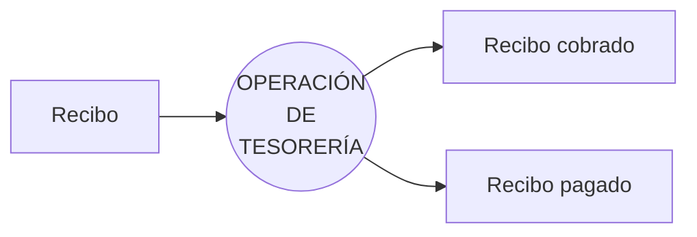
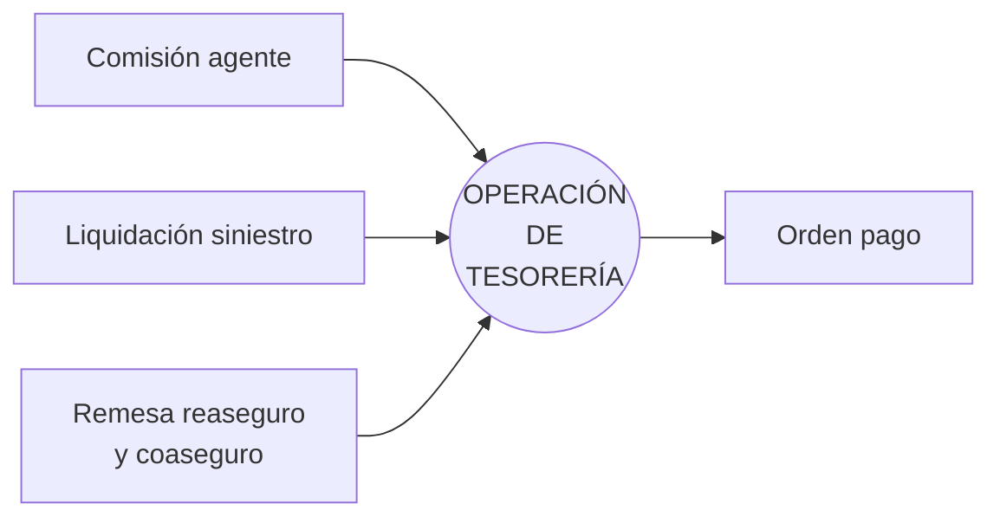
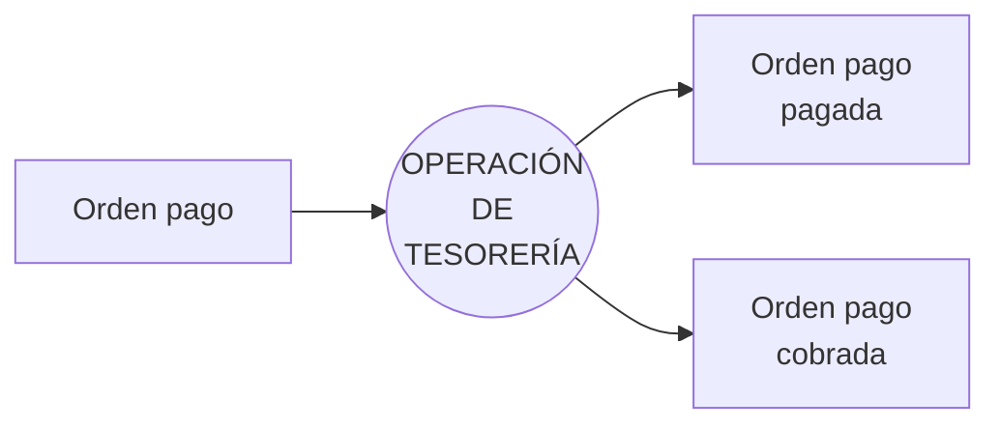

{ width="596" height="159" style="display: block; margin: 0 auto" }

==EN CONSTRUCCIÓN==

# INTRODUCCIÓN - Módulo Tesorería {#titulo}  
## **Objetivo**
El módulo de Tesorería se encarga de controlar todos los flujos monetarios de la compañía: Gestión de Pagos, Gestión de Cobros, Previsiones de Tesorería, Gestiones Bancarias. 

## **Características**
- [Generales](#generales)  
- [Acceso](#acceso)  
- [Multimoneda](#multimoneda)

### **Generales** {#generales}
El módulo de tesorería permite, fundamentalmente, realizar operaciones de contabilidad sin tener mayor conocimiento contable.  

Este módulo está basado en el plan general contable, siendo este un documento que contiene la normativa contable vigente y aplicable a las empresas. Es el marco legal y normativo para la elaboración de la contabilidad financiera, que es la contabilidad ‘legal’ y obligatoria de las empresas.  

Se trabaja con el registro diario de operaciones, que es donde se registran todas las operaciones diarias de la empresa de manera cronológica y en forma de asiento contable.  

Un asiento contable es la anotación que se realiza en el libro de contabilidad para registrar una entrada o salida, es decir, una compra realizada o un pago por servicio prestado. Cada asiento contable se refleja a través de dos anotaciones: Debe y Haber. 

- Cuando se carga una cantidad, se apunta en el **Debe**  
- Cuando se abona una cantidad, se registra en el **Haber**  

Además, desde este módulo se realiza la actualización de la información de la contabilidad.  

### **Acceso** {#acceso}  
Para trabajar con el módulo de tesorería, el usuario debe estar definido en el sistema y además, tener rol de cajero. 

Los cajeros se clasifican como:  
P: Cajero principal  
S: Cajero secundario  

Por cada nivel 3 de la estructura comercial, debe existir un cajero principal y tantos secundarios como sea necesario.  

El cajero principal es el único que puede realizar el cierre del registro diario.  

### **Multimoneda** {#multimoneda}  
Las operaciones se pueden realizar en distintas monedas.  

## **Conceptos principales**  
- [Concepto de cobro y pago vario](#concepto_cobro_pago)  
- [Orden de pago                 ](#orden_pago)  
- [Cuenta simplificada           ](#cuenta_simplificada)  

### **Concepto de cobro y pago vario** {#concepto_cobro_pago}  

### **Orden de pago** {#orden_pago}  

### **Cuenta simplificada** {#cuenta_simplificada}

## **Entradas/Salidas**  
### **Gestión de recibo**  

### **Generación orden pago**  

### **Gestión orden pago**  

