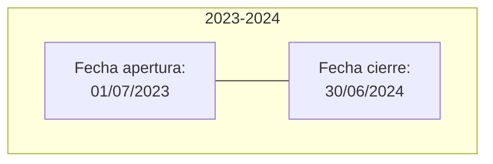
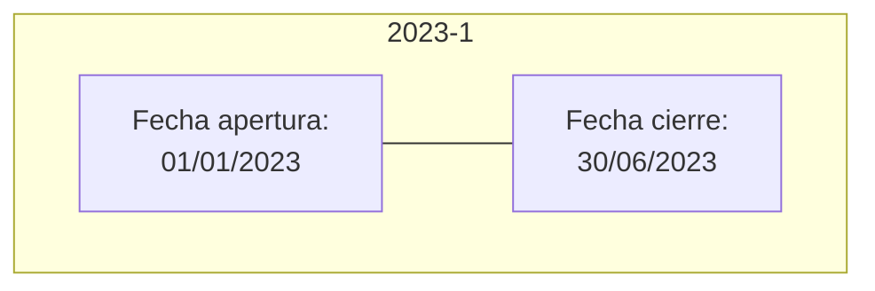
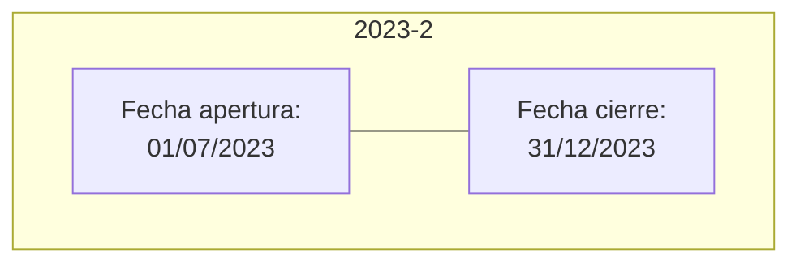

{ width="596" height="159" style="display: block; margin: 0 auto" }

==EN CONSTRUCCIÓN==

# INTRODUCCIÓN - Módulo Contabilidad {#titulo}  
## **Objetivo**
Este módulo permite registrar y anotar las operaciones contables de la compañía.

Gestiona el registro de los asientos contables, aplicando las normativas y cumpliendo con las directrices que se recogen en el Plan General de Contabilidad.

## **Características**
### **Multi Ejercicios**
El período de tiempo en el que se realizan las operaciones contables, se denomina **ejercicio**.  

Cada compañía puede tener varios ejercicios abiertos, pueden ser inferiores a un año natural, coincidir con el año natural, o pueden estar entre dos años naturales.  

El período que comprende cada ejercicio se identifica con una fecha de apertura, que indica la fecha en la que inicia el ejercicio contable, y una fecha de cierre que indica la fecha en la que finaliza el ejercicio contable.  

Ejemplo:  
•	El ejercicio coincide con el año natural  
    Para el ejemplo suponemos que el año natural es 2023.  


•	El ejercicio está entre dos años naturales  
    Para el ejemplo suponemos que el período contempla el segundo semestre del año 2023 y el primer semestre del año 2024.  



•	Si hay más de un ejercicio en el mismo año natural  
    Para el ejemplo suponemos que el año natural es 2023 y que existen dos ejercicios, uno que comprende el primer trimestre y el segundo que comprende el segundo trimestre.  

1.	Primer ejercicio  
    


2.	Segundo ejercicio  
    


### **Plan de Cuentas piramidal definible por el usuario**  
Se define la longitud de cada nivel del plan de cuentas

### **Cuentas Multidivisa**  
Por defecto, las cuentas son multidivisa, es decir, admiten movimientos en cualquier divisa definida en el sistema.

### **Clases de Asientos**  
Sirven para identificar el origen de los asientos: Emisión, Siniestros, Comisiones, Tesorería, etc.  

### **Asientos Provisionales – Definitivos**  
Todos los asientos: manuales, mecanizados o externos, se crean en contabilidad como provisionales. Mientras son provisionales se podrán modificar, rechazar o autorizar. Se tienen que pasar a definitivos momento en el que se generan los saldos acumulados.  

### **Saldos Acumulados**
Solo los asientos definitivos generan saldos acumulados mensuales. Son útiles para la obtención de informes más rápidamente que por análisis de los asientos.  

### **Traspaso de datos entre ejercicios**  
Existen definiciones en contabilidad que dependen el ejercicio contable, estas definiciones pueden variar en un nuevo ejercicio. Para evitar tener que introducir de nuevo estas definiciones, existe una utilidad para traspasarlas de un ejercicio al siguiente.  

### **Asiento de Apertura (Saldos Iniciales)**  
Los saldos iniciales de las cuentas de balance se crean mediante un asiento de apertura. Este asiento se puede generar varias veces hasta considerar la apertura definitiva. Es el asiento con clase de asiento “000”, el único que tiene una clase fija en el sistema.  

### **Cierre de Ejercicio**  
No existe asiento de cierre. Hay que contabilizar manualmente el asiento de Resultados. Hasta que no exista este asiento no se podrá marcar el ejercicio como cerrado.  

## **Conceptos principales**  

## **Entradas/Salidas**  

``` mermaid
graph LR
  A["Pólizas"]
  B["Recibos"]
  C["Siniestros"]
  D["Orden Pago]
  E(("OPERACIÓN
      DE
      CONTABILIDAD"))
  F["Asientos contables"]
  A --> E;
  B --> E;
  C --> E;
  D --> E;
  E --> F;
  