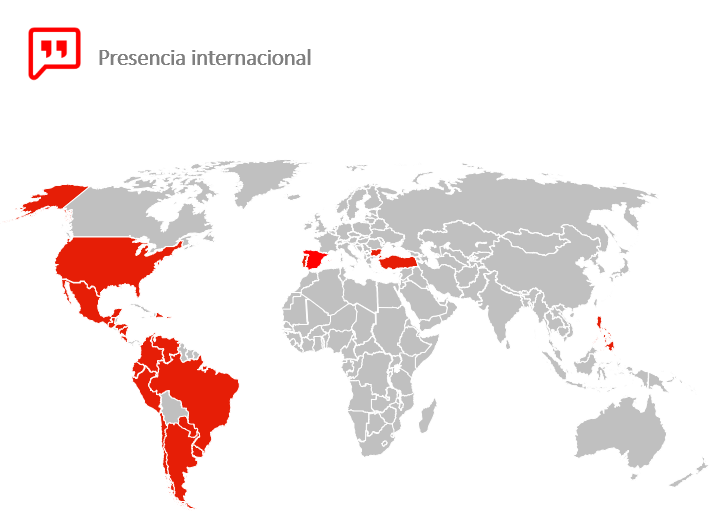

{ width="596" height="159" style="display: block; margin: 0 auto" }

[//]: # (---)
[//]: # (tags:)
[//]: # (  - negocio)
[//]: # (  - analista)
[//]: # (  - implementador)
[//]: # (  - desarrollador)
[//]: # (---)

# INTRODUCCIÓN a TRON {#titulo}

## **OBJETIVO**

Conocer las principales capacidades de TRON como Solución integral de Gestión de Seguros que permite a las entidades MAPFRE gestionar el ciclo de vida de sus pólizas.

- [Evolución Versiones           ](#evolucion-versiones)
- [Presencia Internacional       ](#presencia-internacional)
- [Características Principales   ](#caracteristicas-principales)
- [Solución Modular              ](#solucion-modular)
- [Flexibilidad de la Solución   ](#flexibilidad-de-la-solucion)
- [Integraciones MarketPlace REEF](#integraciones-marketplace-reef)

### **Evolución Versiones** {#evolucion-versiones}

La Evolución temporal de las soluciones TRON, ha sido...

| AÑO                       | DENOMINACIÓN APLICACIÓN        |                                                 | 
| :-----------:             | :-----------                   | :----------                                     |
| 1989                      | Tronador                       | Adaptación del Sistema de Procedencia ARGENTINA |
| 1993                      | Tron2000                       | Reingeniería, Rediseño y Evolución Funcional    |
| 2002                      | TronWeb                        | Frontal Java                                    |
| 2009/2010                 | WebTronWeb                     | Html                                            |
| 2007                      | TRON21                         | Adaptación BACK-END para MAPFRE España          |
| 2017                      | NewTron                        | Reingeniería, Rediseño y Evolución Funcional    |

2009-2010

### **Presencia Internacional** {#presencia-internacional}

| AÑOS                      | PAÍSES                                       |
| -----------:              | :-----------                                 |
| ...  - 1990               | Argentina                                    |
| 1990 - 2000               | España (Mutral- Reale Mutua). México. Perú   |
|                           | España (Mutua Valenciana de Taxis). Chile    |
|                           | Puerto Rico. Venezuela. Portugal. Colombia   |
| 2000 – 2010               | Paraguay. República Dominicana. U.S.A        |
|                           | España (MAPFRE Tron21)                       |
| 2010 – 2020               | Costa Rica. Uruguay. Nicaragua. Guatemala.   |
|                           | **Filipinas.** Honduras. El Salvador.        | 
| 2020 - Actual             | Panamá                                       |

NOTA: Filipinas ya no utiliza el Sistema por estar fuera del Grupo MAPFRE.

### **Características Principales** {#caracteristicas-principales}

Para facilitar su comprensión, las capacidades de TRON se agrupan y dividen en:

- [Características Corporativas            ](#caracteristicas-corporativas)
- [Características Operativas              ](#caracteristicas-operativas)
- [Características Orientadas al Producto  ](#caracteristicas-orientadas-al-producto)
- [Características Orientadas al *Cliente* ](#caracteristicas-orientadas-al-cliente)

#### Características Corporativas {#caracteristicas-corporativas}

- Una Solución implementada **por y para** MAPFRE. 
- Una Solución que se aprovecha del **conocimiento** y de la **experiencia** de los países en su evolución funcional.
- Una Solución **Probada y consolidada** geográfica y temporalmente.
- Una Plataforma de Seguros **moderna y actual**.
- Una Plataforma de Seguros que cumple correctamente con las **funciones** para las que ha sido diseñada: emitir y suscribir pólizas, cobrar recibos, gestionar siniestros, étc.
- Una Solución **escalable** con capacidad de satisfacer las necesidades empresariales de países tan dispares como España, Brasil o los Países CentroAmericanos.

#### Características Operativas {#caracteristicas-operativas}

- Una Solución que es **fácil** de utilizar.
- Una Solución **eficiente** puesto que hace un uso adecuado de los recursos que utiliza.
- Una Solución con un alto grado de **fiabilidad**.
- Una Solución cuya funcionalidad contempla el **ciclo de vida** de la póliza **de extremo a extremo**, es decir, desde la contratación de la póliza hasta la contabilización de sus primas, la gestión de sus siniestros, etcétera.
- Una Solución **Multi Compañía** que permite configurar más de una entidad aseguradora en la misma plataforma.
- Una Solución **Multi País**.
- Una Solución **Multi Moneda** que permite la suscripción y gestión de las pólizas en US$ Dólares, Euros, Francos Suizos, etcétera, de acuerdo con la configuración realizada.
- Una Solución **Multi Idioma** que permite visualizar los literales o textos de las pantallas de la aplicación en diferentes idiomas teniendo declarados 'de caja' los literales correspondientes a los idiomas Español e Inglés.
- La presentación de la información en las pantallas de la Solución se efectúa de acuerdo con los **accesos y roles** asignados a los Usuarios de la aplicación.

#### Características Orientadas al Producto {#caracteristicas-orientadas-al-producto}

- Una Solución centrada en el **Producto**: Seguros de Salud, de Automóviles, Seguro de Hogar, Comercios, étc.
- Una Solución que cuenta con la capacidad de **definir y configurar** Productos y *Procesos* (como por ejemplo la definición de un 'Seguro Todo Riesgo de Automóviles') que contemple sus reglas de negocio y cálculo de sus primas, así como la configuración del conjunto de tareas del Proceso de Gestión de Siniestros y Prestaciones sobre dicho Seguro.
- Una Solución que soporta la definición y operación de múltiples Líneas de Negocio: para productos Vida y No Vida y para productos Individuales o Colectivos.
- Una Solución que contempla la posibilidad de contar con Productos Pre-Configurados para su utilización por los países.

#### Características Orientadas al *Cliente* {#caracteristicas-orientadas-al-cliente}

- Una Solución que permite la **identificación** única y la gestión centralizada de *clientes*.
- Una Solución que **clasifica a las Personas Físicas y Jurídicas** de acuerdo con las actividades que tengan asignadas: Agentes, Asegurados, Proveedores, Abogados, étc.
- Una Solución **Omni canal** en la comercialización de las pólizas por parte de la compañía (Contratación Telefónica, contratación vía Web, a través de un Agente de Seguros, en una plataforma de Banca Seguros, etcétera.)
- Una Solución que en su evolución presenta **funcionalidad reforzada** para el tratamiento de los Colectivos y la identificación y gestión de los Terceros como Proveedores. 
- Una Solución que permite medir la calidad en la prestación de los servicios realizados, al contabilizar y dar soporte a la gestión y seguimiento de las Incidencias, Quejas, Reclamaciones y Felicitaciones de los Clientes (también denominadas **"I.Q.R.F"**).

### **Solución Modular** {#solucion-modular}

La Solución agrupa y clasifica sus funcionalidades en los siguientes módulos:

- La Configuración que aplica transversalmente a todos los módulos se realiza en el Módulo de [Comunes](./01-Modulos/01-Comunes/INTRODUCCION-Comunes.md#titulo).
- La Configuración y Gestión de Clientes o Otras figuras como Abogados, Talleres, Bancos, etcétera se realiza en el Módulo de [Terceros](./01-Modulos/02-Terceros/INTRODUCCION-Terceros.md#titulo).
- La Contratación y Gestión de Pólizas se efectúa en el Módulo de [Emisión/Suscripción](./01-Modulos/03-Emision/INTRODUCIR-Emision.md#titulo).
- La Gestión de los Siniestros y sus Prestaciones se realiza en el Módulo de [Siniestros](./01-Modulos/04-Siniestros/INTRODUCIR-Siniestros.md#titulo).
- La Gestión Financiera de Cobros y Pagos se efectúa en el Módulo de [Tesorería](./01-Modulos/05-Tesoreria/INTRODUCIR-Tesoreria.md#titulo).
- La acción y el efecto de contabilizar se realizar en el Módulo de [Contabilidad.](./01-Modulos/06-Contabilidad/INTRODUCIR-Contabilidad.md)

Es Importante señalar que aún siendo una **Solución Modular**, es una Solución totalmente **Integrada** puesto que todos los módulos comparten **en tiempo real** la información de las pólizas, sus siniestros, sus recibos, etcétera.

### **Flexibilidad de la Solución** {#flexibilidad-de-la-solucion}

Una Solución **basada en parámetros** configurables (entendiendo como tales a los valores que se configuran manualmente y que afectan el comportamiento del sistema) que permiten:

- Controlar diferentes aspectos de los módulos, de sus procesos y de sus funcionalidades así como la interfaz de la Solución.
- Configurar determinadas características de los elementos principales de los módulos, como por ejemplo cómo identificar a los Clientes en el sistema, cómo clasificar los diferentes Productos, cómo numerar los  Siniestros, etc.
- Representar y definir reglas de negocio, como por ejemplo para restringir temporalmente la posibilidad de emitir una póliza del Seguro de Automóviles siempre y cuando la marca del Vehículo corresponda a un vehículo FERRARI o a un ASTON MARTIN, o en el Seguro de Salud controlar que no puedan asegurarse personas menores de 18 años.
- Definir constantes y listas de valores.

Ejemplos de parámetros de TRON: 

- El número de decimales con el que se van a calcular las primas de las pólizas.
- Saber si una moneda es una divisa real o una Unidad de Valor Financiero como por ejemplo las UDI's en México o las Unidades de Fomento en Chile.
- Si la instalación permite o no la captura para un Tercero de múltiples cuentas corrientes / tarjetas de crédito/débito.
- Si en el formato que se va a mostrar por defecto en la captura de la fecha de efecto en la emisión de las pólizas/suplementos de los Seguros que así lo tengan configurado muestra las 24:00 o las 12:00 hrs.
- El uso de Listas de Valores para identificar el Tratamiento de las Personas Físicas (Ilmo., Excelentísimo, Señor, Don, Doña,...) 
- Si se solicita o no el motivo por el que se realiza un cambio en la valoración del siniestro.
- etcétera.

Por otra parte, la Solución cuenta de caja con la funcionalidad necesaria para operar y gestionar la información de las pólizas en los principales procesos de una entidad aseguradora sin embargo, para operar localmente el Sistema, es necesario que las entidades...
   
- **Configuren** directamente en la Solución los procesos y los productos de acuerdo con las necesidades Operativas locales. 
- **Configuren y Personalicen** el código fuente del sistema para adaptarlo a sus necesidades específicas siempre y cuando la funcionalidad de caja no cubra o cubra parcialmente las necesidades locales.

... Si bien y a medio plazo, con la Introducción de la Plataforma REEF, se está planteando modificar técnicamente este comportamiento.

### **Integraciones MarketPlace REEF** {#integraciones-marketplace-reef}

Fruto de la necesidad de integración con otras soluciones y aplicaciones, la Solución TRON puede realizarlo con otras Soluciones ofrecidas por la Plataforma REEF (ya sea desde los sistemas locales de cada entidad o ser consumidas directamente sobre la propia plataforma), Soluciones que permiten **extender y complementar** la funcionalidad del núcleo del Sistema.

Estas Soluciones a Octubre de 2023, son...

- **NEUROTECH**

   Es una solución de motor de suscripción centralizado con reglas personalizables utilizando fuentes proporcionadas por MAPFRE.

- **SIRMAP 360**

   SIRMAP 360 es una solución que permite tener una sistemática comercial estandarizada para la venta consultiva del negocio asociado al segmento PYME. Se trata de una herramienta enfocada en promover y facilitar a la Red Agencial la gestión comercial con Empresas de manera profesional, orientada al asesoramiento a clientes respecto al grado de protección y cobertura aseguradora de sus negocios y la detección de necesidades de cara a promover la captación de nuevo negocio y la venta cruzada.

- **CILIA**

   Sistema auxiliar en el proceso de presupuestación de reparaciones automotrices utilizando Inteligencia artificial(AI) para identificación de daños.

- **QAPTER**

   Qapter es el conjunto modular de productos de industria automotriz disponible globalmente, alimentado por Inteligencia Artificial (IA), para que aseguradoras puedan acelerar el proceso de siniestros. Esta herramienta detecta automáticamente el daño causado a un vehículo desde una imagen enviada y devuelve el costo óptimo de la reparación.

- **DOCUMENTUM**

   Documentum es una plataforma destinada al almacenamiento y conservación de documentación en formato digital.

- **AUTOINSPECCIÓN MAPFRE**

   Aplicación móvil para brindar autogestión a los clientes, intermediarios y peritos que deseen realizar las inspecciones de vehículo a través de un ambiente 100% digital.

- **OFICINA DIGITAL MAPFRE (ODM)**

   Solución para ofrecer la comercialización de productos y operativa de seguros

- **MINDBREEZE**

   Mindbreeze InSpire es un motor de análisis de información que proporciona y procesa datos empresariales para una búsqueda moderna e intuitiva. Es un sistema inteligente de auto-aprendizaje para el procesamiento y análisis semántico automatizado de documentos

- **ONEINC**

   ClaimsPay® es una solución de pago digital comprobada que permite a las aseguradoras desembolsar el pago de reclamos a cualquier persona, utilizando cualquier método y desde cualquier lugar. Creado por aseguradoras para aseguradoras, cuando se trata de desembolsos, ClaimsPay® aumenta la retención de clientes, reduce los costos y reduce el riesgo al ofrecer pagos digitales rápidos y seguros a través de los canales y métodos preferidos de los clientes.

- **MARLEY**

   Hi Marley es la plataforma inteligente de comunicación de mensajes de texto bidireccionales para la industria de seguros. Creada por personas que saben de seguros, la plataforma permite enviar mensajes de texto sin problemas en todo el ecosistema, lo que empodera a los profesionales de seguros y a los asegurados.

- **MAPFRE RED EN LA RED**

   El Marco Global de Red en la Red de MAPFRE es una herramienta que ofrece múltiples beneficios a todas las entidades de MAPFRE. Permite generar páginas web optimizadas de forma masiva para oficinas, agentes, talleres, centros médicos, entre otros, mejorando su posicionamiento en buscadores y ofreciendo una experiencia de usuario optima, unificando la imagen de marca de MAPFRE en nuestra red.

- **CONTROL EXPERT (PolicyCheck)**

   Solución que aplica IA a la detección de daño/no daño en tiempo real en imágenes de autos en el proceso de contratación de la póliza.

- **CATÁLOGO de PRESTADORES de FIRMA Electrónica (LOGALTY, EVICERTIA, DOCUSIGN, SIA)**

   Se necesita un prestador de servicios de firma para la firma y comunicaciones de documentos electrónicos.

- **SMART INDEXING**

   Herramienta de captura inteligente de documentos para automatizar la identificación de tipologías, extracción y validación del contenido.

- **MAPFRE PLANIFICADOR FINANCIERO**

   El Planificador Financiero de Vida MAPFRE es una herramienta comercial de oferta, que analiza el bienestar financiero de las familias, detecta sus necesidades y plantea una solución en materia de protección ante fallecimiento, educación de los hijos, objetivos de ahorro y jubilación.

- **DUP (DYNAMIC UNDERWRITING & PRICING)**

   DUP es una herramienta para la gestión de la suscripción y el precio de manera rentable y dinámica. Antes de devolver un precio a un cliente durante la emisión de una póliza, un presupuesto o una cotización DUP calcula si es rentable en función de las coberturas.

- **ORION G2**

   ORIÓN G2 es un sistema integral de gestión de siniestros, 100% ON LINE, de desarrollo interno, para la valorización y gestión de daños materiales de vehículos. Además, es el sistema de gestión operacional omnicanal entre Mapfre y su cliente que permite conocer el riesgo asumido de un siniestro y los tiempos y valores de mano de obra para la reparación adecuados. Integra a proveedores para la compra de repuestos y a los talleres de reparación con sus distintas funcionalidades.

- **FINAMETRIX**

   Finametrix es una herramienta que pone a disposición un portal web seguro, moderno y escalable que permita tanto a clientes como asesores de Mapfre simular, contratar y gestionar objetivos de ahorro y/o inversión online.

- **MICROSERVICIO RTE - ACTIVO DIGITAL TARIFICADOR/COTIZADOR**

   El microservicio RTE es una herramienta que permite tarificar la prima de las coberturas contratadas en cada uno de los objetos asegurados de la póliza. También expone un simulador para calcular la prima de acuerdo a una configuración previamente establecida.

- **CAPTIO (E-TICKET)**

   Captio es una solución en cloud de digitalización de facturas y tickets orientada a la gestión de gastos de empleados. Permite a los empleados comunicar los gastos de empresa para su liquidación.

- **IDENTIFICACIÓN BIOMÉTRICA**

   Esta solución sirve para verificar la identidad de las personas a través de biometría facial, biometría de voz y verificación de documentos de identidad.

- **FIS CSF - GENERACIÓN de Documentos**

   Esta solución automatiza la generación de documentación y facilita su distribución por los diferentes canales de comunicación digitales que necesites. Puedes utilizarlo para cualquier documento y cualquier proceso de negocio.

- **(... Para una relación más actualizada de las soluciones visite la página oficial del [MaketPlace.](https://internos.mapfre.com/marketplace-reef/soluciones/))**