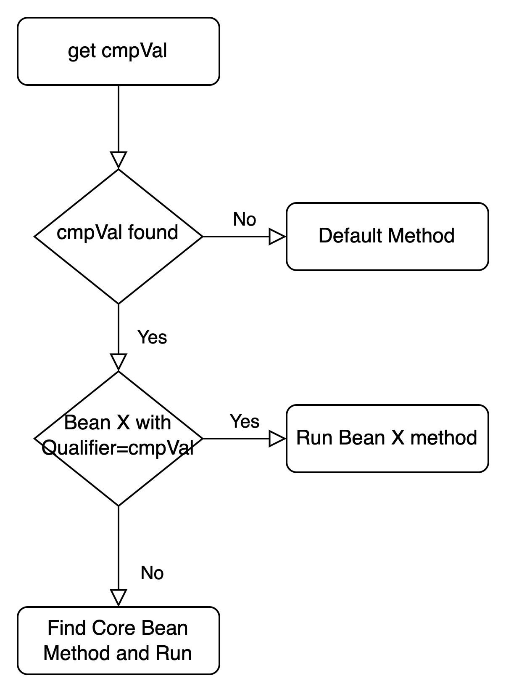

# 1. Modelo de desarrollo Java TRON REEF

<!-- @import "[TOC]" {cmd="toc" depthFrom=2 depthTo=6 orderedList=false} -->
<!-- code_chunk_output -->
- [1. Modelo de desarrollo Java TRON REEF](#1-modelo-de-desarrollo-java-tron-reef)
  - [1.1. Introducción](#11-introducción)
    - [1.1.1. Principios de la Arquitectura Java en REEF](#111-principios-de-la-arquitectura-java-en-reef)
  - [1.2. Pasos previos al desarrollo](#12-pasos-previos-al-desarrollo)
    - [1.2.1. Creación de los repositorios](#121-creación-de-los-repositorios)
    - [1.2.2. Generación de los proyectos](#122-generación-de-los-proyectos)
    - [1.2.3. Configuración del puesto de trabajo](#123-configuración-del-puesto-de-trabajo)
      - [1.2.3.1. Comenzando con MAPFRE-Toolsuite](#1231-comenzando-con-mapfre-toolsuite)
  - [1.3. Desarrollo de personalizaciones en Java TRON REEF](#13-desarrollo-de-personalizaciones-en-java-tron-reef)
    - [1.3.1. Mecanismo de decisión](#131-mecanismo-de-decisión)
    - [1.3.2. Localización de las clases personalizadas](#132-localización-de-las-clases-personalizadas)
    - [1.3.3. Extensión vs implementación](#133-extensión-vs-implementación)
  - [1.4. Desarrollo de las APIS](#14-desarrollo-de-las-apis)
    - [1.4.1. Estructura de los proyectos](#141-estructura-de-los-proyectos)
    - [1.4.2. Configuración / perfiles](#142-configuración--perfiles)
    - [1.4.3. Desarrollo de las personalizaciones](#143-desarrollo-de-las-personalizaciones)
    - [1.4.4. Testing](#144-testing)
  - [1.5. Desarrollo de Newtron](#15-desarrollo-de-newtron)
    - [1.5.1. Estructura de los proyectos](#151-estructura-de-los-proyectos)
    - [1.5.2. Configuración / perfiles](#152-configuración--perfiles)
    - [1.5.3. Desarrollo de las personalizaciones](#153-desarrollo-de-las-personalizaciones)
    - [1.5.4. Testing](#154-testing)
  - [1.6. Actualizaciones de la release de Core en los proyectos personalizados](#16-actualizaciones-de-la-release-de-core-en-los-proyectos-personalizados)
<!-- /code_chunk_output -->

## 1.1. Introducción

### 1.1.1. Principios de la Arquitectura Java en REEF

<a href="https://mapfrealm.atlassian.net/wiki/spaces/TRONCORE/pages/1711309452" rel="nofollow">Principios Arquitectura Newtron Backend Java - ALM DCTPSOL TRON - Confluence (atlassian.net)</a>

## 1.2. Pasos previos al desarrollo

Este apartado explica los pasos que se deben llevar a cabo para empezar a desarrollar en Newtron y en las APIs personalizadas de TRON. Se tratan los siguientes puntos:

|Tarea|Responsable|
|-|-|
|Creación repositorios|Local|
|Generación proyectos|Corporativo|
|Automatización DevOps |Corporativo|


### 1.2.1. Creación de los repositorios

Previo a comenzar los desarrollos es necesario tener creados los repositorios para cada uno de los proyectos personalizados. Los repositorios deberían ser alojados en un espacio de trabajo propio. Estos repositorios deben tener una nomenclatura concreta. Los repositorios que crean son los siguientes, sustituyendo XX por el código del país/países:

- APIs 
  - **xx_tron_business_api**. Proyecto de API de Negocio
  - **xx_tron_cmn_api**. Proyecto de API de servicios comunes
  - **xx_tron_isu_api**. Proyecto de API de Emisión
  - **xx_tron_lss_api**. Proyecto de API de Siniestros
  - **xx_tron_thp_api**. Proyecto de API de Terceros
  - **xx_tron_tsy_api**. Proyecto de API de Tesorería
  - **xx_tron_btc_api**. Proyecto de API de procesos Batch
  - **xx_tron_spl_api**. Proyecto de API de Proveedores
  - **xx_tron_rpt_nwt**. Proyecto de API de Reportes
- Newtron
  - **xx_tron_fe_nwt**. Proyecto de capa frontal de Newtron
  - **xx_tron_be_nwt**. Proyecto de capa Java backend de Newtron

Una vez creados los repositorios se debe dar permisos de escritura a varias personas del equipo de Corporativo. Para ello se debe consultar con la persona de contacto de Corporativo. 

### 1.2.2. Generación de los proyectos

Este paso consiste en generar la estructura y configuración de los proyectos en los que se desarrollarán las aplicaciones personalizadas. Para cada uno se genera un proyecto con dependencia a la funcionalidad correspondiente de core. Esta tarea es responsabilidad del equipo de Corporativo por lo que se debe contactar con Corporativo para realizar este paso.

### 1.2.3. Configuración del puesto de trabajo

Para hacer los desarrollos se utilizan las siguientes herramientas en los puestos de trabajo:

- **Eclipse**: IDE popular para el desarrollo de software. En MAPFRE contamos con un MAPFRE-Toolsuite que cuenta con una colección de varios plugins preinstalados y una configuración inicial.

  - Se puede descargar <a href="https://mar.mapfre.com/tooling/mapfre-toolsuite/" class="external-link" rel="nofollow">aquí</a>.

- **Visual Studio:** Para desarrollos de frontal. También se utiliza como entorno visual para trabajar Git.

- **Tomcat**: Servidor web que se utiliza para ejecutar aplicaciones Java.

- **Maven**: Herramienta de gestión de proyectos utilizada para compilar y administrar dependencias.

- **Git**: Sistema de control de versiones.

- **Soap UI**: Herramienta para probar servicios web.

- **SQL Developer**: Herramienta para trabajar con bases de datos.

#### 1.2.3.1. Comenzando con MAPFRE-Toolsuite

Nuestro IDE será preferentemente MAPFRE-Toolsuite pero se pueden utilizar otros, siempre y cuando respetemos las versiones de Java, Maven y que el encoding utilizado sea UTF-8.

También nos tenemos que asegurar de que el archivo settings.xml de Maven sea correcto. Ya que este debe apuntar a Azure Artifacts y debemos configurarlo con nuestro token. Para configurar el archivo settings.xml de Maven, vamos a Window &gt; Preferences, buscamos Maven y dentro de él, seleccionamos User Settings. Si pulsamos en el enlace “open file” se abrirá el settings.xml. Para configurarlo correctamente debemos seguir las intrucciones de este <a href="https://mar.mapfre.com/devops/azure-artifact-manual/" class="external-link" rel="nofollow">enlace</a>.

Para abrir Eclipse, entramos en la carpeta MAPFRE-toolsuite que se encuentra en la carpeta raíz C:/. Dentro de esa carpeta, hay dos archivos .BAT: uno abre el IDE y el otro abre una ventana de CMD con todas las variables del entorno creadas. Abrimos el IDE.

Una vez abierto el IDE, importamos los proyectos. Para importar un proyecto, hacemos clic en File &gt; Import &gt; Existing Maven Project. Seleccionamos el directorio raíz del proyecto que queremos importar y hacemos clic en Aceptar.

## 1.3. Desarrollo de personalizaciones en Java TRON REEF

### 1.3.1. Mecanismo de decisión

La necesidad del mecanismo de decisión viene dado de que inicialmente tenemos una serie de implementaciones como base y que cada país puede personalizar estas implementaciones según sus necesidades, por tanto, con el fin de orquestar dichas personalizaciones para cada país, se ha definido un mecanismo de decisión.

Para el mecanismo de decisión se ha empleado como base el patrón de diseño Strategy customizado con una serie de optimizaciones para facilitar nuestro desarrollo.

Este mecanismo de decisión inicia con la intercepción de una petición que va dirigido a los métodos de la capa personalizable:

```java
       @Around("execution(public * com.mapfre.tron.ca.api..*(..))")
        public Object methodExecution(ProceedingJoinPoint pjp) throws Throwable {...}
```

y a continuación ejecuta los siguientes pasos:

1. Busca el valor de cmpVal en los argumentos de la petición.

    - En caso de no encontrarlo se termina la decisión ejecutando el método de implementación por defecto que es el no personalizado.

    - En caso de encontrarlo se pasa al siguiente punto.

```java
    @Around("execution(public * com.mapfre.tron.ca.api..*(..))")
    public Object methodExecution(ProceedingJoinPoint pjp) throws Throwable {
        Class defaulClass = null;
        String cmpCode = getCmpCode(pjp);
        if (cmpCode == null) return pjp.proceed();
        ...
    }

    private String getCmpCode(ProceedingJoinPoint pjp) {
        CodeSignature cs = (CodeSignature) pjp.getSignature();
        int cmpValIndex = getCmpValIndex(cs);

        if (cmpValIndex < 0) {
            return null;
        } else {
            Integer cmpVal = (Integer) pjp.getArgs()[cmpValIndex];
            return getCmpCodeFromCmpVal(cmpVal);
        }
    }
```

2. Busca y filtra por reflexión todas los objetos que esten en el contexto de spring y que contenga el nombre del método que invoca la petición y posteriormente se extrae el valor del Qualifier de esos objetos y se compara con el valor del cmpVal.

    - En caso de que ningún valor del Qualifier coincida con el cmpVal entonces se termina la decisión y se ejecuta el objeto del método de implementación por defecto que es el que no lleva Qualifier.

    - En caso de que algún Qualifier coincida con el cmpVal, entonces, se invoca el método de ese objeto.

    - En caso de que el cmpVal tenga el valor DEFAULT (no corresponde a ningun pais), entonces se termina la decision ejecutando la implementacion de CORE.
   
```java
    @Around("execution(public * com.mapfre.tron.ca.api..*(..))")
    public Object methodExecution(ProceedingJoinPoint pjp) throws Throwable {
        Class defaulClass = null;
        String cmpCode = getCmpCode(pjp);
        if (cmpCode == null) return pjp.proceed();

        Set<Class> classes = findAllClassesWithoutInterface("com.mapfre.tron", pjp);
        for (Class a : classes) {
            Qualifier qualifier = (Qualifier) a.getAnnotation(Qualifier.class);
            if (qualifier == null) {
                if ("DEFAULT".equals(cmpCode)) return invokeMethod(a, pjp);
                defaulClass = a;
            }
            else if (qualifier.value().equals(cmpCode))
                return invokeMethod(a, pjp);
        }
        return defaulClass != null ? invokeMethod(defaulClass, pjp) : pjp.proceed();
    }

    private Set<Class> findAllClassesWithoutInterface(String packageName, ProceedingJoinPoint invocation) {
        Reflections reflections = new Reflections(packageName, new SubTypesScanner(false));
        return reflections.getSubTypesOf(Object.class).stream().filter(a -> isContextBean(a) && isContainMethod(a, invocation) && !a.isInterface()).collect(Collectors.toSet());
    }

    public boolean isContextBean(Class a){
        try {
            applicationContext.getBean(a);
            return true;
        } catch (NoSuchBeanDefinitionException e) {
            return false;
        }
    }

    private boolean isContainMethod(Class a, ProceedingJoinPoint invocation) {
        try {
            a.getMethod(invocation.getSignature().getName(), ((MethodSignature) (invocation.getSignature())).getParameterTypes());
            return true;
        } catch (NoSuchMethodException e) {
            return false;
        }
    }

    @SneakyThrows
    private Object invokeMethod(Class a, ProceedingJoinPoint invocation) {
        return a.getMethod(invocation.getSignature().getName(), ((MethodSignature) (invocation.getSignature())).getParameterTypes()).invoke(a.newInstance(),
        invocation.getArgs());
    }
```

En el siguiente diagrama se puede observar mejor todo el mecanismo de decisión.



### 1.3.2. Localización de las clases personalizadas

- Capas personalizables (BL, DL)

- La capa SR (controllers) no se personaliza en APIS

### 1.3.3. Extensión vs implementación

Existen dos modalidades de desarrollar una personalización, extendiéndolo o implementando, a continuación se detallara con ejemplos estas dos modalidades:

- Ejemplo con extends. Cuando solo queremos extender parte de la funcionalidad

```java
    @Slf4j
    @Primary
    @Qualifier("MPA")
    @Service
    public class MPABlAbdVhuQryImpl extends TwBlAbdVhuQryImpl {

        @Override
        public List<OAbdVhuS> getVehicleUsesByDealAndSubdeal(String lngVal, Integer cmpVal, String usrVal, Integer lobVal, Integer delVal, Integer sblVal,
                Integer vhuVal, Long vldDat) {
            
            log.warn("MPA implementation");
            
            List<OAbdVhuS> result= new ArrayList<OAbdVhuS>();
            OAbdVhuS oAdbVhuS= new OAbdVhuS();
            result.add(oAdbVhuS);
            return result;
            
        }   
    }
```

- Ejemplo con implements. Cuando queremos sustituir completamente el comportamiento de ese componente.

```java
    @Slf4j
    @Primary
    @Qualifier("MPA")
    @Service
    public class MPABlAbdVhuQryImpl implements TwBlAbdVhuQryImpl {...}
```

## 1.4. Desarrollo de las APIS

<a href="https://mapfrealm.atlassian.net/wiki/spaces/TRONCORE/pages/1131315501/API+EDGE+de+TRON" data-linked-resource-id="1131315501" data-linked-resource-version="11" data-linked-resource-type="page">API EDGE de TRON - ALM DCTPSOL TRON - Confluence (atlassian.net)</a>

### 1.4.1. Estructura de los proyectos

### 1.4.2. Configuración / perfiles

<a href="https://mapfrealm.atlassian.net/wiki/spaces/TRONCORE/pages/168677113916/Gesti+n+Configuraci+n+API+Edge+TRON" rel="nofollow">Gestión Configuración API Edge TRON - ALM DCTPSOL TRON - Confluence (atlassian.net)</a>

- perfiles
- propiedades por funcionalidades (comunes)
  - auth
  - roles
  - peca
  - otros…

### 1.4.3. Desarrollo de las personalizaciones

Para desarrollar y aplicar una personalización a nuestro proyecto debemos seguir los siguientes pasos:

1. Crear una clase extendiendo o implementando la funcionalidad que deseamos personalizar. Ejemplos:

```java
    public class MPABlAbdVhuQryImpl extends TwBlAbdVhuQryImpl {...}
```

```java
    public class MPABlAbdVhuQryImpl implements TwBlAbdVhuQryImpl {...}
```

2. Incluir un Qualifier a la clase con la nomenclatura del país a personalizar. Ejemplo:

```java
    @Qualifier("MPA")
    public class MPABlAbdVhuQryImpl extends TwBlAbdVhuQryImpl {...}
```

3. Con los dos pasos anteriores ,ya habríamos terminado el desarrollo de la personalización y el resto ya se encarga el mecanismo de decisión de orquestar la ejecución de la personalización.

### 1.4.4. Testing

En este apartado explicaremos como ejecutar nuestro proyecto y como probar su funcionalidad.

## 1.5. Desarrollo de Newtron

### 1.5.1. Estructura de los proyectos

### 1.5.2. Configuración / perfiles

- perfiles

- propiedades por funcionalidades

  - auth

  - peca

  - otros…

### 1.5.3. Desarrollo de las personalizaciones

En este apartado se explicará paso a paso con ejemplos y con el uso de las distintas herramientas y librerías que se proporcionan.

### 1.5.4. Testing

En este apartado explicaremos como ejecutar nuestro proyecto y como probar su funcionalidad.

## 1.6. Actualizaciones de la release de Core en los proyectos personalizados

